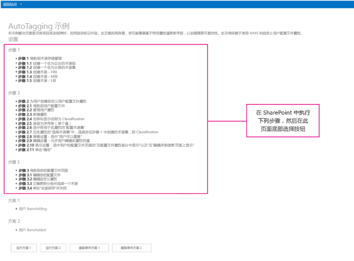
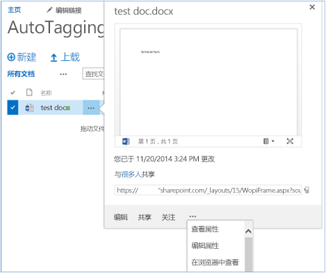
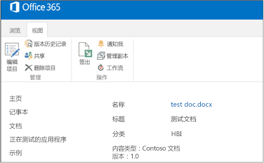


# 自动标记示例 SharePoint 外接程序
作为企业内容管理 (ECM) 策略的一部分，当创建文档或将文档上载到 SharePoint 时，您可以使用元数据自动标记文档。 

 **上次修改时间：** 2015年8月12日

 _ **适用范围：** SharePoint 2013?| SharePoint Add-ins?| SharePoint Online_

 **注释**  名称"SharePoint 相关应用程序"将更改为"SharePoint 外接程序"。在转换期间，某些 SharePoint 产品和 Visual Studio 工具的文档和 UI 仍可能使用术语"SharePoint 相关应用程序"。有关详细信息，请参阅 [Office 和 SharePoint 相关应用程序的新名称](05b07b04-6c8b-4b7e-bd86-e32c589dfead.md#bk_newname)。

[ECM.AutoTagging](https://github.com/OfficeDev/PnP/tree/dev/Scenarios/ECM.AutoTagging) 示例说明如何使用提供程序托管的 外接程序，使用自定义用户配置文件属性中的数据自动标记添加到 SharePoint 库的内容。此外接程序使用托管在 Azure 网站 上的远程事件接收器，以：

- 创建字段、内容类型和文档库。
    
- 检索自定义用户配置文件属性的值。
    
- 设置分类字段。
    
如果您需要执行以下操作，请使用此解决方案：

- 在 SharePoint Online 中实现事件接收器。 
    
- 创建内容时向其附加其他元数据以改进搜索结果。
    
- 对您的内容进行分类。
    
- 迁移到 SharePoint 新版本之前更新代码，您过去曾使用过事件接收器。
    
 **为改进此内容做贡献**
您可以获取最新的更新，或为改进 [GitHub 上的此文章](https://github.com/OfficeDev/PnP-Guidance/blob/master/articles/Autotagging-sample-app-for-SharePoint.md)做贡献。您还可以为改进本示例以及 [GitHub 上的其他示例](https://github.com/OfficeDev/PnP)做贡献。有关示例的完整列表，请参阅 [模式和做法开发人员中心](http://dev.office.com/patterns-and-practices)。我们欢迎您做出 [贡献](https://github.com/OfficeDev/PnP/wiki/contributing-to-Office-365-developer-patterns-and-practices)。 

## 开始之前

若要开始，请从 GitHub 上的 [Office 365 开发人员模式和做法](https://github.com/OfficeDev/PnP/tree/dev)项目下载 [ECM.AutoTagging](https://github.com/OfficeDev/PnP/tree/dev/Scenarios/ECM.AutoTagging) 示例外接程序。

在运行此外接程序之前，请执行以下操作：


1. 创建 Azure 网站 并向其部署 ECM.AutoTaggingWeb 项目。
    
2. 在 Office 365 中使用 Appregnew.aspx 页面注册外接程序。 
    
3. 此外接程序使用仅外接程序权限。您需要在 Office 365 中使用 AppInv.aspx 页面分配仅外接程序权限。将以下 XML 从 AppManifest.xml 文件复制到 AppInv.aspx 页面上的权限请求 XML 文本框。 
    
  ```XML
  <AppPermissionRequests AllowAppOnlyPolicy="true">
    <AppPermissionRequest Scope="http://sharepoint/content/tenant" Right="FullControl" />
    <AppPermissionRequest Scope="http://sharepoint/taxonomy" Right="Read" />
    <AppPermissionRequest Scope="http://sharepoint/social/tenant" Right="Read" />
  </AppPermissionRequests>


  ```

4. 在 ECM.AutoTaggingWeb 项目的 ReceiverHelper.cs 文件中，在  **CreateEventReciever** 方法中，使用您的 Azure 网站 的 URL 更新 **ReceiverUrl** 属性。
    
  ```C#
  public static EventReceiverDefinitionCreationInformation CreateEventReciever(string receiverName, EventReceiverType type)
        {

            EventReceiverDefinitionCreationInformation _rer = new EventReceiverDefinitionCreationInformation();
            _rer.EventType = type;
            _rer.ReceiverName = receiverName;
            _rer.ReceiverClass = "ECM.AutoTaggingWeb.Services.AutoTaggingService";
            _rer.ReceiverUrl = "https://<Your domain>.azurewebsites.net/Services/AutoTaggingService.svc";
            _rer.Synchronization = EventReceiverSynchronization.Synchronous;
            return _rer;
        }

  ```

5. 打包和部署您的外接程序。 
    
当您启动外接程序时，将显示文档自动标记提供程序托管的外接程序的起始页面，如图 2 中所示。起始页面显示了在分配或删除事件接收器之前需执行的一些额外配置步骤。 


**图 1. 在 SharePoint 中需在外接程序起始页面上执行的额外配置步骤**




## 使用 ECM.Autotagging 示例外接程序

此示例使用远程事件接收器，使用自定义用户配置文件属性中的数据，自动标记（将元数据添加到）添加到文档库中的文档。

使用远程事件接收器将元数据分配到文档库中新创建的文档：


1. 用户创建新内容或将新内容上载到文档库。已分配远程事件接收器以处理此文档库上的  **ItemAdding** 或 **ItemAdded** 事件。
    
2.  **ItemAdding** 或 **ItemAdded** 方法调用远程事件接收器。
    
3. 提供程序托管的外接程序获取该用户的 SharePoint 的 User Profile Service 中自定义用户配置文件属性的值。在此示例外接程序中，将检索之前已添加的 Classification 自定义用户配置文件属性。
    
4. 远程事件接收器使用该用户的自定义用户配置文件属性值更新新文档上的元数据。 
    

### 运行方案 1

当您选择按钮"运行方案 1"时，外接程序将执行以下操作：


1. 创建文档库。
    
2. 创建用于 ItemAdding 事件的远程事件接收器。
    
     **注释**  本文讨论 ItemAdding 事件接收器类型。通常情况下，ItemAdding 事件接收器类型执行得比 ItemAdded 事件接收器类型好。ECM.Autotagging 示例提供用于 ItemAdding 和 ItemAdded 事件接收器类型的代码。
3. 将远程事件接收器添加到文档库。
    
ECM.AutoTaggingWeb 项目中 Default.aspx.cs 页面的  **btnScenario1_Click** 方法中的以下代码显示下列步骤。


 **注释**  本文中的代码按原样提供，不提供任何明示或暗示的担保，包括对特定用途适用性、适销性或不侵权的默示担保。


```C#
protected void btnScenario1_Click(object sender, EventArgs e)
        {
            var _libraryToCreate = this.GetLibaryInformationItemAdding();
 
            var spContext = SharePointContextProvider.Current.GetSharePointContext(Context);
            using (var ctx = spContext.CreateUserClientContextForSPHost())
            {
                try 
                { 
                    if(!ctx.Web.ListExists(_libraryToCreate.Title))
                    {
                        ScenarioHandler _scenario = new ScenarioHandler();
                        _scenario.CreateContosoDocumentLibrary(ctx, _libraryToCreate);
                    }
                    List _list = ctx.Web.Lists.GetByTitle(_libraryToCreate.Title);
                    EventReceiverDefinitionCreationInformation _rec = ReceiverHelper.CreateEventReciever(ScenarioHandler.AUTOTAGGING_ITEM_ADDING_RERNAME, EventReceiverType.ItemAdding);
                    ReceiverHelper.AddEventReceiver(ctx, _list, _rec);
                }
                catch(Exception _ex)
                {

                }
            }
        }  


?


```

将调用  **CreateContosoDocumentLibrary** 方法。ScenarioHandler.cs 文件的以下代码使用 OfficeDevPnP.Core 中的方法，使用自定义内容类型创建自定义文档库。文档库中的默认内容类型将删除。


```C#
public void CreateContosoDocumentLibrary(ClientContext ctx, Library library)
        {
            // Check the fields.
            if (!ctx.Web.FieldExistsById(FLD_CLASSIFICATION_ID))
            {
                ctx.Web.CreateTaxonomyField(FLD_CLASSIFICATION_ID,
                                            FLD_CLASSIFICATION_INTERNAL_NAME,
                                            FLD_CLASSIFICATION_DISPLAY_NAME,
                                            FIELDS_GROUP_NAME,
                                            TAXONOMY_GROUP,
                                            TAXONOMY_TERMSET_CLASSIFICATION_NAME);
            }

            // Check the content type.
            if (!ctx.Web.ContentTypeExistsById(CONTOSODOCUMENT_CT_ID))
            {
                ctx.Web.CreateContentType(CONTOSODOCUMENT_CT_NAME,
                                          CT_DESC, CONTOSODOCUMENT_CT_ID,
                                          CT_GROUP);
            }

            // Associate fields to content types.
            if (!ctx.Web.FieldExistsByNameInContentType(CONTOSODOCUMENT_CT_NAME, FLD_CLASSIFICATION_INTERNAL_NAME))
            {
                ctx.Web.AddFieldToContentTypeById(CONTOSODOCUMENT_CT_ID,
                                                  FLD_CLASSIFICATION_ID.ToString(),
                                                  false);
            }

            
            CreateLibrary(ctx, library, CONTOSODOCUMENT_CT_ID);
        }

private void CreateLibrary(ClientContext ctx, Library library, string associateContentTypeID)
        {
            if (!ctx.Web.ListExists(library.Title))
            {
                ctx.Web.AddList(ListTemplateType.DocumentLibrary, library.Title, false);
                List _list = ctx.Web.GetListByTitle(library.Title);
                if (!string.IsNullOrEmpty(library.Description))
                {
                    _list.Description = library.Description;
                }

                if (library.VerisioningEnabled)
                {
                    _list.EnableVersioning = true;
                }

                _list.ContentTypesEnabled = true;
                _list.RemoveContentTypeByName("Document");
                _list.Update();
                
     
                ctx.Web.AddContentTypeToListById(library.Title, associateContentTypeID, true);
                ctx.Web.Context.ExecuteQuery();
               
            }
            else
            {
                throw new Exception("A list, survey, discussion board, or document library with the specified title already exists in this Web site.  Please choose another title.");
            }
        }
```

此代码运行后，将在网站内容中创建 AutoTaggingSampleItemAdding 文档库。

在 ECM.AutoTaggingWeb 项目中的 ReceiverHelper.cs 文件中， **CreateEventReciever** 方法将创建 ItemAdding 事件接收器定义。在 ECM.AutoTaggingWeb 项目中，Services 文件夹包括一项称为 AutoTaggingService.svc 的 Web 服务。将 ECM.AutoTaggingWeb 项目发布到您的 Azure 网站 之后，此 Web 服务也已部署到网站中。 **CreateEventReciever** 方法将此 Web 服务指定为文档库上的远程事件接收器。 **CreateEventReciever** 方法中的以下代码说明如何将 Web 服务分配到远程事件接收器。


```C#
public static EventReceiverDefinitionCreationInformation CreateEventReciever(string receiverName, EventReceiverType type)
        {

            EventReceiverDefinitionCreationInformation _rer = new EventReceiverDefinitionCreationInformation();
            _rer.EventType = type;
            _rer.ReceiverName = receiverName;
            _rer.ReceiverClass = "ECM.AutoTaggingWeb.Services.AutoTaggingService";
            _rer.ReceiverUrl = "https://<Your domain>.azurewebsites.net/Services/AutoTaggingService.svc";
            _rer.Synchronization = EventReceiverSynchronization.Synchronous;
            return _rer;
        }

```

 **AddEventReceiver** 方法中的以下代码将远程事件接收器分配到文档库。


```C#
public static void AddEventReceiver(ClientContext ctx, List list, EventReceiverDefinitionCreationInformation eventReceiverInfo)
        {
            if (!DoesEventReceiverExistByName(ctx, list, eventReceiverInfo.ReceiverName))
            {
                list.EventReceivers.Add(eventReceiverInfo);
                ctx.ExecuteQuery();
            }
        }

```

现在，远程事件接收器已添加到文档库。当您将文档上载到  **AutoTaggingSampleItemAdding** 文档库时，将使用该用户的 Classification 自定义用户配置文件属性值标记该文档。图 5 显示了如何查看文档上的属性。图 6 显示了文档的元数据以及 Classification 字段。


**图 5. 查看文档属性**


**图 6. 文档元数据中的 Classification 字段**

AutoTaggingService.svc.cs 文件中的  **HandleAutoTaggingItemAdding** 方法使用 **GetProfilePropertyFor** 方法检索 Classification 用户配置文件属性的值。


```C#
public void HandleAutoTaggingItemAdding(SPRemoteEventProperties properties,SPRemoteEventResult result)
        {
            using (ClientContext ctx = TokenHelper.CreateRemoteEventReceiverClientContext(properties))
            {
                if (ctx != null)
                {
                    var itemProperties = properties.ItemEventProperties;
                    var _userLoginName = properties.ItemEventProperties.UserLoginName;
                    var _afterProperites = itemProperties.AfterProperties;
                    if(!_afterProperites.ContainsKey(ScenarioHandler.FLD_CLASSIFICATION_INTERNAL_NAME))
                    {
                        string _classficationToSet = ProfileHelper.GetProfilePropertyFor(ctx, _userLoginName, Constants.UPA_CLASSIFICATION_PROPERTY);
                        if(!string.IsNullOrEmpty(_classficationToSet))
                        { 
                            var _formatTaxonomy = AutoTaggingHelper.GetTaxonomyFormat(ctx, _classficationToSet);
                            result.ChangedItemProperties.Add(ScenarioHandler.FLD_CLASSIFICATION_INTERNAL_NAME, _formatTaxonomy);
                        }
                    }
                }
            }
        }

```


    
 **重要信息**  从  **GetProfilePropertyFor** 方法中检索 **Classification** 值之后，必须以特定方式对 **Classification** 值进行格式化，然后才能将其作为元数据存储在文档上。AutoTaggingHelper.cs 文件中的 **GetTaxonomyFormat** 方法显示如何格式化 **Classification** 值。


```C#
public static string GetTaxonomyFormat(ClientContext ctx, string term)
        { 
            if(string.IsNullOrEmpty(term))
            {
                throw new ArgumentException(string.Format(EXCEPTION_MSG_INVALID_ARG, "term"));
            }
            string _result = string.Empty;
            var _list = ctx.Web.Lists.GetByTitle(TAXONOMY_HIDDEN_LIST_NAME);
            CamlQuery _caml = new CamlQuery();

            _caml.ViewXml = string.Format(TAXONOMY_CAML_QRY, term);
            var _listItemCollection = _list.GetItems(_caml);

            ctx.Load(_listItemCollection,
                eachItem => eachItem.Include(
                    item => item,
                    item => item.Id,
                    item => item[TAXONOMY_FIELDS_IDFORTERM]));
            ctx.ExecuteQuery();

            if (_listItemCollection.Count > 0)
            {
                var _item = _listItemCollection.FirstOrDefault();
                var _wssId = _item.Id;
                var _termId = _item[TAXONOMY_FIELDS_IDFORTERM].ToString(); ;
                _result = string.Format(TAXONOMY_FORMATED_STRING, _wssId, term, _termId);
            }

            return _result;
        }

```


### 删除事件方案 1

当您选择按钮"删除事件方案 1"时，将运行以下代码，从文档库中删除事件接收器。


```C#
public static void RemoveEventReceiver(ClientContext ctx, List list, string receiverName)
        {
            ctx.Load(list, lib => lib.EventReceivers);
            ctx.ExecuteQuery();

            var _rer = list.EventReceivers.Where(e => e.ReceiverName == receiverName).FirstOrDefault();
            if(_rer != null)
            {
                _rer.DeleteObject();
                ctx.ExecuteQuery();
            }
        }

```


## 其他资源


- [适用于 SharePoint 2013 和 SharePoint Online 的企业内容管理解决方案](enterprise-content-management-solutions-for-sharepoint-2013-and-sharepoint-online.md)
    
- [OfficeDevPnP.Core 示例](https://github.com/OfficeDev/PnP/tree/master/OfficeDevPnP.Core)
    
