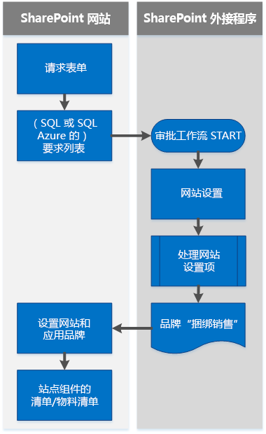


# SharePoint 2013 和 SharePoint Online 的品牌打造和网站设置解决方案
通过引入 Office 外接程序模型和 SharePoint 外接程序，提供了对 SharePoint 网站现有的既定品牌打造和网站设置方式的替代解决方案。

 **上次修改时间：** 2015年8月12日

 _ **适用范围：** Office 365?| SharePoint 2013?| SharePoint Add-ins?| SharePoint Online_

 **注释**  名称"SharePoint 相关应用程序"将更改为"SharePoint 外接程序"。在转换期间，某些 SharePoint 产品和 Visual Studio 工具的文档和 UI 仍可能使用术语"SharePoint 相关应用程序"。有关详细信息，请参阅 [Office 和 SharePoint 相关应用程序的新名称](05b07b04-6c8b-4b7e-bd86-e32c589dfead.md#bk_newname)。

到目前为止，您可能已使用 SharePoint 功能框架、网站模板、Web 模板和网站定义来设置网站和网站集。远程设置模式显示了如何创建自定义 SharePoint 外接程序，这些应用程序可设置网站品牌打造并执行其他网站设置任务。
本节中的文章提供了关于使用 SharePoint 外接程序设置和管理网站品牌打造的信息，该模式有时称为远程设置。

 **注释**  您可以使用 [Office 365 开发人员模式和做法](https://github.com/OfficeDev/PnP)项目为这些示例 [做出贡献](https://github.com/OfficeDev/PnP/wiki/contributing-to-Office-365-developer-patterns-and-practices)。您还可以使用 GitHub 上的 [指导项目](https://github.com/OfficeDev/PnP-Guidance)对这些文章做出贡献。有关示例的完整列表，请参阅 [模式和做法开发人员中心](http://dev.office.com/patterns-and-practices)。 

## 您需要了解的 SharePoint 相关信息

要使用 SharePoint 中的品牌打造和网站设置功能，您需要熟悉以下内容：

- SharePoint 的关键术语和概念。
    
- SharePoint 结构元素的层次结构。
    
- SharePoint 网站的类型以及使用各个类型的原因。
    
- 文件系统和内容数据库，以及它们如何协同工作。
    
- 文件自定义状态及其对升级的长期影响。
    
- SharePoint 外接程序。
    
- 使用 .NET 客户端对象模型 (CSOM) 和 REST API 的 SharePoint 中的客户端编程。
    

## SharePoint 的关键术语和概念

下表列出了开始在远程设置模式中使用 SharePoint 网站设置和品牌打造时需要了解的有用术语和概念。

 **SharePoint 术语和概念**

|**术语或概念**|**说明**|**有关详细信息**|
|:-----|:-----|:-----|
|SharePoint 外接程序|通过 Office 外接程序模型与常用 Web 标准和技术集成，以扩展 SharePoint 网站的功能的轻型 Web 应用程序。|[SharePoint 外接程序](http://msdn.microsoft.com/library/cd1eda9e-8e54-4223-93a9-a6ea0d18df70%28Office.15%29.aspx)|
|外接程序 web|从中部署外接程序的网站。|[SharePoint 2013 中的主机 Web、外接程序 Web 和 SharePoint 组件](http://msdn.microsoft.com/library/b791cdf5-8aa2-47fa-bc4c-aee437354759%28Office.15%29.aspx)|
|审批工作流|特定于发布网站的工作流，其中指定了由谁审批页面的发布以及何时发布。|[SharePoint 2013 审批工作流](http://blogs.msdn.com/b/thirusrinivasan1/archive/2013/10/31/sharepoint-2013-workflow-calling-a-wcf-service.aspx), [SharePoint 2013 中的工作流入门](http://msdn.microsoft.com/library/a2643cd7-474d-4e4c-85bb-00f0b6685a1d%28Office.15%29.aspx)|
|ClientContext|在所有 SharePoint CSOM 和 JSOM 操作中占据核心地位的中心对象。|[T:Microsoft.SharePoint.Client.ClientContext](https://msdn.microsoft.com/zh-cn/library/office/microsoft.sharepoint.client.clientcontext.aspx)|
|云外接程序模型|SharePoint 外接程序为自包含功能，它们可扩展 SharePoint website. 网站的功能。您可以使用云外接程序模型创作和交付安全、可靠、灵活且一致的 SharePoint 外接程序。|[SharePoint 外接程序](http://msdn.microsoft.com/library/cd1eda9e-8e54-4223-93a9-a6ea0d18df70%28Office.15%29.aspx)|
|内容数据库|内容数据库存储网站集的所有内容，包括：
<ul xmlns:xlink="http://www.w3.org/1999/xlink" xmlns:mtps="http://msdn2.microsoft.com/mtps" xmlns:mshelp="http://msdn.microsoft.com/mshelp" xmlns:ddue="http://ddue.schemas.microsoft.com/authoring/2003/5" xmlns:msxsl="urn:schemas-microsoft-com:xslt"><li>
文档库中的网站文档和文件
</li><li>
列表数据
</li><li>
Web 部件属性
</li><li>
用户名和权限
</li></ul>|[数据库类型和说明](https://technet.microsoft.com/zh-cn/library/cc678868.aspx)|
|CSOM|客户端对象模型。用于使用 .NET Framework 编写 SharePoint 的客户端代码的模型。|[在 SharePoint 2013 中使用具有外部数据的客户端对象模型入门](http://msdn.microsoft.com/library/8ed91929-fdb6-4fde-ba2a-7942870575f3%28Office.15%29.aspx)[[MS-CSOM]：SharePoint 客户端查询协议](https://msdn.microsoft.com/zh-cn/library/dd912094%28v=office.15%29.aspx)[SharePoint 2013 .NET 服务器、CSOM、JSOM 和 REST API 索引](http://msdn.microsoft.com/library/fddbb75f-9f6c-46d3-8d95-1d4a5e791dfa%28Office.15%29.aspx)|
|配置单元|SharePoint 物理文件；文件系统中的文件。这些文件与存储在内容数据库中的内容有所不同。下面是配置单元的位置。 `%program files%/Common Files/Microsoft Shared/Web Server Extensions/15/`||
|主机 Web|在其中安装外接程序的网站。|[SharePoint 2013 中的主机 Web、外接程序 Web 和 SharePoint 组件](http://msdn.microsoft.com/library/b791cdf5-8aa2-47fa-bc4c-aee437354759%28Office.15%29.aspx)|
|OneDrive for Business|用于存储和组织可在您的组织内共享的工作文档的个人库。|[OneDrive for Business 与 OneDrive 有所不同](https://support.office.microsoft.com/zh-cn/article/What-is-OneDrive-for-Business-187f90af-056f-47c0-9656-cc0ddca7fdc2?CorrelationId=2ac1e496-1807-483a-a39f-c1a460efc7af&amp;ui=en-US&amp;rs=en-US&amp;ad=US#differences)[OneDrive for Business 与工作组网站有所不同](https://support.office.microsoft.com/zh-cn/article/Should-I-save-my-documents-to-OneDrive-for-Business-or-a-team-site-d18d21a0-1f9f-4f6c-ac45-d52afa0a4a2e?CTT=5&amp;origin=HA102822076&amp;CorrelationId=e3a0512c-ab5f-4ae7-a58f-e33878242936&amp;ui=en-US&amp;rs=en-US&amp;ad=US)|
|远程设置|在提供程序托管的外接程序中，使用在 SharePoint 外部运行的模板和代码设置的模型。|[SharePoint 2013 中的网站设置技术和远程设置](http://blogs.msdn.com/b/vesku/archive/2013/08/23/site-provisioning-techniques-and-remote-provisioning-in-sharepoint-2013.aspx)[使用 SharePoint 外接程序 2013 的自助服务网站设置](http://blogs.msdn.com/b/richard_dizeregas_blog/archive/2013/04/04/self-service-site-provisioning-using-apps-for-sharepoint-2013.aspx)|
|REST| 无状态的体系结构样式，提取体系结构元素并使用 HTTP 谓词从包含 XML 文件的网页读取服务和写入数据。|[使用 REST 接口设置列表的自定义权限](http://msdn.microsoft.com/library/d5fcc26c-4e44-404b-aacf-e9351af8cc7d%28Office.15%29.aspx)|
|根网站|网站集内的第一个网站。根网站有时也称为"Web 应用程序根"。 ||
|SharePoint Online|Office 365 中基于云的 SharePoint 产品。 |[SharePoint Online 常规参考](https://msdn.microsoft.com/zh-cn/library/office/gg271151%28v=office.14%29.aspx#sectionSection0)|
|网站|一组共享相同所有者和管理设置（如权限）的网站。|[T:Microsoft.SharePoint.Client.Web](https://msdn.microsoft.com/zh-cn/library/office/microsoft.sharepoint.client.web.aspx)|
|网站集|一组共享相同所有者和管理设置（如权限）的网站。|[在 SharePoint 2013 中创建网站集](https://technet.microsoft.com/zh-cn/library/cc263094.aspx)|
|网站设置|为网站设置功能、结构、品牌和其他功能的过程。|[SharePoint 2013 中的网站设置技术和远程设置](http://blogs.msdn.com/b/vesku/archive/2013/08/23/site-provisioning-techniques-and-remote-provisioning-in-sharepoint-2013.aspx)[使用 SharePoint 外接程序 2013 的自助服务网站设置](http://blogs.msdn.com/b/richard_dizeregas_blog/archive/2013/04/04/self-service-site-provisioning-using-apps-for-sharepoint-2013.aspx)|
|子网站|SharePoint 网站集中的单个 SharePoint 网站。子网站可以从父网站继承导航和权限，也可以具有独有的权限和导航。您可以创建基于根网站集的子网站，也可以创建基于其他网站集的网站。您可以选择从网站集继承权限或为子网站指定独有的权限。||

## SharePoint 结构元素的层次结构

从概念上说，SharePoint 对象的层次结构表示为容器：对象类型和层次结构类型包含层次结构中其下方的所有对象类型。表 2 列出了 SharePoint 结构元素的层次结构。

 **表 2. SharePoint 结构元素**

|**对象类型（按层次结构顺序）**|**说明**|
|:-----|:-----|
|Web 应用程序|服务器上对浏览器请求做出响应的应用程序。Web 应用程序是 Internet 信息服务 (IIS) 的中心结构。 在 SharePoint 中，Web 应用程序是具有独有 URL 且有一个单独的内容数据库存储在 SQL Server 中的网站。|
|网站集|定义权限且可以根据配置为容器中的所有网站定义品牌打造某些方面的网站的容器。|
|站点|通常围绕某个中心主题组织的列表、库、结构、导航和外观元素的集合。 属于相同网站集中其他网站的子项的网站有时称为子网站。子网站是存储在父网站子文件夹中的网站。子网站可以从其父网站继承权限和导航结构，也可能具有独有的管理和创作权限。子网站可能具有子子网站。|
|外接程序、列表和文档库|组织到特定结构的内容和数据的容器。 母版页样式库 SharePoint 2010 发布网站中的特殊文档库，其中默认存储了所有品牌元素，包括模板页、页面布局、JavaScript 文件、CSS 和图像。每个网站都有自己的模板页样式库。 在工作组网站中，模板页来自网站，而不是网站集。|
|项目|外接程序、列表和文档库中包含的各部分内容或数据。|

## SharePoint 外接程序

SharePoint 外接程序是未安装在 SharePoint 主机服务器上的轻量级解决方案，这意味着他们不会对主机服务器发出太多 API 调用。您可以使用云外接程序模型构建 SharePoint 外接程序。用户可以从 Office 应用商店或从企业的外接程序目录发现和下载外接程序。有关详细信息，请参阅 [SharePoint 外接程序](http://msdn.microsoft.com/library/cd1eda9e-8e54-4223-93a9-a6ea0d18df70%28Office.15%29.aspx)。 

## 文件系统和内容数据库，以及它们如何协同工作

要了解您的品牌打造选项以及网站自定义对升级和迁移的含义，您需要了解 SharePoint 文件系统和内容数据库。

### 文件系统

SharePoint 将文件存储在文件系统 ("hive") 中。在 SharePoint 2013 中，此位置称为"15-hive"。下面是 15-hive 的路径。 

 `%program files%/Common Files/Microsoft Shared/Web Server Extensions/15/`

15-hive 包括多个子文件夹，其中存储了您在打造网站品牌和设置网站时将要使用的文件。

### 内容数据库

内容数据库存储 SharePoint 内容对象，如网站集。当您部署 SharePoint 2013 时，将为每个网站集自动安装内容数据库。网站集的所有内容存储在一台服务器上的一个内容数据库中。但是，内容数据库可与多个网站集关联，您可以将内容数据库连接到 SharePoint Web 应用程序。您可能需要将内容从一个内容数据库移动到另一个，例如，当内容大小即将超过内容数据库的大小时。

内容数据库的某些特征因网站集的使用方式而异。例如，网站通常为写入密集，而其他类型的内容（如只读文档）为读取密集。内容的使用方式影响着内容数据库的各个方面，例如大小和性能。 

## 文件自定义状态及其对升级的影响

SharePoint 文件和内容的状态会影响其应用更新，并控制 SharePoint 是否提供内容数据库或文件系统中的文件。默认情况下，所有 SharePoint 文件均取消自定义并已制作幻像，且在 SharePoint 文件系统和内容数据库中位于匹配的状态。当文件和/或内容数据库条目以特定方式使用或更改时，内容的状态的可能会受影响。

 **表 3. 文件和内容状态**

|**文件或内容状态**|**定义**|**注释**|
|:-----|:-----|:-----|
|未自定义|与文件关联的一个属性，指示其尚未修改。|文件的多个副本可能指向相同的源。这样设计程序可以更轻松地实施更改。|
|自定义|与文件关联的一个属性，指示其已修改。|文件经过自定义后，要应用广泛的更新将更加困难。谨慎执行自定义。通常，使用默认的 SharePoint 文件和功能比自定义系统文件或引入需要手动更新的自定义更好。|
|已制作幻像|源存储在内容数据库外部的文件。|内容数据库中的指针（文件幻象）仍然存在，告知 SharePoint 在服务器的文件系统上查找文件源。|
|取消制作幻象|内容数据库中存在源文件的非自定义版本。|示例：SharePoint 2013 设计管理器创建了一个沙盒解决方案以打包品牌文件。它绝对不会添加到服务器的文件系统，因此根据定义，其文件视为已制作幻象。但是，它部署的文件仍处于未自定义状态。 |

 **注释**  如果某个文件已自定义，则在您安装新服务包或更新 SharePoint Online 服务时不会更新该文件。

## 使用云外接程序模型进行网站品牌打造和设置

在 SharePoint 2013 中，您可以使用 SharePoint 外接程序中的自定义 CSOM 代码来设置具有网站元素的 SharePoint 网站集、网站和子网站。此网站设置模式称为远程设置。SharePoint 越来越着重于基于云的部署，因此我们创建了此模式以帮助您使用 SharePoint 的现成功能，以一种可降低复杂度和长期运营成本的方式设置网站品牌打造。

### 云外接程序模型有何作用？

有时，完全信任模式和云外接程序模型的功能之间没有任何关联。基于 SharePoint 外接程序和云外接程序模型开发自定义项时，请考虑使用替代方法，而非直接转换，并尽量简化自定义项。下面是一些示例：

- 将事件接收器替换为远程事件接收器（请参阅 [在 SharePoint 外接程序中创建远程事件接收器](http://msdn.microsoft.com/library/628c6103-52f9-4d85-9464-4a6862b36640%28Office.15%29.aspx)）。
    
- 将网站模板、Web 模板和网站定义替换为远程设置。这对子网站和网站集均适用。
    
- 将计时器作业替换为 Microsoft Azure 或内部部署 [辅助角色](https://msdn.microsoft.com/library/azure/jj149831.aspx)。
    
有些东西不能使用云外接程序模型构建，例如 HTTP 模块和 HTTP 处理程序。在您尝试复制云外接程序模型中的现有自定义项之前，首先考虑为什么构建这些自定义项，以及现成 SharePoint 功能是否能正常运行。

### 远程设置模式

远程设置使用新的外接程序模式将设置逻辑完全移到 SharePoint 服务器场以外。此方法消除了在 SharePoint 服务器场中使用功能框架或其他自定义项的需要，而使您能够控制 SharePoint 外部的自定义项。通过此方法，在不影响 SharePoint 可用性的前提下更新和更改设置引擎成为可能。有关功能框架的详细信息，请参阅 [网站定义和设置：功能框架](https://msdn.microsoft.com/zh-cn/library/ms454453%28v=office.12%29.aspx)。此部分详细介绍了远程设置模式的各个方面和实施。您会发现，首先阅读有关模式的下列介绍文章将非常有用：

- [使用 SharePoint 外接程序 2013 的自助服务网站设置](http://blogs.msdn.com/b/richard_dizeregas_blog/archive/2013/04/04/self-service-site-provisioning-using-apps-for-sharepoint-2013.aspx)
    
- [SharePoint 2013 网站设置技术视频录像](http://blogs.msdn.com/b/vesku/archive/2013/09/09/sharepoint-2013-site-provisioning-techniques-presentation-video-recording.aspx)
    
- [为什么引入 SharePoint 外接程序模式？](http://blogs.msdn.com/b/vesku/archive/2013/09/06/introduction-to-sp-apps-or-cam.aspx)
    
在远程设置模式最简单的实施中，设置要求存储在 SQL Server 或 SQL Azure 数据库或 XML 文件中，然后 SharePoint 外接程序 将从数据源读取要求，从源位置读取品牌元素，并根据设置要求将品牌元素应用到目标网站。

品牌打造和设置代码示例遵循此事件顺序，以显示远程设置模式。

 **表 4. 基本远程设置顺序和相关示例**

|**步骤**|**说明**|**示例**|**文章**|
|:-----|:-----|:-----|:-----|
|1|用户请求通过表单对网站进行更改，这将启动审批工作流。 用户通过请求表单提交的数据使用任何可能的数据存储格式（SQL、SQL Azure、XML）存储。|[Provisioning.Cloud.Workflow.AppWeb ](https://github.com/OfficeDev/PnP/tree/dev/Samples/Provisioning.Cloud.Workflow.AppWeb)|[SharePoint 网站设置解决方案](sharepoint-site-provisioning-solutions.md)|
|2|如果工作流得到审批，SharePoint 外接程序 将调用存储的数据并根据用户在步骤 1 中提交的元数据设置网站。|[Provisioning.Batch](https://github.com/OfficeDev/PnP/tree/dev/Samples/Provisioning.Batch)[Provisioning.Cloud.Workflow.AppWeb ](https://github.com/OfficeDev/PnP/tree/dev/Samples/Provisioning.Cloud.Workflow.AppWeb)[Provisioning.OnPrem.Async ](https://github.com/OfficeDev/PnP/tree/master/Samples/Provisioning.OnPrem.Async)[Provisioning.SiteCol.OnPrem](https://github.com/OfficeDev/PnP/tree/master/Samples/Provisioning.SiteCol.OnPrem)|[SharePoint 网站设置解决方案](sharepoint-site-provisioning-solutions.md)|
|3|SharePoint 外接程序 将设置范围限定为请求表单中的指示，方法是使用外接程序 Web 和内容数据库中提供的数据。在此阶段中，将为网站设置适用的品牌元素。|[Branding.AlternateCSSAndSiteLogo ](https://github.com/OfficeDev/PnP/tree/master/Samples/Branding.AlternateCSSAndSiteLogo)[Branding.Themes](https://github.com/Lauragra/PnP/tree/master/Scenarios/Branding.Themes)[OD4B.Configuration.Async ](https://github.com/OfficeDev/PnP/tree/master/Solutions/OD4B.Configuration.Async)[Provisioning.Pages](https://github.com/OfficeDev/PnP/tree/master/Scenarios/Provisioning.Pages)|[SharePoint 页面和页面模型](SharePoint-pages-and-the-page-model.md)[SharePoint 网站品牌和页面自定义解决方案](SharePoint-site-branding-and-page-customization-solutions.md)[SharePoint 网站设置解决方案](sharepoint-site-provisioning-solutions.md)|

 **注释**  表 4 列出了可能是典型的远程设置方案的步骤。您使用的示例取决于最适合您的企业的方法。例如，如果您没有创建自定义审批工作流的业务需求，则您不需要使用该示例。 

**图 1. 使用远程设置模式的网站设置和品牌打造工作流的示例**

### 远程设置对已存在的网站内容有何影响

根据您想设置的特定网站元素，您的代码将会覆盖与远程设置 SharePoint 外接程序 有关的默认或已存在的网站内容。此外接程序将根据数据库中存储的设置要求选择网站模板和其他功能，而根本无需配置 SharePoint。

基本远程设置模式均相同，不论其他要求如何。但是，当您计划使用此模式来设置网站品牌打造时，请在 SharePoint CSOM、JSOM 和 REST API 提供的自定义功能背景下制定您的品牌发展策略（本节描述的代码示例使用 CSOM）。此外还需考虑以下事项： 

- 网站体系结构。您构建的是面向 Internet 的网站、Intranet 网站，还是要求授权用户通过面向 Internet 的网站登录才能访问公司数据的 Extranet 网站？
    
- 特定用户必须定义和请求设置要求的控制程度。用户是否应该能够使用表单指定自定义设置选项？更改是自动应用到网站，还是仅在具有决策权的用户审批更改后应用，抑或是由治理策略进行管理？
    
- 您想应用的品牌打造自定义项的类型（结构和/或外观）
    

## 品牌打造和网站设置代码示例

本节中所述的代码示例显示了核心方案，并对其进行扩展以覆盖一些更具体的用例。本节中的文章还包括一些代码示例。下列表格列出并说明了这些示例。

 **表 5. 网站设置示例**

|**示例**|**说明**|**相关文章**|
|:-----|:-----|:-----|
|[Provisioning.Batch](https://github.com/OfficeDev/PnP/tree/dev/Samples/Provisioning.Batch)|在控制台外接程序中设置网站集。|[SharePoint 网站设置解决方案](sharepoint-site-provisioning-solutions.md)|
|[Provisioning.Pages](https://github.com/OfficeDev/PnP/tree/master/Scenarios/Provisioning.Pages)|说明如何使用远程设置模型来设置 Wiki 页面，以及如何从 Wiki 页面添加远程 Web 部件和 HTML。|[SharePoint 页面和页面模型](SharePoint-pages-and-the-page-model.md)|
|[Provisioning.Cloud.Workflow.AppWeb ](https://github.com/OfficeDev/PnP/tree/dev/Samples/Provisioning.Cloud.Workflow.AppWeb)|在主机 Web 和远程事件接收器上使用工作流设置网站集。|[SharePoint 网站设置解决方案](sharepoint-site-provisioning-solutions.md)|
|[Provisioning.Cloud.Workflow.AppWeb ](https://github.com/OfficeDev/PnP/tree/dev/Samples/Provisioning.Cloud.Workflow.AppWeb)|在外接程序 Web 和远程事件接收器上使用工作流设置网站集。|[SharePoint 网站设置解决方案](sharepoint-site-provisioning-solutions.md)|

 **注释**  BatchProvisioning、SiteProvisioningWorkflow 和 SiteProvisioningWorkflowAppWeb 示例演示了远程设置模式的核心概念和功能。ProvisionWikiPages 示例针对一个特定的用例（Wiki 页面设置）。

 **表 6. 品牌打造示例**

|**示例**|**说明**|**相关文章**|
|:-----|:-----|:-----|
|[Branding.Theme](https://github.com/OfficeDev/PnP/tree/master/Scenarios/Branding.Themes)|显示如何应用主题 (CSOM)。|[SharePoint 网站品牌和页面自定义解决方案](SharePoint-site-branding-and-page-customization-solutions.md)|
|[OD4B.Configuration.Async](https://github.com/OfficeDev/PnP/tree/master/Solutions/OD4B.Configuration.Async)|说明如何使用远程设置模型来设置 Wiki 页面，以及如何从 Wiki 页面添加远程 Web 部件和 HTML。|[SharePoint 网站品牌和页面自定义解决方案](SharePoint-site-branding-and-page-customization-solutions.md)|
|[Branding.AlternateCSSAndSiteLogo ](https://github.com/OfficeDev/PnP/tree/master/Samples/Branding.AlternateCSSAndSiteLogo)|说明如何使用用户自定义操作和嵌入式 JavaScript (CSOM) 来设置主机网站的自定义 CSS。|[SharePoint 网站品牌和页面自定义解决方案](SharePoint-site-branding-and-page-customization-solutions.md)|
|[Provisioning.OnPrem.Async](https://github.com/OfficeDev/PnP/tree/master/Samples/Provisioning.OnPrem.Async)[Provisioning.SiteCol.OnPrem](https://github.com/OfficeDev/PnP/tree/master/Samples/Provisioning.SiteCol.OnPrem)|说明如何使用服务将 SharePoint 主机 Web 中的所有信息封装在外接程序 Web 中，如何获取指定 Web 应用程序中的网站集列表，以及如何使用特定的 ContentTypeId 创建内容类型。如果您想使用远程设置模式来设置使用 SharePoint 外接程序的网站，但完成方案所需的 CSOM 成员在 CSOM 中尚未提供，此示例将尤其有用。 |[SharePoint 网站设置解决方案](sharepoint-site-provisioning-solutions.md)|

## SharePoint 品牌打造工作流

SharePoint 网站品牌打造与其他网站的品牌打造非常相似。您使用熟悉的 Web 技术（如 HTML、CSS 和 JavaScript）构建网站结构、外观和自定义行为。SharePoint 也基于 ASP.NET，并使用与 ASP.NET 母版页/页面布局模型非常相似的页面模型。页面模型涵盖结构，并提供应用外观元素时的关联和逻辑。

SharePoint 提供了多个 Web 部件，您可以使用这些 Web 部件将数据视图、图像、脚本、搜索结果等内容集成到网站设计中。组合外观使用户可以轻松地自定义网站的外观，同时增强设计人员和 IT 部门对设计细节和可用外观选项的控制力度，主题引擎和自定义 CSS 功能都为高级品牌打造自定义打开了大门。 

SharePoint 网站的品牌设计和开发工作流与业内用于以下方面的设计工作流非常相似：

- 规划网站体系结构和设计。
    
- 使用熟悉的 Web 设计工具和技术来创建设计资产。
    
- 使用设计管理器等 SharePoint 工具构建网站。
    
- 打包网站设计，使用 SharePoint 外接程序和远程设置模式设置网站品牌。
    

 **注释**  在 SharePoint 中应用品牌打造意味着修改默认 SharePoint 网站的外观。这可能包括对网站的外观进行结构和表面化更改。

### 品牌打造成本和复杂性

品牌更改包括从低成本的简单更改到高成本的复杂更改。通过 UI，用户可以应用组合外观，其中包括背景图像、调色板、字体、与这些元素相关的母版页以及与母版页相关的预览文件。您可以使用 SharePoint 2013 主题引擎创建您自己的主题，并且可以创建自定义 CSS 以修改网站外观。 

 **重要信息**  虽然在品牌打造项目中可以创建自定义母版页和其他结构元素，支持的结构自定义的长期成本可能很高，并且可能使得您的组织在应用升级和支持自定义短期投资的长期适用性方面成本高昂。

### 为在内部部署或专用服务器场上承载的 SharePoint 网站进行品牌打造

您可以在网站集和子网站级别，使用远程设置模式为工作组网站、发布网站和在内部部署或专用服务器场上承载的 OneDrive for Business 网站进行品牌打造。 

### SharePoint Online

在规划 SharePoint 品牌打造项目时，需确定要构建、打造和设置的网站类型。SharePoint Online 许可会影响发布网站功能对您是否可用。所有许可证均允许您至少指定一个具有 SharePoint 服务器发布网站部分功能的公共网站，但并非所有许可证均提供完整的发布网站功能。

 **表 7. SharePoint Online 中的网站选项**

|**Office 365 版本**|**工作组网站**|**公共网站**|**发布网站**|**注释**|
|:-----|:-----|:-----|:-----|:-----|
|小型企业版|是|是|否|包括一个工作组网站和一个公共网站。不包括发布网站功能。公共网站功能以满足小型企业需求为设计理念。|
|企业版|是|否|是|对于不包括发布的域，包括根 Web 应用程序的工作组网站集，您可以在根 Web 应用程序下创建新的发布网站集。 |
有关详细信息，请参阅 [选择 Office 365 企业版计划](https://products.office.com/zh-cn/business/compare-office-365-for-business-plans?legRedir=true&amp;CorrelationId=b633601e-1b0f-46cf-a4f8-1bfa8645376e)和 [模型：SharePoint 2013 中的设计和品牌打造](http://www.microsoft.com/en-us/download/details.aspx?id=30715)。

## 何时应自定义？

满足您业务需求所需的大多数功能均在 SharePoint 中现成提供。因此，在创建自定义项之前，请确定是否存在创建自定义项的实际业务案例，以及创建和支持此自定义项对企业的长期成本是多少。功能以什么方式提供给最终用户？在考虑技术之前，请先考虑业务目标和用户体验。

使用现有的自定义 SharePoint 解决方案并权衡是否以及如何迁移到云外接程序模型时，请首先了解为何执行自定义及其目的。 

考虑将现有自定义项从完全信任代码迁移到云外接程序模型时，这通常不是功能之间的一对一关系。您可以考虑采用替代方法，而非尝试发现服务器端代码和客户端代码之间的一对一匹配。表 8 将 SharePoint 解决方案的一些常用概念和功能映射到 SharePoint 外接程序中的同等项。

 **表 8. 将 SharePoint 概念映射到外接程序**

|**任务**|**在 SharePoint 解决方案中**|**在 SharePoint 外接程序中**|**指南**|
|:-----|:-----|:-----|:-----|
|显示 SharePoint 页面中的信息|Web 部件|外接程序部件|Web 部件使用用户权限或完全权限/提升的权限在 SharePoint Server 上运行。外接程序部件使用专门授权的权限在浏览器中或在外部服务器上运行。它们在自己的域中的客户端上完全隔离。外接程序部件在 SharePoint 外部执行，且对 SharePoint Server 没有任何性能影响。 [创建外接程序部件以安装 SharePoint 外接程序](http://msdn.microsoft.com/library/a2664289-6c56-4cb1-987a-22367fad55eb%28Office.15%29.aspx)|
|创建和管理通知|事件接收器和功能接收器|远程事件接收器和外接程序事件接收器|事件接收器和功能接收器需要服务器端代码，并且无法向外部系统通知事件。远程事件接收器使用客户端代码，可用于 SharePoint 解决方案或 SharePoint 外接程序，并且可以向外部系统通知事件。外接程序事件接收器在安装、卸载或升级外接程序时执行代码。 [处理 SharePoint 外接程序中的事件](http://msdn.microsoft.com/library/c050d056-8548-4496-a053-016779d723d9%28Office.15%29.aspx)|
|访问数据| .NET 服务器对象模型 (SSOM), .NET 客户端对象模型 (CSOM) 和 OData|.NET 客户端对象模型 (CSOM, JSOM)、OData、REST、跨域库|[使用 SharePoint 2013 客户端库代码完成基本操作](http://msdn.microsoft.com/library/5a69c9e3-73bf-4ed5-bc19-182056bdb394%28Office.15%29.aspx)[使用 SharePoint 2013 中的 JavaScript 库代码完成基本操作](http://msdn.microsoft.com/library/29089af8-dbc0-49b7-a1a0-9e311f49c826%28Office.15%29.aspx)[了解 SharePoint 2013 REST 服务](http://msdn.microsoft.com/library/2de035a0-ac75-43bd-9665-5c5a59c4c590%28Office.15%29.aspx)[REST API 引用和示例](http://msdn.microsoft.com/library/02128c70-9d27-4388-9374-a11bce68fdb8%28Office.15%29.aspx)|
|打包和部署|解决方案包（WSP、功能包）|外接程序目录和 Office 应用商店|解决方案包很难跨 SharePoint 服务器场部署。如果您希望公开提供或销售 SharePoint 外接程序，您可以将其发布到 Office 应用商店。 使用外接程序目录在您的组织内提供 SharePoint 外接程序。解决方案包中的指南和代码示例演示了如何使用 SharePoint 外接程序将品牌元素设置到 SharePoint 网站。 [在 Office 365 上设置外接程序目录](http://msdn.microsoft.com/library/1d50a571-6e02-4bc0-a3d6-6ef1eca3c2ce%28Office.15%29.aspx)[在 SharePoint 上设置外接程序目录](http://msdn.microsoft.com/library/fddbdb6c-250e-411c-9de4-4b6d874fc096%28Office.15%29.aspx)[将 Office 与 SharePoint 外接程序和 Office 365 Web 应用提交到 Office 应用商店](http://msdn.microsoft.com/library/ff075782-1303-4517-91cc-b3d730e9b9ae%28Office.15%29.aspx)[为开发和托管 SharePoint 外接程序选择模式](http://msdn.microsoft.com/library/05ce5435-0a03-4ddc-976b-c33b08d03457%28Office.15%29.aspx)|
|使用外部数据|外部内容类型|外接程序范围的外部内容类型|SharePoint 网站管理员或 SharePoint Designer 用户必须创建和/或安装只能在服务器场级别安装的外部内容类型。外接程序范围的外部内容类型仅适用于针对其创建的 SharePoint 外接程序 ，无需管理，并且可以访问 OData 源。 [SharePoint 2013 中外接程序范围的外部内容类型](http://msdn.microsoft.com/library/a34cbbba-dc38-4d3d-b796-d54b5848bdfb%28Office.15%29.aspx)[如何：在 SharePoint 2013 中从 OData 源创建外部内容类型](http://msdn.microsoft.com/library/bc60ea49-c44e-4531-af62-06b8cf77d35d%28Office.15%29.aspx)|
|添加自定义页和母版页|应用程序页和网站页面|Web 托管的页面|应用程序页面在服务器上的所有网站之间共享，并在 SharePoint 上托管。网站页面由 SharePoint 托管，并且要求页面控件属于安全控件列表。应用程序页面是自定义代码的理想选择，但网站页面上的自定义代码在进行自定义设置后可能会被破坏。 相反，应使用 Web 托管的页面。Web 托管的页面设计为可自定义，支持在网站页面上使用内置 Web 部件，可在外部托管，且在外接程序安装的任何位置均可用。|

## 本节内容

- [SharePoint 页面和页面模型](SharePoint-pages-and-the-page-model.md)
    
- [SharePoint 开发和设计工具及实践](SharePoint-development-and-design-tools-and-practices.md)
    
- [SharePoint 网站品牌和页面自定义解决方案](SharePoint-site-branding-and-page-customization-solutions.md)
    
- [SharePoint 网站设置解决方案](sharepoint-site-provisioning-solutions.md)
    
- [SharePoint 元数据、 网站导航和发布网站功能](sharepoint-metadata-site-navigation-and-publishing-site-features.md)
    
- [SharePoint 2013 和 SharePoint Online 中的 UX 组件](ux-components-in-sharepoint-2013-and-sharepoint-online.md)
    

## 其他资源

- [Office 365 开发模式和做法解决方案指南](Office-365-development-patterns-and-practices-solution-guidance.md)
    
- [模式和做法开发人员中心](http://dev.office.com/patterns-and-practices)
    
