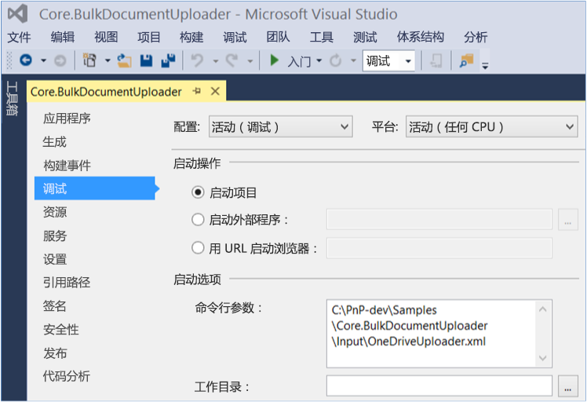


# 批量上载文档示例 SharePoint 外接程序
作为企业内容管理 (ECM) 策略的一部分，您可以将文档批量上载到 SharePoint 文档库，包括 OneDrive for Business。

 **上次修改时间：** 2015年8月7日

 _ **适用范围：** SharePoint 2013?| SharePoint Add-ins?| SharePoint Online_

 **注释**  名称"SharePoint 相关应用程序"将更改为"SharePoint 外接程序"。在转换期间，某些 SharePoint 产品和 Visual Studio 工具的文档和 UI 仍可能使用术语"SharePoint 相关应用程序"。有关详细信息，请参阅 [Office 和 SharePoint 相关应用程序的新名称](05b07b04-6c8b-4b7e-bd86-e32c589dfead.md#bk_newname)。

[Core.BulkDocumentUploader](https://github.com/OfficeDev/PnP/tree/master/Samples/Core.BulkDocumentUploader) 示例显示如何使用 REST API 将文档上载到 SharePoint 文档库，包括 OneDrive for Business。

 **注释**  此示例将一个文件上载到文档库。若要上载多个文件，您需要扩展此示例。

此外接程序使用一个控制台应用程序，以使用 REST API 调用上载文件。配置设置在 XML 和 CSV 文件中指定。如果需要执行以下操作，请使用此解决方案：

- 将文件上载到 SharePoint Online。
    
- 迁移到 Office 365 并使用自定义迁移工具移动文件。
    
 **为此内容做出贡献**
您可以获取最新的更新，或为改进 [GitHub 上的此文章](https://github.com/OfficeDev/PnP-Guidance/blob/master/articles/Bulk-upload-documents-sample-app-for-SharePoint.md)做贡献。您还可以为改进本示例以及 [GitHub 上的其他示例](https://github.com/OfficeDev/PnP)做贡献。有关示例的完整列表，请参阅 [模式和做法开发人员中心](http://dev.office.com/patterns-and-practices)。我们欢迎您做出 [贡献](https://github.com/OfficeDev/PnP/wiki/contributing-to-Office-365-developer-patterns-and-practices)。 

## 开始之前

若要开始，请从 GitHub 上的 [Office 365 开发人员模式和做法](https://github.com/OfficeDev/PnP/tree/dev)项目下载 [Core.BulkDocumentUploader](https://github.com/OfficeDev/PnP/tree/master/Samples/Core.BulkDocumentUploader) 示例外接程序。

在运行代码示例之前，请执行以下操作：


1. 使用下列信息编辑 OneDriveUploader.xml 文件：
    
      - 您要在其中保存您的文本和 CSV 日志文件的位置。
    
  - CSV 映射文件的文件路径（例如 C:\PnP\Samples\Core.BulkDocumentUploader\Input\SharePointSites.csv）。
    
  - 要上载的公司策略文件的位置（例如 C:\PnP\Samples\Core.BulkDocumentUploader\Input\OneDriveFiles）。
    
  - 您的 SharePoint Online 凭据。
    
  - 要执行的文档操作（上载或删除）。
    
  - 文件上载到文档库之后应用于文件的新文件名（例如 COMPANY POLICY DOCUMENT.xlsx）。
    
2. 在 SharePointSites.csv 映射文件中，列出要将文件上载到的文档库 URL 以及要上载的公司策略文件的名称。 
    
3. 添加 OneDriveUploader.xml 文件的文件路径作为命令行参数。要执行此操作，请在解决方案资源管理器中打开 Core.BulkDocumentUploader 项目属性，然后选择"属性">"调试"，如图 1 中所示。
    
    **图 1. 在项目属性中设置 OneDriveUploader.xml 作为命令行参数**

    


## 使用 Core.BulkDocumentUploader 示例外接程序

从 Program.cs 中的  **Main** 方法， **RecurseActions** 方法调用 OneDriveMapper.cs 中的 **Run** 方法。 **Run** 方法从 SharePointSites.csv 获取要上载的文件的位置，然后调用 **IterateCollection** 方法。


 **注释**  本文中的代码按原样提供，不提供任何明示或暗示的担保，包括对特定用途适用性、适销性或不侵权的默示担保。


```C#
public override void Run(BaseAction parentAction, DateTime CurrentTime, LogHelper logger)
        {
            CsvProcessor csvProcessor = new CsvProcessor();

            logger.LogVerbose(string.Format("Attempting to read mapping CSV file '{0}'", this.UserMappingCSVFile));

            using (StreamReader reader = new StreamReader(this.UserMappingCSVFile))
            {
                csvProcessor.Execute(reader, (entries, y) => { IterateCollection(entries, logger); }, logger);
            }
        }

```

SharePointSite.csv 文件列出要上载的文件以及要将该文件上载到的文档库。然后  **IterateCollection** 方法执行以下操作，将文件上载到文档库：


1. 获取要上载的文件。 
    
2. 确保用户有权限添加项目。
    
3. 创建具有身份验证 Cookie 的  **HttpWebRequest** 对象、上载文档的 REST 字符串请求以及 HTTP 请求操作方法。
    
4. 执行文件上载。
    

 **注释**  使用 OneDriveUploader.xml 中指定的  **FileUploadName** 值替代文件名。


```C#
public override void IterateCollection(Collection<string> entries, LogHelper logger)
        {
            Stopwatch IterationSW = new Stopwatch();
            IterationSW.Start();

            logger.LogVerbose(string.Format(CultureInfo.CurrentCulture, "Establishing context object to: '{0}'", entries[this.SiteIndex]));

            try
            {
                // Use the context of the current iteration URL for current user item.
                using (ClientContext context = new ClientContext(entries[this.SiteIndex]))
                {
                    using (SecureString password = new SecureString())
                    {
                        foreach (char c in this.Password.ToCharArray())
                        {
                            password.AppendChar(c);
                        }

                        context.Credentials = new SharePointOnlineCredentials(this.UserName, password);

                        // Get the file to upload from the directory.
                        FileInfo theFileToUpload = new FileInfo(Path.Combine(this.DirectoryLocation + "\\", entries[this.FileIndex] + ".xlsx"));

                        logger.LogVerbose(string.Format(CultureInfo.CurrentCulture, "Attempting to {0} file {1}", this.DocumentAction, theFileToUpload));

                        // Ensure that the account has permissions to access.
                        BasePermissions perm = new BasePermissions();
                        perm.Set(PermissionKind.AddListItems);

                        ConditionalScope scope = new ConditionalScope(context, () => context.Web.DoesUserHavePermissions(perm).Value);

                        using(scope.StartScope())
                        {
                            Stopwatch tempSW = new Stopwatch();
                            tempSW.Start();

                            int success = 0;

                            while(tempSW.Elapsed.TotalSeconds < 20)
                            {
                                var digest = context.GetFormDigestDirect();

                                string cookie = ((SharePointOnlineCredentials)context.Credentials).GetAuthenticationCookie(new Uri(entries[this.SiteIndex])).TrimStart("SPOIDCRL=".ToCharArray());

                                using (Stream s = theFileToUpload.OpenRead())
                                {
                                    // Define REST string request to upload document to context. This string specifies the Documents folder, but you can specify another document library.
                                    string theTargetUri = string.Format(CultureInfo.CurrentCulture, "{0}/_api/web/lists/getByTitle('Documents')/RootFolder/Files/add(url='{1}',overwrite='true')?", entries[this.SiteIndex], this.FileUploadName);

                                    // Define REST HTTP request object.
                                    HttpWebRequest SPORequest = (HttpWebRequest)HttpWebRequest.Create(theTargetUri);

                                    // Define HTTP request action method.
                                    if (this.DocumentAction == "Upload")
                                    {
                                        SPORequest.Method = "POST";
                                    }
                                    else if (this.DocumentAction == "Delete")
                                    {
                                        SPORequest.Method = "DELETE";
                                    }
                                    else
                                    {
                                        logger.LogVerbose(string.Format(CultureInfo.CurrentCulture, "There was a problem with the HTTP request in DocumentAction attribute of XML file"));
                                        throw new Exception("The HTTP Request operation is not supported, please check the value of DocumentAction in the XML file");
                                    }

                                    // Build out additional HTTP request details.
                                    SPORequest.Accept = "application/json;odata=verbose";
                                    SPORequest.Headers.Add("X-RequestDigest", digest.DigestValue);
                                    SPORequest.ContentLength = s.Length;
                                    SPORequest.ContentType = "application/octet-stream";

                                    // Handle authentication to context through cookie.
                                    SPORequest.CookieContainer = new CookieContainer();
                                    SPORequest.CookieContainer.Add(new Cookie("SPOIDCRL", cookie, string.Empty, new Uri(entries[this.SiteIndex]).Authority));

                                    // Perform file upload/deletion.
                                    using (Stream requestStream = SPORequest.GetRequestStream())
                                    {
                                        s.CopyTo(requestStream);
                                    }

                                    // Get HTTP response to determine success of operation.
                                    HttpWebResponse SPOResponse = (HttpWebResponse)SPORequest.GetResponse();

                                    logger.LogVerbose(string.Format(CultureInfo.CurrentCulture, "Successfully '{0}' file {1}", this.DocumentAction, theFileToUpload));
                                    logger.LogOutcome(entries[this.SiteIndex], "SUCCCESS");

                                    success = 1;

                                    // Dispose of the HTTP response.
                                    SPOResponse.Close();

                                    break;
                                }
                                                       
                            }

                            tempSW.Stop();

                            if (success != 1)
                            {
                                throw new Exception("The HTTP Request operation exceeded the timeout of 20 seconds");
                            }

                        }
                    }
                }

            }
            catch(Exception ex)
            {
                logger.LogVerbose(string.Format(CultureInfo.CurrentCulture, "There was an issue performing '{0}' on to the URL '{1}' with exception: {2}", this.DocumentAction, entries[this.SiteIndex], ex.Message));
                logger.LogOutcome(entries[this.SiteIndex], "FAILURE");
            }
            finally
            {
                IterationSW.Stop();
                logger.LogVerbose(string.Format(CultureInfo.CurrentCulture, "Completed processing URL:'{0}' in {1} seconds", entries[this.SiteIndex], IterationSW.ElapsedMilliseconds/1000));
            }
        }

```


## 其他资源


- [适用于 SharePoint 2013 和 SharePoint Online 的企业内容管理解决方案](Enterprise-Content-Management-solutions-for-SharePoint-2013-and-SharePoint-Online.md)
    
- [Core.LargeFileUpload 示例](https://github.com/OfficeDev/PnP/tree/master/Samples/Core.LargeFileUpload)
    
