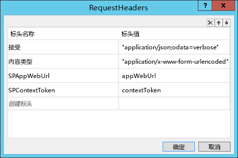

# 从 SharePoint 工作流调用 Web 服务
将 SharePoint 2013 工作流从 SharePoint 外接程序 部署到主机 Web，并从 SharePoint 工作流调用 Web 服务。

 **上次修改时间：** 2015年8月12日

 _ **适用范围：** SharePoint 2013?| SharePoint Add-ins?| SharePoint Online_

 **注释**  名称"SharePoint 相关应用程序"将更改为"SharePoint 外接程序"。在转换期间，某些 SharePoint 产品和 Visual Studio 工具的文档和 UI 仍可能使用术语"SharePoint 相关应用程序"。有关详细信息，请参阅 [Office 和 SharePoint 相关应用程序的新名称](05b07b04-6c8b-4b7e-bd86-e32c589dfead.md#bk_newname)。

您可以使用 SharePoint 2013 外接程序模型创建和部署在外接程序 Web 或主机 Web 上运行的工作流。这些工作流可以与提供程序托管的外接程序的远程托管部分交互。工作流还可以使用下列两种方法之一，调用包含重要业务数据的远程 Web 服务： 

- 通过将查询信息传递到外接程序的远程托管部分。然后远程 Web 外接程序将调用 Web 服务并将信息传回到 SharePoint。
    
- 通过使用 SharePoint 2013 Web 代理查询 Web 服务。工作流将查询结果传递到外接程序的远程托管部分，后者则将信息传递到 SharePoint。
    
从 Web 服务检索的信息可以存储在 SharePoint 列表中。 
本文介绍了三个代码示例，说明如何从工作流调用 Web 服务，如下表中所列。在前两个示例中，工作流和列表在外接程序安装时部署到外接程序 Web。最后一个示例提供了工作流的基本框架，以及有关如何将其部署到主机 Web 并将其与主机 Web 上的列表相关联的说明。 
 **工作流任务和相关示例**


|**任务**|**示例**|
|:-----|:-----|
|[从工作流调用自定义 Web 服务](#从工作流调用自定义-web-服务)|[Workflow.CallCustomService ](https://github.com/OfficeDev/PnP/tree/dev/Samples/Workflow.CallCustomService)|
|[从工作流调用自定义 Web 服务并使用 SharePoint Web 代理更新 SharePoint](#从工作流调用自定义-web-服务并使用-sharepoint-web-代理更新-sharepoint)|[Workflow.CallServiceUpdateSPViaProxy ](https://github.com/OfficeDev/PnP/tree/dev/Samples/Workflow.CallServiceUpdateSPViaProxy)|
|[将工作流关联到主机 Web](#将工作流关联到主机-web)|[Workflow.AssociateToHostWeb](https://github.com/OfficeDev/PnP/tree/dev/Samples/Workflow.AssociateToHostWeb)|
 **为改进此内容做贡献**
您可以获取最新的更新，或为改进 [GitHub 上的此文章](https://github.com/OfficeDev/PnP-Guidance/blob/master/articles/Call-web-services-from-SharePoint-workflows.md)做贡献。您还可以为改进本示例以及 [GitHub 上的其他示例](https://github.com/OfficeDev/PnP)做贡献。有关示例的完整列表，请参阅 [模式和做法开发人员中心](http://dev.office.com/patterns-and-practices)。我们欢迎您做出 [贡献](https://github.com/OfficeDev/PnP/wiki/contributing-to-Office-365-developer-patterns-and-practices)。 

## 从工作流调用自定义 Web 服务


[Workflow.CallCustomService](https://github.com/OfficeDev/PnP/tree/dev/Samples/Workflow.CallCustomService) 示例说明了如何创建调用用于更新 SharePoint 列表数据的自定义 Web 服务的工作流，以及如何设计提供程序承载的外接程序，使其使用与外接程序一起部署的远程承载的 Web 外接程序来查询 Web 服务。如果您希望与 Web 服务的所有交互均由提供程序承载的外接程序的远程承载部分进行处理，此示例非常有用。

此示例通过从远程 Web 外接程序启动一个工作流来运行。此工作流将用户提交的查询信息提交到远程 Web 外接程序，远程 Web 外接程序将使用该信息构建对 Northwind OData Web 服务的查询。查询返回指定国家/地区的产品供应商。收到该信息后，远程 Web 外接程序将更新外接程序部署到外接程序 Web 的产品供应商列表。


 **注释**  [Workflow.CallCustomService ](https://github.com/OfficeDev/PnP/tree/dev/Samples/Workflow.CallCustomService) 示例页面包含部署此外接程序的说明。您也可以在 Visual Studio 中使用 F5 调试进行部署和测试，前提是您遵循了博客文章 [使用 Visual Studio 2013 调试 SharePoint 2013 工作流](http://blogs.msdn.com/b/officeapps/archive/2013/10/30/debugging-sharepoint-2013-workflows-using-visual-studio-2013.aspx)中的说明。

此应用程序的开始页面包含一个下拉菜单，您可从中选择要为其创建产品供应商列表的国家/地区。 

屏幕上的"创建"按钮调用 Controllers\PartSuppliersController.cs 文件中的  **Create** 方法，此方法将在外接程序 Web 上的部件供应商列表中创建一个新条目。然后 **Create** 方法调用 Services\PartSuppliersService.cs 文件中的 **Add** 方法。下面两个代码示例显示了顺序。

 **创建方法**


```
public ActionResult Create(string country, string spHostUrl)
        {
            var spContext = SharePointContextProvider.Current.GetSharePointContext(HttpContext);
            using (var clientContext = spContext.CreateUserClientContextForSPAppWeb())
            {
                var service = new PartSuppliersService(clientContext);
                var id = service.GetIdByCountry(country);
                if (id == null)
                {
                    id = service.Add(country);
                    TempData["Message"] = "Part Supplier Successfully Created!";
                }
                else
                    TempData["ErrorMessage"] = string.Format("Failed to Create The Part Supplier: There's already a Part Supplier who's country is {0}.", country);

                return RedirectToAction("Details", new { id = id.Value, SPHostUrl = spHostUrl });
            }
        }

```

 **添加方法**


```
public int Add(string country)
        {
            var item = list.AddItem(new ListItemCreationInformation());
            item["Country"] = country;
            item.Update();
            clientContext.ExecuteQuery();
            return item.Id;
        }

```

创建该新的列表项之后，外接程序将显示一个可启动审批工作流的按钮，如图 2 中所示。


**图 1. 示例外接程序中的"启动工作流"按钮**

选择"启动工作流"按钮将触发在 Controllers\PartSuppliersController.cs 文件中定义的  **StartWorkflow** 方法。此方法将打包外接程序 Web URL、Web 服务 URL（对于远程承载的 Web 外接程序，而非 Northwind Web 服务）以及上下文令牌值，并将其传递到 **StartWorkflow** 方法。 **PartSuppliersService** 方法将需要上下文令牌才能与 SharePoint 交互。


```
public ActionResult StartWorkflow(int id, Guid workflowSubscriptionId, string spHostUrl)
        {
            var spContext = SharePointContextProvider.Current.GetSharePointContext(HttpContext) as SharePointAcsContext;

            var webServiceUrl = Url.RouteUrl("DefaultApi", new { httproute = "", controller = "Data" }, Request.Url.Scheme);
            var payload = new Dictionary<string, object>
                {
                    { "appWebUrl", spContext.SPAppWebUrl.ToString() },
                    { "webServiceUrl", webServiceUrl },
                    { "contextToken",  spContext.ContextToken }
                };

            using (var clientContext = spContext.CreateUserClientContextForSPAppWeb())
            {
                var service = new PartSuppliersService(clientContext);
                service.StartWorkflow(workflowSubscriptionId, id, payload);
            }

            TempData["Message"] = "Workflow Successfully Started!";
            return RedirectToAction("Details", new { id = id, SPHostUrl = spHostUrl });
        }

```

然后  **StartWorkflow** 方法将创建一个工作流实例，并将有效负载变量中存储的三个值（ _appWebUrl_、 _webServiceUrl_、 _contextToken_）传递到工作流。


```
 {
            var workflowServicesManager = new WorkflowServicesManager(clientContext, clientContext.Web);

            var subscriptionService = workflowServicesManager.GetWorkflowSubscriptionService();
            var subscription = subscriptionService.GetSubscription(subscriptionId);

            var instanceService = workflowServicesManager.GetWorkflowInstanceService();
            instanceService.StartWorkflowOnListItem(subscription, itemId, payload);
            clientContext.ExecuteQuery();
        }

```

工作流启动后，它将向远程承载的 Web 外接程序发出  **POST HTTP** 请求。此请求通知 Web 外接程序使用用户刚刚添加的国家/地区的供应商更新供应商列表。Controllers\DataController.cs 文件包含用于接收此请求的内容的 **POST** 方法。


```
public void Post([FromBody]string country)
        {
            var supplierNames = GetSupplierNames(country);
            UpdateSuppliers(country, supplierNames);
        }

```

 **GetSupplierNames** 方法（位于 Controllers\DataController.cs 文件中）为与所选国家/地区关联的所有供应商构建并执行对 Northwind OData Web 服务的 LINQ 查询。然后 **UpdateSuppliers** 方法将更新新添加的列表项的 _Suppliers_ 字段，如下面两个代码示例中所示。

 **查询 Northwind**


```
private string[] GetSupplierNames(string country)
        {
            Uri uri = new Uri("http://services.odata.org/V3/Northwind/Northwind.svc");
            var entities = new NorthwindEntities(uri);
            var names = entities.Suppliers
                .Where(s => s.Country == country)
                .AsEnumerable()
                .Select(s => s.CompanyName)
                .ToArray();
            return names;
        }

```

 **更新供应商列表**


```
private void UpdateSuppliers(string country, string[] supplierNames)
        {
            var request = HttpContext.Current.Request;
            var authority = request.Url.Authority;
            var spAppWebUrl = request.Headers["SPAppWebUrl"];
            var contextToken = request.Headers["SPContextToken"];

            using (var clientContext = TokenHelper.GetClientContextWithContextToken(
                spAppWebUrl, contextToken, authority))
            {
                var service = new PartSuppliersService(clientContext);
                service.UpdateSuppliers(country, supplierNames);
            }
        }

```

在外接程序项目的"审批供应商"目录中查看 workflow.xaml 文件的设计视图时，您将看到（通过在设计视图左下角选择"参数"选项卡）工作流将三个值存储在作为工作流参数向其传递的  _payload_ 变量中（图 2）。


**图 2. 传递到工作流的有效负载参数**

 **HttpSend** 活动在工作流审批之前发生。此活动将远程 Web 外接程序发送 **POST** 查询，后者将触发调用 Northwind Web 服务，然后触发列表项更新（使用供应商列表）。此活动配置为发送对作为工作流参数传递的 _webServiceUrl_ 值的请求（图 3）。


**图 3. HttpSend 活动 Uri 值**


 **POST** 请求还会传递在工作流运行所在的列表项中存储的国家/地区值（图 4）。


**图 4. HttpSend 活动的属性网格**

工作流通过请求标头将  _appWebUrl_ 和 _contextToken_ 值发送到 Web 外接程序（图 5）。标头还会设置用于发送和接受请求的内容类型。


**图 5. HttpSend 活动的请求标头**

如果工作流得到批准，它会将列表项的  _isApproved_ 字段的值更改为 **true**。


## 从工作流调用自定义 Web 服务并使用 SharePoint Web 代理更新 SharePoint


[Workflow.CallServiceUpdateSPViaProxy ](https://github.com/OfficeDev/PnP/tree/dev/Samples/Workflow.CallServiceUpdateSPViaProxy) 示例说明如何设计提供程序托管的外接程序，以查询 Web 服务，然后将该信息通过 SharePoint 2013 Web 代理传递到 SharePoint 列表。

该示例介绍了一个任务，如果您希望将所有交互封装在 Web 服务中，使其直接由工作流处理，此任务将非常有用。使用 Web 代理，可以更轻松地更新远程 Web 外接程序逻辑，而无需更新工作流实例。如果您未使用代理，且必须更新 Web 外接程序中的逻辑，您将需要删除现有的工作流实例，然后重新部署外接程序。因此，如果您需要调用远程 Web 服务，我们建议您使用此设计。 


 **注释**  [Workflow.CallCustomServiceUpdateViaProxy](https://github.com/OfficeDev/PnP/tree/master/Samples/Workflow.CallServiceUpdateSPViaProxy) 示例页面包含部署此外接程序的说明。您也可以在 Visual Studio 中使用"F5"调试进行部署和测试，前提是您遵循了博客文章 [使用 Visual Studio 2013 调试 SharePoint 2013 工作流](http://blogs.msdn.com/b/officeapps/archive/2013/10/30/debugging-sharepoint-2013-workflows-using-visual-studio-2013.aspx)中的说明。

此示例从远程 Web 外接程序启动工作流。此工作流将用户提交的查询信息传递到 Northwind OData Web 服务。查询将返回指定国家或地区的产品供应商。接收 Web 服务响应后，工作流会将响应中的信息传递到远程 Web 外接程序。然后，远程 Web 外接程序将更新外接程序已部署到外接程序 Web 的产品供应商列表。

启动外接程序时，开始页面包含一个下拉菜单，您可从中选择要为其创建产品供应商列表的国家/地区。

该按钮调用 Controllers\PartSuppliersController.cs 文件中的一个方法，在外接程序 Web 的"产品供应商"列表中创建一个新条目。该文件中的  **Create** 方法调用 Services\PartSuppliersService.cs 文件中的 **Add** 方法。下面两个代码示例显示了这两种方法。

 **创建方法**


```
public ActionResult Create(string country, string spHostUrl)
        {
            var spContext = SharePointContextProvider.Current.GetSharePointContext(HttpContext);
            using (var clientContext = spContext.CreateUserClientContextForSPAppWeb())
            {
                var service = new PartSuppliersService(clientContext);
                var id = service.GetIdByCountry(country);
                if (id == null)
                {
                    id = service.Add(country);
                    TempData["Message"] = "Part Supplier Successfully Created!";
                }
                else
                    TempData["ErrorMessage"] = string.Format("Failed to Create The Part Supplier: There's already a Part Supplier who's country is {0}.", country);

                return RedirectToAction("Details", new { id = id.Value, SPHostUrl = spHostUrl });
            }
        }

```

 **添加方法**


```
public int Add(string country)
        {
            var item = list.AddItem(new ListItemCreationInformation());
            item["Country"] = country;
            item.Update();
            clientContext.ExecuteQuery();
            return item.Id;
        }

```

创建该新的列表项之后，外接程序将显示一个可启动审批工作流的按钮（图 6）。


**图 6. "启动工作流"按钮**

选择"启动工作流"按钮将触发在 Controllers\PartSuppliersController.cs 文件中定义的  **StartWorkflow** 方法。此方法将打包外接程序 Web URL 和 Web 服务 URL（对于远程托管的 Web 外接程序，而非 Northwind Web 服务），并将其传递到 Services\PartSuppliersService.cs 文件中的 **StartWorkflow** 方法。工作流将通过 Web 代理与远程 Web 外接程序通信，Web 代理会将访问令牌添加在请求标头中。这正是工作流不将上下文令牌传递到此示例中的 **StartWorkflow** 方法的原因。代码如以下示例所示。


```
public ActionResult StartWorkflow(int id, Guid workflowSubscriptionId, string spHostUrl)
        {
            var spContext = SharePointContextProvider.Current.GetSharePointContext(HttpContext);

            var webServiceUrl = Url.RouteUrl("DefaultApi", new { httproute = "", controller = "Data" }, Request.Url.Scheme);
            var payload = new Dictionary<string, object>
                {
                    { "appWebUrl", spContext.SPAppWebUrl.ToString() },
                    { "webServiceUrl", webServiceUrl }
                };

            using (var clientContext = spContext.CreateUserClientContextForSPAppWeb())
            {
                var service = new PartSuppliersService(clientContext);
                service.StartWorkflow(workflowSubscriptionId, id, payload);
            }

            TempData["Message"] = "Workflow Successfully Started!";
            return RedirectToAction("Details", new { id = id, SPHostUrl = spHostUrl });
        }

```

然后  **StartWorkflow** 方法将创建一个工作流实例，并将有效负载变量中存储的两个值（ _appWebUrl_ 和 _webServiceUrl_）传递到工作流。


```
public void StartWorkflow(Guid subscriptionId, int itemId, Dictionary<string, object> payload)
        {
            var workflowServicesManager = new WorkflowServicesManager(clientContext, clientContext.Web);

            var subscriptionService = workflowServicesManager.GetWorkflowSubscriptionService();
            var subscription = subscriptionService.GetSubscription(subscriptionId);

            var instanceService = workflowServicesManager.GetWorkflowInstanceService();
            instanceService.StartWorkflowOnListItem(subscription, itemId, payload);
            clientContext.ExecuteQuery();
        }

```

工作流启动后，在其被批准之前，工作流将查询 Northwind Web 服务，以检索您所选的国家/地区的供应商列表，方法是使用向以下终结点发送 OData 查询的  **HTTPSend** 活动： `"http://services.odata.org/V3/Northwind/Northwind.svc/Suppliers/?$filter=Country eq '" + country.Replace("'", "''") + "'&amp;$select=CompanyName"`。 **HttpSend** 活动应该配置为具有 **Accept** 标头的 **GET** 请求，该标头指定了没有元数据的 JSON： ` application/json;odata=nometadata`（图 7 和 8）。


**图 7. HttpSend 活动配置**


**图 8. HttpSend 活动请求标头**

例如，如果用户为新供应商列表项选择了加拿大，JSON 格式的响应将如以下示例中所示。


```
{
    value: [
        {
            CompanyName: "Ma Maison"
        },
        {
            CompanyName: "Forêts d'érables"
        }
    ]
}

```

工作流启动后，它将发出  **POST HTTP** 请求，其中包含通过 代理的远程托管的 Web 外接程序的供应商列表，方法是通过查询 Web 代理 URL 的 **HttpSend** 活动： `appWebUrl + "/_api/SP.WebProxy.invoke"`。 然后工作流会通过构建和传递自定义服务有效负载，传递从 Northwind 服务接收的供应商列表。 **Create Custom Service Payload** 活动属性包含供应商列表以及供应商所在国家/地区的 ID，如图 9 中所示。


**图 9. "创建自定义服务有效负载"活动**

 ** Create WebProxy Payload**活动构建一个有效负载，将此有效负载的内容传递到 Web 代理 URL（图 10）。


**图 10. 创建 WebProxy 有效负载配置**

此活动的属性指定了外接程序 Web URL、POST 请求内容长度和类型以及通过请求标头的请求接受类型（图 11）。


**图 11. WebProxy 有效负载活动属性窗格**

工作流构建有效负载和请求后，它会使用配置为对 Web 代理 URL 的 POST 请求的  **HttpSend** 活动，将请求传递到 Web 代理。请求标头在 **Content-Type** 和 **Accept** 标头中指定 JSON 格式的 OData（图 12）。


**图 12. HttpSend 活动的属性**

Controllers\DataController.cs 文件中的  **Post** 方法接受工作流通过 Web 代理发送的请求的内容。前一示例中的 **Post** 方法调用用于从 Northwind 检索供应商列表的方法以及用于更新相应的 SharePoint 供应商列表的方法。由于本示例中的工作流已经查询了 Northwind 服务，方法的此版本仅需更新 SharePoint 列表。它还会将外接程序 Web URL 和访问令牌（由 Web 代理传递）传递到 Services\PartSuppliersService.cs 文件中的 **UpdateSuppliers** 方法，如以下代码示例中所示。


```
public void Post(UpdatePartSupplierModel model)
        {
            var request = HttpContext.Current.Request;
            var authority = request.Url.Authority;
            var spAppWebUrl = request.Headers["SPAppWebUrl"];
            var accessToken = request.Headers["X-SP-AccessToken"];

            using (var clientContext = TokenHelper.GetClientContextWithContextToken(spAppWebUrl, accessToken, authority))
            {
                var service = new PartSuppliersService(clientContext);
                service.UpdateSuppliers(model.Id, model.Suppliers.Select(s => s.CompanyName));
            }
        }

```

PartSuppliers.cs 文件中的  **UpdateSuppliers** 方法将更新新创建的列表项的 _Suppliers_ 字段。


```
public void UpdateSuppliers(int id, IEnumerable<string> supplierNames)
        {
            var item = list.GetItemById(id);
            clientContext.Load(item);
            clientContext.ExecuteQuery();

            string commaSeparatedList = String.Join(",", supplierNames);
            item["Suppliers"] = commaSeparatedList;
            item.Update();
            clientContext.ExecuteQuery();
        }

```

如果工作流得到批准，它会将列表项的  _isApproved_ 字段的值更改为 true。


## 将工作流关联到主机 Web


[Workflow.AssociateToHostWeb](https://github.com/OfficeDev/PnP/tree/dev/Samples/Workflow.AssociateToHostWeb) 示例说明如何将工作流部署到主机 Web，以及如何使用 Visual Studio 2013 中的工具将工作流与主机 Web 上的列表相关联。本示例的说明介绍如何在 Visual Studio 中创建工作流、如何将工作流部署到主机 Web 以及如何将工作流与主机 Web 上的列表相关联。

示例中包含可与任何列表关联的简单工作流。部署此工作流的说明介绍了如何通过打包外接程序、打开外接程序包并编辑配置文件，然后手动将其重新打包再部署到主机 Web 中，来绕开 Visual Studio 工作流工具的当前限制。

在 Visual Studio 中打开此项目时，您将看到这是一个简单的通用工作流，设计用于任何 SharePoint 列表。除了工作流任务列表外，它不会部署任何可以关联的列表。


 **注释**  您不能使用 Visual Studio 2013 执行本示例中的任务。本示例提供了一个有用的解决方法。如果 Visual Studio 工具在将来更新，您可能需要使用此解决方法。


### 将工作流部署到主机 Web


1. 在项目资源管理器中打开 [Workflow.AssociateToHostWeb](https://github.com/OfficeDev/PnP/tree/dev/Samples/Workflow.AssociateToHostWeb) 外接程序项目的快捷菜单（右键单击），选择"发布"。您将看到一个包含"打包外接程序"按钮的窗口。
    
2. 当您选择"打包外接程序"时，Visual Studio 将在解决方案的  `bin\Debug\app.publish\1.0.0.0` 目录中创建一个 Workflow.AssociateToHostWeb.app 文件。此 .app 文件类型为 zip 文件。
    
3. 首先将文件扩展名更改为 .zip，提取文件的内容。 
    
4. 在已提取的目录中，找到并打开名为 WorkflowManifest.xml 的 XML 文件。该文件为空。
    
5. 向文件中添加以下 XML 片段，然后保存文件。
    
  ```XML
  <SPIntegratedWorkflow xmlns="http://schemas.microsoft.com/sharepoint/2014/app/integratedworkflow">
<IntegratedApp>true</IntegratedApp>
</SPIntegratedWorkflow>

  ```

6. 选择提取的文件夹中的所有文件，然后打开文件的快捷菜单（右键单击），并选择"发送到">"压缩 (zip) 文件夹"。
    
7. 在刚刚创建的 zip 文件上，将文件扩展名更改为 .app。您现在应该具有新的 Workflow.AssociateToHostWeb.app 文件包，其中包含更新的 WorkflowManifest.xml 文件。
    
8. 将外接程序添加到外接程序目录。
    
9. 将外接程序安装到主机网站。
    
10. 转到主机网站上的列表，在页面左上角选择"列表"编辑选项。您将看到"工作流设置"下拉菜单（图 13）。 
    
    **图 13. 列表的工作流设置**

    

11. 从下拉菜单中选择"添加工作流"。
    
12. 从可用选项列表中选择"Workflow.AssociateToHostWeb"外接程序。
    
现在，您已将工作流部署到主机 Web 并将其与主机 Web 上的列表相关联。您可以手动触发工作流，也可以在 Visual Studio 中更新工作流使其以其他方式触发。


## 其他资源


- [适用于 SharePoint 2013 和 SharePoint Online 的复合企业外接程序](composite-buisness-apps-for-sharepoint.md)
    
- [使用 Visual Studio 2013 调试 SharePoint 2013 工作流](http://blogs.msdn.com/b/officeapps/archive/2013/10/30/debugging-sharepoint-2013-workflows-using-visual-studio-2013.aspx)
    
- [Workflow.AssociateToHostWeb](https://github.com/OfficeDev/PnP/tree/dev/Samples/Workflow.AssociateToHostWeb)
    
- [Workflow.CallServiceUpdateSPViaProxy](https://github.com/OfficeDev/PnP/tree/dev/Samples/Workflow.CallServiceUpdateSPViaProxy)
    
- [Workflow.AssociateToHostWeb](https://github.com/OfficeDev/PnP/tree/dev/Samples/Workflow.AssociateToHostWeb)
    
- [Workflow.CallCustomService](https://github.com/OfficeDev/PnP/tree/dev/Samples/Workflow.CallCustomService)
    
