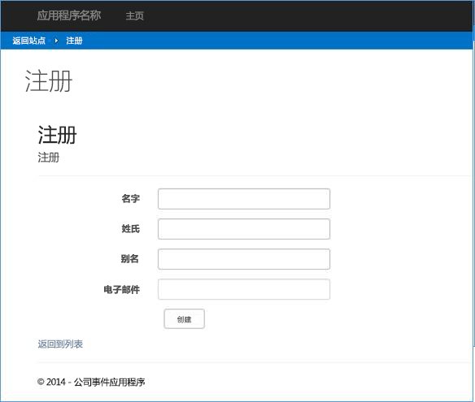

# 公司事件外接程序与 SharePoint 的集成
使用可以实施多个复杂业务任务的提供程序托管的外接程序，将 SharePoint 外接程序集成到业务操作中。

 **上次修改时间：** 2015年8月7日

 _ **适用范围：** SharePoint 2013?| SharePoint Add-ins?| SharePoint Online_

 **注释**  名称"SharePoint 相关应用程序"将更改为"SharePoint 外接程序"。在转换期间，某些 SharePoint 产品和 Visual Studio 工具的文档和 UI 仍可能使用术语"SharePoint 相关应用程序"。有关详细信息，请参阅 [Office 和 SharePoint 相关应用程序的新名称](05b07b04-6c8b-4b7e-bd86-e32c589dfead.md#bk_newname)。

[BusinessApps.CorporateEventApp](https://github.com/OfficeDev/PnP/tree/dev/Solutions/BusinessApps.CorporateEventsApp) 示例介绍了如何将集中公司事件管理系统实施为提供程序托管的外接程序，以便与现有的业务线 (LOB) 应用程序相集成。
更具体地说， [BusinessApps.CorporateEventApp](https://github.com/OfficeDev/PnP/tree/dev/Solutions/BusinessApps.CorporateEventsApp) 示例说明了如何将与 SharePoint 交互的 ASP.NET Web 应用程序实施为 LOB 实体的数据存储。它还说明了如何在具有单个提供程序托管的外接程序的复杂业务任务中实施多个步骤。
此示例外接程序实施由 SharePoint 实体（列表和内容类型）组成的集中管理系统。对于每个新的内容类型，它将在 ASP.NET Web 应用程序中创建相应的 LOB 实体。Web 应用程序的组件在 SharePoint 界面中作为远程托管的外接程序部件运行，并作为完全在远程 Web 主机上运行的页面运行。外接程序将覆盖您的 SharePoint 网站的默认欢迎页面，使其在网站主页上显示自定义品牌界面。
 **为改进此内容做贡献**
您可以获取最新的更新，或为改进 [GitHub 上的此文章](https://github.com/OfficeDev/PnP-Guidance/blob/master/articles/Corporate-app-event-registration-with-SharePoint.md)做贡献。您还可以为改进本示例以及 [GitHub 上的其他示例](https://github.com/OfficeDev/PnP)做贡献。有关示例的完整列表，请参阅 [模式和做法开发人员中心](http://dev.office.com/patterns-and-practices)。我们欢迎您做出 [贡献](https://github.com/OfficeDev/PnP/wiki/contributing-to-Office-365-developer-patterns-and-practices)。 

## 使用 BusinessApps.CorporateEventApp 示例

当您启动 BusinessApps.CorporateEventApp 示例外接程序时，主页上将提供一个选项以便您配置示例。它还为您列出了多个资源，您可从中获取更多信息。

当您选择"启动配置"时，您将转到"配置"页面，如图 1 中所示。当您在"配置"页面上选择"初始化数据存储"时，示例将部署支持示例的 SharePoint 实体和示例数据。


**图 1. "配置"页面**

初始化数据存储后，您可以返回到网站查看新的欢迎页面（EventsHome.aspx 页面），其中填充了外接程序部署的两个 Web 部件，如图 2 中所示。在左侧列中，您将看到外接程序安装的四个新列表。公司事件列表使用示例数据填充。


**图 2. Web 部件已被初始化的欢迎页面**

每个 Web 部件均包含每个显示的事件的链接，您可在其中查看事件详细信息。当您选择一个链接时，事件详细信息页面在远程主机上单独运行，如图 3 中所示。您可以在页面上选择"返回到站点"返回到 SharePoint 网站，并为您自己注册事件。


**图 3. 事件详细信息页面**

注册页面也会在远程主机上单独运行，另外还包含返回到 SharePoint 主机网站的链接（见图 4）。当您注册完事件之后，您的名称将显示在新安装的"事件注册"列表中。


**图 4. 事件注册页面**

Models\DataInitializer.cs 文件包含当您选择此按钮时运行的代码。此文件中的代码将创建和部署四个新的 SharePoint 列表以及四个相应的内容类型：


- 公司事件
    
- 事件注册
    
- 事件扬声器
    
- 事件会话
    
此文件中的代码使用与 [Core.ModifyPages](https://github.com/OfficeDev/PnP/tree/dev/Samples/Core.ModifyPages) 示例中类似的方法将自定义页面添加到站点。


```
            // Create default wiki page.
            web.AddWikiPage("Site Pages", "EventsHome.aspx");
AddWikiPage is an extension method from the Core.DevPnPCore project to add a new page to the site. This new page also becomes the new WelcomePage for the site. It also prepares to add the web parts to this page.
            var welcomePage = "SitePages/EventsHome.aspx";
            var serverRelativeUrl = UrlUtility.Combine(web.ServerRelativeUrl, welcomePage);

            File webPartPage = web.GetFileByServerRelativeUrl(serverRelativeUrl);

            if (webPartPage == null) {
                return;
            }

            web.Context.Load(webPartPage);
            web.Context.Load(webPartPage.ListItemAllFields);
            web.Context.Load(web.RootFolder);
            web.Context.ExecuteQuery();

            web.RootFolder.WelcomePage = welcomePage;
            web.RootFolder.Update();
            web.Context.ExecuteQuery();

```

Models\DataInitializer.cs 文件还为新欢迎页面上显示的两个 Web 部件定义了 XML，然后将其分别添加到页面。以下示例显示这对于"特色事件"Web 部件是如何工作的。

 **定义 Web 部件 XML**


```XML
            var webPart1 = new WebPartEntity(){
                WebPartXml = @"<webParts>
  <webPart xmlns='http://schemas.microsoft.com/WebPart/v3'>
    <metaData>
      <type name='Microsoft.SharePoint.WebPartPages.ClientWebPart, Microsoft.SharePoint, Version=16.0.0.0, Culture=neutral, PublicKeyToken=71e9bce111e9429c' />
      <importErrorMessage>Cannot import this Web Part.</importErrorMessage>
    </metaData>
    <data>
      <properties>
        <property name='Description' type='string'>Displays featured events</property>
        <property name='FeatureId' type='System.Guid, mscorlib, Version=4.0.0.0, Culture=neutral, PublicKeyToken=b77a5c561934e089'>3a6d7f41-2de8-4e69-b4b4-0325bd56b32c</property>
        <property name='Title' type='string'>Featured Events</property>
        <property name='ProductWebId' type='System.Guid, mscorlib, Version=4.0.0.0, Culture=neutral, PublicKeyToken=b77a5c561934e089'>12ae648f-27db-4a97-9c63-37155d3ace1e</property>
        <property name='WebPartName' type='string'>FeaturedEvents</property>
        <property name='ProductId' type='System.Guid, mscorlib, Version=4.0.0.0, Culture=neutral, PublicKeyToken=b77a5c561934e089'>3a6d7f41-2de8-4e69-b4b4-0325bd56b32b</property>
        <property name='ChromeState' type='chromestate'>Normal</property>
      </properties>
    </data>
  </webPart>
</webParts>",
                WebPartIndex = 0,
                WebPartTitle = "Featured Events",
                WebPartZone = "Rich Content"
            };

```

 **将 Web 部件添加到页面**


```XML
            var limitedWebPartManager = webPartPage.GetLimitedWebPartManager(Microsoft.SharePoint.Client.WebParts.PersonalizationScope.Shared);
            web.Context.Load(limitedWebPartManager.WebParts);
            web.Context.ExecuteQuery();

            for (var i = 0; i < limitedWebPartManager.WebParts.Count; i++) {
                limitedWebPartManager.WebParts[i].DeleteWebPart();
            }
            web.Context.ExecuteQuery();

            var oWebPartDefinition1 = limitedWebPartManager.ImportWebPart(webPart1.WebPartXml);
            var oWebPartDefinition2 = limitedWebPartManager.ImportWebPart(webPart2.WebPartXml);
            var wpdNew1 = limitedWebPartManager.AddWebPart(oWebPartDefinition1.WebPart, webPart1.WebPartZone, webPart1.WebPartIndex);
            var wpdNew2 = limitedWebPartManager.AddWebPart(oWebPartDefinition2.WebPart, webPart2.WebPartZone, webPart2.WebPartIndex);
            web.Context.Load(wpdNew1);
            web.Context.Load(wpdNew2);
            web.Context.ExecuteQuery();

```

在您的 Web 项目的"模型"目录中，您将注意到此 MVC ASP.NET Web 应用程序包含四个与外接程序安装的列表和内容类型相对应的类名称：


- Event.cs（公司事件）
    
- Registration.cs（事件注册）
    
- Session.cs（事件会话）
    
- Speaker.cs（事件扬声器）
    
这四个类及其相应的 SharePoint 内容类型共同构成了此外接程序中使用的四个 LOB 实体。

DataInitializer.cs 文件添加 **公司事件** 列表的示例数据，方法是创建与外接程序添加到 **公司事件** 列表的 **公司事件** 内容类型相对应的示例 **Event** 对象。注册事件时，外接程序将创建与外接程序添加到 **事件注册** 列表的 **Event Registration** 内容类型对象对应的 **Registration**对象。示例尚未完全实施  **Session** 和 **Speaker** 对象，因此程序当前无法使用这些对象。

下表列出了需由从  **BaseListItem** 抽象类继承的类实施的属性。

 **表 1. 将在从  **BaseListItem**** 继承的类中实施的方法


|**成员**|**说明**|
|:-----|:-----|
|**ContentTypeName**|获取与项目相关联的内容类型。如果为 null，则将其保存时，将为项目分配默认的库内容类型。|
|**FieldInternalNames**|用于在保存前检查字段数据时，可以缓存以改进性能的字段名称列表。|
|**ListTitle**|获取列表的标题（区分大小写）。|
下表列出了必须由从  **BaseListItem** 抽象类继承的类实施的方法。这些方法返回应设置为 [可直接复制到本机结构中的类型](https://msdn.microsoft.com/zh-cn/library/75dwhxf7%28v=vs.110%29.aspx)的参数，以便可在多个平台上使用。

 **表 2. 返回可直接复制到本机结构中的类型的方法**


|**方法**|**说明**|
|:-----|:-----|
|**ReadProperties(ListItem)**|使用  **BaseGet** 和 **BaseGetEnum** 方法读取 **ListItem** 对象中的属性，并向其分配值子类的属性。|
|**SetProperties(ListItem)**|使用抽象类的  **BaseSet** 和 **BaseSetTaxonomyField** 方法，设置 **ListItem** 对象上的属性。|
下表列出了  **BaseListItem** 类中的帮助程序方法，其子类需要实施 **ReadProperties** 和 **SetProperties** 方法。

 **表 3. BaseListItem 帮助程序方法**


|**帮助程序方法**|**说明**|
|:-----|:-----|
|**BaseGet(ListItem item, string internalName)**|获取  **ListItem** 中的 _internalName_ 参数定义的属性，并返回其通用类型 **T**。|
|**BaseSet(ListItem item, string internalName, object value)**|设置  _internalName_ 参数定义的 **ListItem** 属性。|
|**BaseSetTaxonomyField(ListItem item, string internalName, string label, Guid termId)**|设置  _internalName_ 和 _termId_ 参数定义的 **ListItem** 分类字段。|
|**BaseGetEnum(ListItem item, string internalName, T defaultValue)**|获取  _internalName_ 参数定义的枚举属性的值。如果未设置属性，则返回 _defaultValue_ 参数的值。|
Event.cs 文件包含  **ReadProperties** 和 **SetProperties** 方法的下列实施。

 **ReadProperties**


```C#
        protected override void ReadProperties(ListItem item) {
            RegisteredEventId = BaseGet<string>(item, FIELD_REGISTERED_EVENT_ID);
            Description = BaseGet<string>(item, FIELD_DESCRIPTION);
            Category = BaseGet<string>(item, FIELD_CATEGORY);
            EventDate = BaseGet<DateTime?>(item, FIELD_DATE);
            Location = BaseGet<string>(item, FIELD_LOCATION);
            ContactEmail = BaseGet<string>(item, FIELD_CONTACT_EMAIL);
            Status = BaseGetEnum<EventStatus>(item, FIELD_STATUS);
            var imageUrl = BaseGet<FieldUrlValue>(item, FIELD_IMAGE_URL);

            if (imageUrl != null)
                ImageUrl = imageUrl.Url;
        }
SetProperties:
        protected override void SetProperties(ListItem item) {
            BaseSet(item, FIELD_REGISTERED_EVENT_ID, RegisteredEventId);
            BaseSet(item, FIELD_DESCRIPTION, Description);
            BaseSet(item, FIELD_CATEGORY, Category);
            BaseSet(item, FIELD_DATE, EventDate);
            BaseSet(item, FIELD_LOCATION, Location);
            BaseSet(item, FIELD_CONTACT_EMAIL, ContactEmail);
            BaseSet(item, FIELD_STATUS, Status.ToEnumDescription());
            BaseSet(item, FIELD_IMAGE_URL, ImageUrl);
        }

```

下列代码示例显示基础的  **BaseGet** 和 **BaseSet** 方法在 BaseListItem.cs 中如何定义。

 **BaseGet**


```
protected T BaseGet<T>(ListItem item, string internalName){
            var field = _fields[internalName.ToLowerInvariant()];
            var value = item[field.InternalName];
            return (T)value;
        }

```

 **BaseSet**


```
protected void BaseSet(ListItem item, string internalName, object value) {
            if (_fields.ContainsKey(internalName)) {
                var field = _fields[internalName.ToLowerInvariant()];

                if (field is FieldUrl &amp;&amp; value is string) {
                    var urlValue = new FieldUrlValue() {
                        Url = value.ToString()
                    };
                    value = urlValue;
                }
            }
            item[internalName] = value;
        }


```

 **BaseListItem** 类还包含用于保存外接程序创建和处理的每个 LOB 实体的 **Save** 方法。此方法将加载列表并确定当前项目是否包含大于 0 的 ID。如果 ID 不大于 0，将假定它无效并创建一个新的列表项。它使用 **SetProperties** 方法设置 **ListItem** 上的属性，然后使用 **ReadProperties** 方法设置子类上的属性。


```
public void Save(Web web) {
            var context = web.Context;
            var list = web.GetListByTitle(ListTitle);
            if (!IsNew &amp;&amp; Id > 0) {
                ListItem = list.GetItemById(Id);
            }
            else {
                var listItemCreationInfo = new ListItemCreationInformation();
                ListItem = list.AddItem(listItemCreationInfo);
            }

            // Ensure that the fields have been loaded.
            EnsureFieldsRetrieved(ListItem);

            // Set the properties on the list item.
            SetProperties(ListItem);
            BaseSet(ListItem, TITLE, Title);

            // Use if you want to override the created/modified date.
            //BaseSet(ListItem, CREATED, Created);
            //BaseSet(ListItem, MODIFIED, Modified);

            ListItem.Update();

            if (!string.IsNullOrEmpty(ContentTypeName)) {
                var contentType = list.GetContentTypeByName(ContentTypeName);
                if (contentType != null)
                    BaseSet(ListItem, "ContentTypeId", contentType.Id.StringValue);
            }

            ListItem.Update();

            // Execute the batch.
            context.ExecuteQuery();

            // Reload the properties.
            ListItem.RefreshLoad();
            UpdateBaseProperties(ListItem);
            ReadProperties(ListItem);
        }

```


## 其他资源


- [适用于 SharePoint 2013 和 SharePoint Online 的复合企业外接程序](composite-buisness-apps-for-sharepoint.md)
    
- [Core.ModifyPages 示例](https://github.com/OfficeDev/PnP/tree/dev/Samples/Core.ModifyPages)
    
- [Provisioning.Pages 示例](https://github.com/OfficeDev/PnP/tree/dev/Scenarios/Provisioning.Pages)
    
- [OfficeDevPnP.Core 示例](https://github.com/OfficeDev/PnP/tree/dev/OfficeDevPnP.Core)
    
