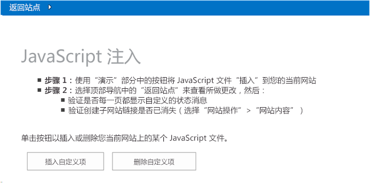
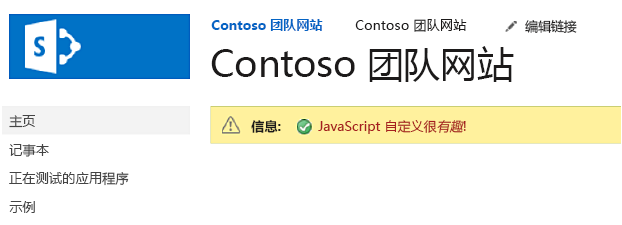
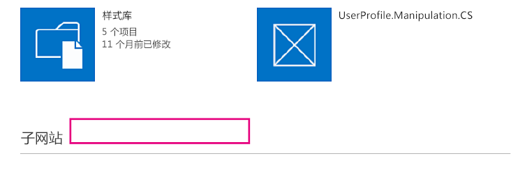


# 使用 JavaScript 自定义您的 SharePoint 网站 UI
 您可以使用 JavaScript 更新 SharePoint 网站的 UI。

 **上次修改时间：** 2015年8月7日

 _ **适用范围：** Office 365?| SharePoint 2013?| SharePoint Add-ins?| SharePoint Online_

 **注释**  名称"SharePoint 相关应用程序"将更改为"SharePoint 外接程序"。在转换期间，某些 SharePoint 产品和 Visual Studio 工具的文档和 UI 仍可能使用术语"SharePoint 相关应用程序"。有关详细信息，请参阅 [Office 和 SharePoint 相关应用程序的新名称](05b07b04-6c8b-4b7e-bd86-e32c589dfead.md#bk_newname)。

[Core.EmbedJavaScript](https://github.com/OfficeDev/PnP/tree/master/Samples/Core.EmbedJavaScript) 示例外接程序将一条状态栏消息添加到 SharePoint 网站上的所有页中，并使用 JavaScript 从"网站内容"页中删除"新建子网站"。
如果您想要使用 JavaScript（有时也称作嵌入的 JavaScript 技术）将 UI 更新应用到 SharePoint 网站，则可以使用此解决方案，而无需创建自定义母版页。 
 **为改进此内容做贡献**
您可以获取最新的更新，或为改进 [GitHub 上的此文章](https://github.com/OfficeDev/PnP-Guidance/blob/master/articles/Customize-your-SharePoint-site-UI-by-using-JavaScript.md)做贡献。您还可以为改进本示例以及 [GitHub 上的其他示例](https://github.com/OfficeDev/PnP)做贡献。有关示例的完整列表，请参阅 [模式和做法开发人员中心](http://dev.office.com/patterns-and-practices)。我们欢迎您做出 [贡献](https://github.com/OfficeDev/PnP/wiki/contributing-to-Office-365-developer-patterns-and-practices)。 

## 开始之前

若要开始，请从 GitHub 上的 [Office 365 开发人员模式和做法](https://github.com/OfficeDev/PnP/tree/dev)项目下载 [Core.EmbedJavaScript](https://github.com/OfficeDev/PnP/tree/master/Samples/Core.EmbedJavaScript) 示例外接程序。


## 使用 Core.EmbedJavaScript 外接程序

运行本代码示例时，会显示提供程序托管的外接程序，如图 1 中所示。 


**图 1. Core.EmbedJavaScript 外接程序起始页的屏幕截图**

选择"启用自定义项"自定义 SharePoint 网站，通过以下方式进行：


- 在 SharePoint 网站中的所有页面上创建一条状态栏消息，如图 2 中所示。
    
- 从"网站内容"中删除"新建子网站" 链接，如图 3 中所示。
    

**图 2. 添加到所有页面的状态栏的屏幕截图**




**图 3. 从"网站内容"页删除的新建子网站链接的屏幕截图**

在图 1 中，选择"启用自定义项"将调用 default.aspx 中的  **btnSubmit_Click**。 **btnSubmit_Click** 将调用 **AddJsLink**，这将会执行以下操作：


1. 创建一个字符串来表示脚本块定义。此脚本块定义指向包含在 SharePoint 网站上的所有页面中的 JavaScript 文件 (scenario1.js)。 
    
2. 使用 [UserCustomActions](https://msdn.microsoft.com/library/office/microsoft.sharepoint.spweb.usercustomactions%28v=office.15%29.aspx) 获取在 SharePoint 网站上定义的所有用户自定义操作。将删除对名为"scenario1.js"的 JavaScript 文件的所有现有引用。
    
3.  创建一个新的自定义操作，并将步骤 1 中创建的脚本块定义分配给新的自定义操作。
    
4. 将新的自定义操作添加到网站。
    
您的 SharePoint 网站上的所有页面现在都将运行 scenario1.js，并显示图 2 和图 3 中所示的 UI 自定义项。


    
 **注释**  本文中的代码按原样提供，不提供任何明示或暗示的担保，包括对特定用途适用性、适销性或不侵权的默示担保。


```C#
 public void AddJsLink(ClientContext ctx, Web web)
        {
            string scenarioUrl = String.Format("{0}://{1}:{2}/Scripts", this.Request.Url.Scheme, 
                                                this.Request.Url.DnsSafeHost, this.Request.Url.Port);
            string revision = Guid.NewGuid().ToString().Replace("-", "");
            string jsLink = string.Format("{0}/{1}?rev={2}", scenarioUrl, "scenario1.js", revision);

            StringBuilder scripts = new StringBuilder(@"
                var headID = document.getElementsByTagName('head')[0]; 
                var");

            scripts.AppendFormat(@"
                newScript = document.createElement('script');
                newScript.type = 'text/javascript';
                newScript.src = '{0}';
                headID.appendChild(newScript);", jsLink);
            string scriptBlock = scripts.ToString();

            var existingActions = web.UserCustomActions;
            ctx.Load(existingActions);
            ctx.ExecuteQuery();
            var actions = existingActions.ToArray();
            foreach (var action in actions)
            {
                if (action.Description == "scenario1" &amp;&amp;
                    action.Location == "ScriptLink")
                {
                    action.DeleteObject();
                    ctx.ExecuteQuery();
                }
            }

            var newAction = existingActions.Add();
            newAction.Description = "scenario1";
            newAction.Location = "ScriptLink";

            newAction.ScriptBlock = scriptBlock;
            newAction.Update();
            ctx.Load(web, s => s.UserCustomActions);
            ctx.ExecuteQuery();
        }
```

用户在 SharePoint 网站上的页面之间导航时，SharePoint 使用最少下载策略 (MDS) 减少浏览器下载的数据量。有关详细信息，请参阅 [最少下载策略概述](https://msdn.microsoft.com/library/office/dn456544%28v=office.15%29.aspx)。在 scenario1.js 中，以下代码将确保，无论您的 SharePoint 网站是否使用最少下载策略， **RemoteManager_Inject** 都将始终运行。


```
// Is MDS enabled?
if ("undefined" != typeof g_MinimalDownload &amp;&amp; g_MinimalDownload &amp;&amp; (window.location.pathname.toLowerCase()).endsWith("/_layouts/15/start.aspx") &amp;&amp; "undefined" != typeof asyncDeltaManager) {
    // Register script for MDS if possible
    RegisterModuleInit("scenario1.js", RemoteManager_Inject); //MDS registration
    RemoteManager_Inject(); //non MDS run
} else {
    RemoteManager_Inject();
}
```

 **RemoteManager_Inject** 将在您的 SharePoint 网站上执行以下任务：


- 在主机 Web 上创建一个状态栏。 **RemoteManager_Inject** 将使用 [SP.SOD.executeOrDelayUntilScriptLoaded](https://msdn.microsoft.com/library/office/ff411788%28v=office.14%29.aspx) 确保已首先加载 sp.js，然后再调用 **SetStatusBar** 以将状态栏添加到网站。由于 JavaScript 文件是异步加载的，因此，使用 **SP.SOD.executeOrDelayUntilScriptLoaded** 可确保首先加载 JavaScript 文件 (sp.js)，然后代码再调用在该 JavaScript 文件中定义的函数。
    
- 隐藏"网站内容"页上的"新建子网站"链接。
    


```
function RemoteManager_Inject() {

    loadScript(jQuery, function () {
        $(document).ready(function () {
            var message = " <font color='#AA0000'>JavaScript customization is <i>fun</i>!</font>"

            // Execute status setter only after SP.JS has been loaded
            SP.SOD.executeOrDelayUntilScriptLoaded(function () { SetStatusBar(message); }, 'sp.js');

            // Customize the viewlsts.aspx page
            if (IsOnPage("viewlsts.aspx")) {
                //hide the subsites link on the viewlsts.aspx page
                $("#createnewsite").parent().hide();
            }
        });
    });
}

function SetStatusBar(message) {
    var strStatusID = SP.UI.Status.addStatus("Information : ", message, true);
    SP.UI.Status.setStatusPriColor(strStatusID, "yellow");
}

function IsOnPage(pageName) {
    if (window.location.href.toLowerCase().indexOf(pageName.toLowerCase()) > -1) {
        return true;
    } else {
        return false;
    }
}

```


## 其他资源


- [Office 365 开发模式和做法解决方案指南](https://msdn.microsoft.com/library/office/dn904529.aspx)
    
- [Core.JavaScriptCustomization](https://github.com/OfficeDev/PnP/tree/master/Scenarios/Core.JavaScriptCustomization)
    
- [如何：使用客户端呈现在 SharePoint 外接程序中自定义列表视图](https://msdn.microsoft.com/library/8d5cabb2-70d0-46a0-bfe0-9e21f8d67d86.aspx)
    
- [模式和做法开发人员中心](http://dev.office.com/patterns-and-practices)
    
