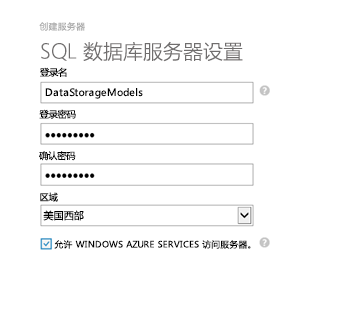
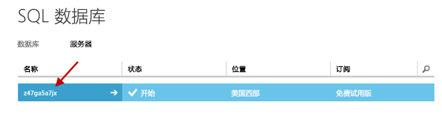
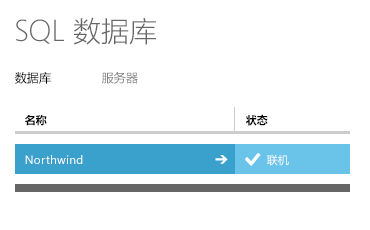
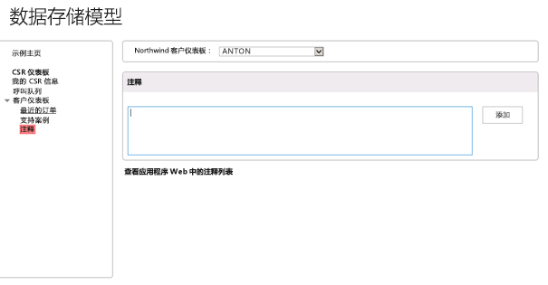
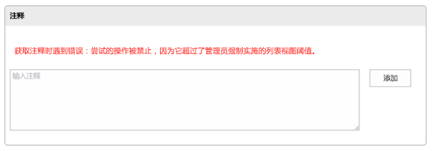
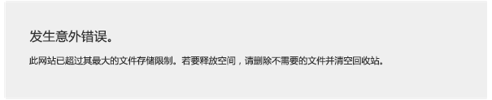
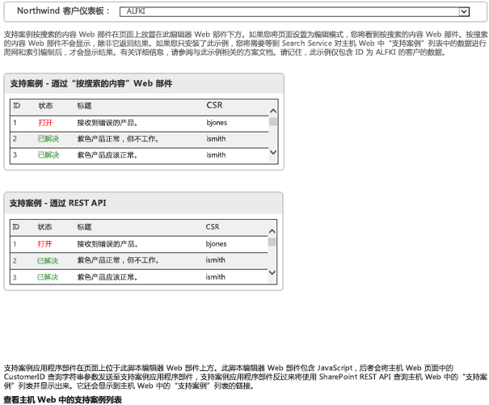
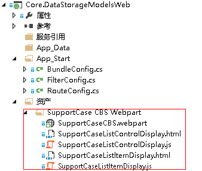


# SharePoint Online 中的数据存储选项
开发 SharePoint Online 外接程序时，您具有多个不同的数据存储选项。您可以使用本文中所述的示例研究每个选项之间的区别，并了解使用远程数据存储的优势。 

 **上次修改时间：** 2015年8月12日

 _ **适用范围：** SharePoint 2013?| SharePoint Add-ins?| SharePoint Online_

 **注释**  名称"SharePoint 相关应用程序"将更改为"SharePoint 外接程序"。在转换期间，某些 SharePoint 产品和 Visual Studio 工具的文档和 UI 仍可能使用术语"SharePoint 相关应用程序"。有关详细信息，请参阅 [Office 和 SharePoint 相关应用程序的新名称](05b07b04-6c8b-4b7e-bd86-e32c589dfead.md#bk_newname)。

本文介绍了 [Core.DataStorageModels](https://github.com/OfficeDev/PnP/tree/dev/Samples/Core.DataStorageModels) 示例外接程序，它显示了下面每种数据存储选项及其各自的优点和缺点：

- 主机 Web 上的 SharePoint 列表
    
- 外接程序 Web 上的 SharePoint 列表
    
- SQL Azure 数据库
    
- Azure 队列存储
    
- Azure 表存储
    
- 外部 Web 服务
    
[Core.DataStorageModels](https://github.com/OfficeDev/PnP/tree/dev/Samples/Core.DataStorageModels) 示例外接程序是使用 C# 和 JavaScript 编写的提供程序托管的外接程序，它向主机 Web 和外接程序 Web 部署多种 SharePoint 项目（列表、外接程序部件、Web 部件）。它与外接程序 Web 和主机 Web 上的 SharePoint 列表交互，并调用 SQL Azure 数据库、Azure 队列和表存储以及实施 OData 的远程 Web 服务。此示例使用模型-视图-控制器 (MVC) 模式。
[Core.DataStorageModels](https://github.com/OfficeDev/PnP/tree/dev/Samples/Core.DataStorageModels) 示例外接程序对选项适应的特定功能应用各个数据存储选项，如下表中所述。


|**示例外接程序存储选项**|**用途**|
|:-----|:-----|
|SharePoint 列表外接程序 Web|客户注意事项|
|SharePoint 列表主机 Web|支持案例|
|Northwind OData 服务|客户|
|Azure 表存储|CSR 评级|
|Azure 队列存储|呼叫队列|
|SQL Azure Northwind 数据库|订单、订单明细、产品|
外接程序实施客户服务仪表板，以及显示最近订单、客户代表调查评级、客户注意事项、支持案例和客户代表呼叫队列的相关界面。 
前两个方案允许您使用相对简单的客户端对象模型代码或 REST 查询检索数据，但会受列表查询阈值限制。后四个方案使用不同类型的远程存储。 
 **为改进此内容做贡献**
您可以获取最新的更新，或为改进 [GitHub 上的此文章](https://github.com/OfficeDev/PnP-Guidance/blob/master/articles/Data-storage-options-in-SharePoint-Online.md)做贡献。您还可以为改进本示例以及 [GitHub 上的其他示例](https://github.com/OfficeDev/PnP)做贡献。有关示例的完整列表，请参阅 [模式和做法开发人员中心](http://dev.office.com/patterns-and-practices)。我们欢迎您做出 [贡献](https://github.com/OfficeDev/PnP/wiki/contributing-to-Office-365-developer-patterns-and-practices)。 

## 开始之前

使用此示例之前，请确保具备以下几项：


- 您可以部署 SQL Azure 数据库和创建 Azure 存储帐户的 Microsoft Azure 帐户。 
    
- 可以从 Visual Studio 2013 部署实例的 SharePoint 开发人员网站。
    
此外，您还需要将 Northwind 数据库部署到 Microsoft Azure。


### 部署 Northwind 数据库


1. 登录到 Azure 管理门户，并选择"SQL 数据库">"服务器"。
    
2. 选择"创建 SQL 数据库服务器"。
    
3. 在"创建服务器"表单中，输入"登录名"、"登录密码"和"地区"的值，如图 2 中所示。
    
    **图 1. SQL 数据库服务器设置**

    

4. 选择复选标记按钮，以完成并创建服务器。
    
5. 现在您已创建了数据库，选择您创建的服务器名称，如图 3 中所示。
    
    **图 2. "服务器"页面上的服务器名称**

    

6. 选择"配置"，然后选择右下角的箭头以完成配置，选择"保存"。
    
7. 在本地开发计算机上打开 SQL Server Management Studio，创建一个名为  **NorthWind** 的新数据库。
    
8. 在"对象资源管理器"中，选择"Northwind"数据库，然后选择"新查询"。
    
9. 在您选择的文本编辑器中，打开 [Core.DataStorageModels](https://github.com/OfficeDev/PnP/tree/dev/Samples/Core.DataStorageModels) 示例中提供的 northwind.sql SQL 脚本。
    
10. 将 northwind.sql 文件中的文本复制并粘贴到 SQL Server Management Studio 的"SQL 查询"窗口中，然后选择"执行"。
    
11. 在"对象资源管理器"中，打开"Northwind"数据库的快捷菜单（右键单击），选择"任务"，然后选择"将数据库部署到 SQL Azure"。
    
12. 在"简介"屏幕上，选择"下一步"。
    
13. 选择"连接..."，然后输入您刚刚创建的 SQL Azure 数据库服务器的"服务器名称"。
    
14. 在"身份验证"下拉列表中，选择"SQL Server 身份验证"。
    
15. 输入您创建 SQL Azure 数据库服务器时使用的用户名和密码，然后选择"连接"。
    
16. 选择"下一步"，然后选择"完成"，等待数据库创建完成，然后选择"关闭"以关闭向导。
    
17. 返回到 Azure 管理门户 ([https://manage.windowsazure.com/](https://manage.windowsazure.com/))，验证 Northwind 数据库已成功创建。您应该会看到它列在 sql 数据库屏幕上，如图 4 中所示。
    
    **图 3. SQL Server 数据库列表**

    

18. 选择 Northwind 数据库，然后选择"查看 SQL 数据库连接字符串"。
    
19. 将连接字符串复制并粘贴到文本文件中，将该文本文件保存在本地。稍后您将需要此连接字符串。关闭"连接字符串"对话框。
    
20. 选择"设置此 IP 地址的 Windows Azure 防火墙规则"链接，将您的 IP 地址添加到防火墙规则，以便您可以访问数据库。
    
21. 在 Visual Studio 2013 中打开 Core.DataStorageModels.sln 项目。
    
22. 在 Visual Studio"解决方案资源管理器"中，找到 Web.config 文件。
    
23. 在 Web.config 文件中，找到 add  `name="NorthWindEntities"` 元素，并使用在步骤 19 中保存到本地的连接字符串信息替换现有的 connectionString 值。
    
  ```XML
  <add name="NorthWindEntities" connectionString="metadata=res://*/Northwind.csdl|res://*/Northwind.ssdl|res://*/Northwind.msl;provider=System.Data.SqlClient;provider connection string=&amp;quot;data source=<Your Server Here>.database.windows.net;initial catalog=NorthWind;user id=<Your Username Here>@<Your Server Here>;password=<Your Password Here>;MultipleActiveResultSets=True;App=EntityFramework&amp;quot;" providerName="System.Data.EntityClient" />

  ```

24. 保存 Web.config 文件
    

## 外接程序 Web 上的 SharePoint 列表（注释方案）

注释列表方案使用外接程序 Web 上的 SharePoint 列表，它显示了列表如何在 SharePoint 外接程序 Web 中执行。注释列表使用标题和说明字段在外接程序 Web 中创建。SharePoint REST API 查询注释列表并根据客户 ID 返回所有注释。

与其他存储解决方案相比，使用外接程序 Web 中的列表有一个重要优势：您可以使用简单的 SharePoint REST API 调用查询数据。但是，这有一些缺点：


- 若要更新列表元数据，您必须更新并重新部署外接程序。
    
- 若要更新数据结构，您必须重新编写用于存储和更新数据的应用程序逻辑。
    
- 列表中存储的信息不能轻松地与其他外接程序共享。
    
- 无法搜索 SharePoint 中的数据。
    
- 在列表中可以存储的数据量和查询结果集的大小有限。
    
客户仪表板的基础"注释"部分的代码使用 REST 查询从部署到外接程序 Web 的列表中检索数据。此列表包含标题、作者、客户 ID 和说明字段。您可以使用外接程序的界面添加和检索指定客户的注释，如图 5 中所示。


**图 4. 注释外接程序的用户界面**

"查看外接程序 Web 中的注释列表"链接提供了列表数据的"开箱即用"视图。

此外接程序使用模型-视图-控制器 (MVC) 模式。您可以在 Views/CustomerDashboard/Notes.cshtml 文件中查看注释方案的代码。它使用简单的 REST 调用来添加和检索数据。以下代码从指定客户的注释列表中检索注释。


```C#
function getNotesAndShow() {
    var executor = new SP.RequestExecutor(appWebUrl);
    executor.executeAsync(
       {
           url: appWebUrl + "/_api/web/lists/getByTitle('Notes')/items/" +
                "?$select=FTCAM_Description,Modified,Title,Author/ID,Author/Title" +
                "&amp;$expand=Author/ID,Author/Title" +
                "&amp;$filter=(Title eq '" + customerID + "')",
           type: "GET",
           dataType: 'json',
           headers: { "accept": "application/json;odata=verbose" },
           success: function (data) {
               var value = JSON.parse(data.body);
               showNotes(value.d.results);
           },
           error: function (error) { console.log(JSON.stringify(error)) }
       }

    );
}

```

以下代码将指定客户的注释添加到注释列表中。


```C#
function addNoteToList(note, customerID) {
    var executor = new SP.RequestExecutor(appWebUrl);
    var bodyProps = {
        '__metadata': { 'type': 'SP.Data.NotesListItem' },
        'Title': customerID,
        'FTCAM_Description': note
    };
    executor.executeAsync({
        url: appWebUrl + "/_api/SP.AppContextSite(@target)/web/lists/getbytitle('Notes')/items?@target='" + appWebUrl + "'",
        contentType: "application/json;odata=verbose",
        method: "POST",
        headers: {
            "accept": "application/json;odata=verbose",
            "content-type": "application/json;odata=verbose",
            "X-RequestDigest": $("#__REQUESTDIGEST").val()
        },
        body: JSON.stringify(bodyProps),
        success: getNotesAndShow,
        error: addNoteFailed
    });
}

```

您可以在列表中添加 5000 个项目，以显示生成 5000 个或更多项目的结果集的列表查询将达到列表查询阈值并失败。您还可以在超过网站集存储限制的外接程序 Web 上的列表中添加这么多数据（具体取决于您向其分配的存储空间）。这些方案显示了此方法最重要的两个限制：列表查询大小限制和存储空间限制。如果您的企业要求您使用大型数据集和查询结果集，此方法将不起作用。


### 列表查询阈值


加载足够的数据以超过列表查询阈值限制：


1. 在左侧菜单中，选择"示例主页"。
    
2. 在"列表查询阈值"部分中，选择"将列表项添加到外接程序 Web 中的注释列表"。
    
3. 按照按钮上方显示的说明，执行此操作 10 次。
    
    更新注释列表时，页面顶部将显示一条消息，指明您添加了多少列表项（注释）以及还有多少项目要添加。
    
     **注释**  每次选择此按钮时，大约需要一分钟完成操作。运行操作 10 次的最终结果显示在图 6 中。
4. 将 5,001 个项目添加到列表中后，在左侧菜单中选择"注释"。加载页面后，您将看到来自 SharePoint REST API 的错误消息，如图 6 中所示。
    
    **图 5. 超过列表查询阈值的错误消息**

    

5. 选择"查看外接程序 Web 中的注释列表"，按页浏览列表以确认其中包含 500 行。请注意，尽管 SharePoint 列表视图可以容纳浏览这么多条目，但由于列表查询限制阈值，REST API 将失败。
    

### 数据存储限制


加载足够的数据以超过数据存储限制：


1. 在左侧菜单中，选择"示例主页"。
    
2. 在"数据阈值"部分中，选择"使用 1 GB 的数据填充外接程序 Web 注释列表"。
    
3. 按照"使用 1 GB 的数据填充外接程序 Web 注释列表"按钮上方显示的说明，执行此操作 11 次。
    
    更新注释列表时，页面顶部将显示一条消息，指明您添加了多少列表项（注释）以及还有多少项目要添加。
    
     **注释**  每次选择此按钮时，大约需要一分钟完成操作。运行操作 11 次的最终结果显示在图 7 中。
4. 执行操作 11 次之后，您选择此按钮时将显示一条错误消息，如图 7 中所示。
    
    **图 6. 超过数据存储阈值的错误消息**

    

5. 超过数据存储限制后，在 Web 浏览器中选择后退按钮，然后在左侧菜单中选择"注释"链接。
    
6. 选择"查看外接程序 Web 中的注释列表"。
    
    加载页面后，页面顶部将显示一条错误消息，指示您的网站的存储空间已用完。
    

## 主机 Web 上的 SharePoint 列表（支持案例）

支持案例方案显示存储在主机 Web 的 SharePoint 中的数据。此方案使用两种不同的模式来访问数据并使用数据进行交互。第一种模式包括 SharePoint 搜索服务和按搜索的内容 Web 部件，其中应用了自定义显示模板。第二种模式包括显示 MVC 视图的外接程序部件（客户端 Web 部件），它使用  **SP.RequestExecutor** 类来调用 SharePoint REST API。

使用此方法具有下列优点：


- 您可以使用简单 REST 查询或客户端对象模型代码轻松地查询数据。
    
- 可以搜索 SharePoint 中的数据。
    
- 您可以更新列表元数据并创建列表的新视图，而无需更新和重新部署外接程序。这些更改对外接程序的行为没有影响。
    
- 当您卸载外接程序时，不会删除主机 Web 上的列表，除非外接程序使用  **AppUninstalled** 事件删除列表和/或删除数据。
    
下列缺点会抵消这些优点：


- 主机 Web 会限制在列表中可以存储的数据量以及查询结果的大小。如果您的企业需要存储和/或查询大数据集，则不建议使用此方法。
    
- 对于复杂查询，列表的表现则没有数据库好。
    
- 对于备份和还原数据，列表的表现则没有数据库好。
    
此方案的数据存储在部署到主机 Web 的 SharePoint 列表中。数据可通过以下方式检索和显示： 


- [内容搜索 Web 部件](https://msdn.microsoft.com/zh-cn/library/office/jj163789%28v=office.15%29.aspx)。
    
- 作为模型-视图-控制器视图实施的外接程序部件。 
    
此视图中的代码使用 REST 查询从列表中检索信息，而内容搜索 Web 部件使用 SharePoint 搜索服务检索数据。两种方法演示了此选项的主要优点：您可以使用搜索服务和 REST/CSOM API 从主机 Web 的列表中检索信息。

当您从支持案例下拉列表中选择客户时，您将看到该客户的支持案例数据显示在 Web 部件和外接程序部件（图 8）中。Web 部件可能不会立即返回内容，因为它可能需要长达 24 小时，SharePoint 搜索服务才能会数据编制索引。您还可以选择"查看主机 Web 中的支持案例列表"链接查看列表数据的传统视图。


**图 7. 支持案例方案的用户界面**

此外接程序部署的内容搜索 Web 部件使用自定义显示模板。图 9 显示了 Web 项目的"资产"目录，您可在其中找到 Web 部件和关联的模板。


**图 8. Web 项目的"资产"目录的内容**

您将在 Views/SupportCaseAppPart\Index.cshtml 文件中找到的以下 JavaScript 代码使用跨域库在主机 Web 的 SharePoint 列表上调用 REST 查询。 


```C#
function execCrossDomainRequest() {
var executor = new SP.RequestExecutor(appWebUrl);

executor.executeAsync(
   {
        url: appWebUrl + "/_api/SP.AppContextSite(@@target)" +
                "/web/lists/getbytitle('Support Cases')/items" +
              "?$filter=(FTCAM_CustomerID eq '" + customerID + "')" +
            "&amp;$top=30" +
                    "&amp;$select=Id,Title,FTCAM_Status,FTCAM_CSR" +
                    "&amp;@@target='" + hostWebUrl + "'",
method: "GET",
              headers: { "Accept": "application/json; odata=verbose" },
              success: successHandler,
              error: errorHandler
   }
);
}

```

您可以在列表中添加 5000 个项目，以显示生成 5000 个或更多项目的结果集的列表查询将达到列表查询阈值并失败。此方案显示了此方案最重要的限制之一：列表查询大小限制。如果您的企业要求您使用大型数据和查询结果集，此方法将不起作用。有关详细信息，请参阅本文前面的 [列表查询阈值](#列表查询阈值)。


## Northwind OData Web 服务（客户仪表板方案）

客户仪表板方案使用 JQuery AJAX 来调用 NorthWind OData 服务，以返回客户信息。 外接程序将其数据存储在 Web 服务中，然后使用 [OData](http://www.odata.org/) 进行检索。

使用此方法具有下列优点：


- 指定的 Web 服务可以支持多个外接程序。
    
- 您可以更新 Web 服务，而无需更新和重新部署您的外接程序。
    
- 您的 SharePoint 和 Web 服务安装不会相互影响。
    
- Microsoft Azure 等托管服务使您能够扩展 Web 服务。
    
- 您可以与 SharePoint 网站分开备份和还原关于 Web 服务的数据。
    
- 卸载外接程序时不会丢失数据，除非外接程序使用  **AppUninstalled** 事件删除数据。
    
客户仪表板方案将其数据存储在实施 OData 标准以检索数据的 Web 服务中。在客户仪表板界面中，您从下列菜单中选择一个客户，客户信息将显示在"客户信息"窗格中。

此 UI 页面是模型-视图-控制器视图。显示在 Views/CustomerDashboard\Home.cshtml 文件中定义。基础代码位于 Scripts/CustomerDashboard.js 文件中。JavaScript 代码使用 AJAX 查询 Northwind Web 服务。因为这是 OData 服务，Web 服务查询包含附加到指向 Web 服务终结点的 URL 的查询字符串参数。服务以 JSON 格式返回客户信息。

当您选择"客户仪表板"链接时，以下代码将运行。它将检索所有客户名称和 ID 以填充下拉菜单。


```C#
var getCustomerIDsUrl = "https://odatasampleservices.azurewebsites.net/V3/Northwind/Northwind.svc/Customers?$format=json&amp;$select=CustomerID";
    $.get(getCustomerIDsUrl).done(getCustomerIDsDone)
        .error(function (jqXHR, textStatus, errorThrown) {
            $('#topErrorMessage').text('Can\'t get customers. An error occurred: ' + jqXHR.statusText);
        });

```

当您从下拉菜单中选择客户名称时，以下代码将运行。它使用 OData  **$filter** 参数指定客户 ID 和其他查询字符串参数以检索与此客户相关的信息。


```C#
var url = "https://odatasampleservices.azurewebsites.net/V3/Northwind/Northwind.svc/Customers?$format=json" +  "&amp;$select=CustomerID,CompanyName,ContactName,ContactTitle,Address,City,Country,Phone,Fax" + "&amp;$filter=CustomerID eq '" + customerID + "'";

$.get(url).done(getCustomersDone)
   .error(function (jqXHR, textStatus, errorThrown) {
          alert('Can\'t get customer ' + customerID + '. An error occurred: ' + 
                 jqXHR.statusText);
});

```


## Azure 表存储（客户服务调查方案）

客户服务调查方案允许客户服务代表查看基于客户调查的评级，并使用 Azure 表存储和 Microsoft.WindowsAzure.Storage.Table.CloudTable API 来存储数据并使用数据进行交互。

使用此方法具有下列优点：


- Azure 存储表支持多个外接程序。
    
- 您可以更新 Azure 存储表，而无需更新和重新部署您的外接程序。
    
- 您的 SharePoint 安装和 Azure 存储表不会相互影响性能。
    
- Azure 存储表可轻松扩展。
    
- 您可以与 SharePoint 网站分开备份和还原 Azure 存储表。
    
- 卸载外接程序时不会丢失数据，除非外接程序使用  **AppUninstalled** 事件删除数据。
    
外接程序界面在中心页面显示当前用户的调查评级。如果该 Azure 存储表为空，外接程序将向表中添加一些信息，然后再显示。

CSRInfoController.cs 中的以下代码定义了用于检索用户的  **nameId** 的 **Home** 方法。


```C#
[SharePointContextFilter]
public ActionResult Home()
{
    var context = 
        SharePointContextProvider.Current.GetSharePointContext(HttpContext);
    var sharePointService = new SharePointService(context);
    var currentUser = sharePointService.GetCurrentUser();
    ViewBag.UserName = currentUser.Title;

    var surveyRatingsService = new SurveyRatingsService();
    ViewBag.Score = surveyRatingsService.GetUserScore(currentUser.UserId.NameId);

    return View();
}

```

SurveyRatingService.cs 文件中的以下代码定义了  **SurveyRatingsService** 构造函数，以设置到 Azure 存储帐户的连接。


```C#
public SurveyRatingsService(string storageConnectionStringConfigName = 
        "StorageConnectionString")
{
    var connectionString = Util.GetConfigSetting("StorageConnectionString");
    var storageAccount = CloudStorageAccount.Parse(connectionString);

    this.tableClient = storageAccount.CreateCloudTableClient();
    this.surveyRatingsTable = this.tableClient.GetTableReference("SurveyRatings");
    this.surveyRatingsTable.CreateIfNotExists();
}

```

该文件中的以下代码定义了  **GetUserScore** 方法，以从 Azure 存储表检索用户的调查分数。


```C#
public float GetUserScore(string userName)
{
    var query = new TableQuery<Models.Customer>()
    .Select(new List<string> { "Score" })
    .Where(TableQuery.GenerateFilterCondition("Name", 
    QueryComparisons.Equal, userName));

    var items = surveyRatingsTable
         .ExecuteQuery(query)
             .ToArray();

    if (items.Length == 0)           
    return AddSurveyRatings(userName);

    return (float)items.Average(c => c.Score);
}

```

如果表中不包含与当前用户相关的任何调查数据， **AddSurveyRating** 方法将为用户随机分配一个分数。


```C#
private float AddSurveyRatings(string userName)
{
    float sum = 0;
    int count = 4;
    var random = new Random();

    for (int i = 0; i < count; i++)
    {
    var score = random.Next(80, 100);
    var customer = new Models.Customer(Guid.NewGuid(), userName, score);

    var insertOperation = TableOperation.Insert(customer);
    surveyRatingsTable.Execute(insertOperation);

    sum += score;
    }
    return sum / count;
}

```


## Azure 队列存储（客户调用队列方案）

客户呼叫队列方案列出支持队列中的呼叫者并模拟接听电话。此方案使用 Azure 存储队列在模型-视图-控制器中存储数据和  **Microsoft.WindowsAzure.Storage.Queue.CloudQueue** API。

使用此方法具有下列优点：


- Azure 存储队列支持多个外接程序。
    
- 您可以更新 Azure 存储队列，而无需更新和重新部署您的外接程序。
    
- 您的 SharePoint 安装和 Azure 存储队列不会相互影响性能。
    
- Azure 存储队列可轻松扩展。
    
- 您可以与 SharePoint 网站分开备份和还原 Azure 存储队列。
    
- 卸载外接程序时不会丢失数据，除非外接程序使用  **AppUninstalled** 事件删除数据。
    
当您选择"呼叫队列"链接时，外接程序界面在中心窗格中显示支持呼叫队列。您可以选择"模拟呼叫"，模拟接通电话（向队列中添加一个呼叫）；也可以选择与指定呼叫关联的"接听电话"操作，模拟接听最早的呼叫（将呼叫从队列中删除）。

此页面是在 Views\CallQueue\Home.cshmtl 文件中定义的模型-视图-控制器视图。Controllers\CallQueueController.cs 文件定义了  **CallQueueController** 类，其中包含用于检索队列中所有呼叫、向队列中添加呼叫（模拟呼叫）以及从队列中删除呼叫（接听电话）的方法。每种方法均调用 Services\CallQueueService.cs 文件中定义的方法，使用 Azure 存储队列 API 来检索存储队列中的基础信息。


```C#
public class CallQueueController : Controller
{
    public CallQueueService CallQueueService { get; private set; }

    public CallQueueController()
    {
        CallQueueService = new CallQueueService();
    }

    // GET: CallQueue
    public ActionResult Home(UInt16 displayCount = 10)
    {
        var calls = CallQueueService.PeekCalls(displayCount);
        ViewBag.DisplayCount = displayCount;
        ViewBag.TotalCallCount = CallQueueService.GetCallCount();
        return View(calls);
    }

    [HttpPost]
    public ActionResult SimulateCalls(string spHostUrl)
    {
        int count = CallQueueService.SimulateCalls();
        TempData["Message"] = string.Format("Successfully simulated {0} calls and added them to the call queue.", count);
        return RedirectToAction("Index", new { SPHostUrl = spHostUrl });
    }

    [HttpPost]
    public ActionResult TakeCall(string spHostUrl)
    {
        CallQueueService.DequeueCall();
        TempData["Message"] = "Call taken successfully and removed from the call queue!";
        return RedirectToAction("Index", new { SPHostUrl = spHostUrl });
    }
}

```

CallQueueService.cs 文件定义  **CallQueueService** 类，以构建到 Azure 存储队列的连接。该类还包含用于添加呼叫、删除（从队列中删除）呼叫以及检索队列中呼叫的方法。


```C#
public class CallQueueService
{
    private CloudQueueClient queueClient;

    private CloudQueue queue;

    public CallQueueService(string storageConnectionStringConfigName = "StorageConnectionString")
    {
        var connectionString = CloudConfigurationManager.GetSetting(storageConnectionStringConfigName);
        var storageAccount = CloudStorageAccount.Parse(connectionString);

        this.queueClient = storageAccount.CreateCloudQueueClient();
        this.queue = queueClient.GetQueueReference("calls");
        this.queue.CreateIfNotExists();
        }

        public int? GetCallCount()
        {
        queue.FetchAttributes();
        return queue.ApproximateMessageCount;
    }

    public IEnumerable<Call> PeekCalls(UInt16 count)
    {
        var messages = queue.PeekMessages(count);

        var serializer = new JavaScriptSerializer();
        foreach (var message in messages)
        {
        Call call = null;
        try
        {
        call = serializer.Deserialize<Call>(message.AsString);
        }
        catch { }

        if (call != null) yield return call;
        }
    }

    public void AddCall(Call call)
    {
        var serializer = new JavaScriptSerializer();
        var content = serializer.Serialize(call);
        var message = new CloudQueueMessage(content);
        queue.AddMessage(message);
    }

    public void DequeueCall()
    {
        var message = queue.GetMessage();
        queue.DeleteMessage(message);
    }

    public int SimulateCalls()
    {
        Random random = new Random();
        int count = random.Next(1, 6);
        for (int i = 0; i < count; i++)
        {
        int phoneNumber = random.Next();
        var call = new Call
        {
        ReceivedDate = DateTime.Now,
        PhoneNumber = phoneNumber.ToString("+1-000-000-0000")
        };
        AddCall(call);

        return count;
    }
}

```


## SQL Azure 数据库（最近的订单方案）

最近的订单方案通过直接调用 Northwind SQL Azure 数据库，返回指定客户的所有订单。

使用此方法具有下列优点：


- 数据库可支持多个外接程序。
    
- 您可以更新数据库架构，而无需更新和重新部署您的外接程序，前提是架构更改不会影响您的外接程序中的查询。
    
- 关系数据库可支持多对多关系，因此支持更复杂的业务方案。
    
- 您可以使用数据库设计工具来优化数据库设计。
    
- 如果您需要在查询中执行复杂的操作（例如计算和合并），关系数据库将提供比其他选项更好的性能。
    
- SQL Azure 数据库使您可以轻松地导入和导出数据，因为可以更轻松地管理和移动数据。
    
- 卸载外接程序时不会丢失任何数据，除非外接程序使用  **AppUninstalled** 事件删除数据。
    
最近的订单界面的工作方式与客户仪表板界面非常相似。您在左侧列中选择"最近的订单"链接，然后从中心窗格顶部的下拉菜单中选择一个客户。该客户的订单列表将显示在中心窗格中。 

此页面是在 Views\CustomerDashboard\Orders.cshtml 文件中定义的模型-视图-控制器视图。Controllers\CustomerDashboardController.cs 文件中的代码使用 [实体框架](https://msdn.microsoft.com/zh-cn/data/ef.aspx)查询 SQL Azure 数据库中的"订单"表。客户 ID 使用 URL 中的查询字符串参数进行传递，该 URL 在用户从下拉菜单中选择客户时传递。查询将在"客户"、"员工"和"发货人"表上创建合并。然后查询结果将传递到显示结果的模型-视图-控制器视图中。

CustomerDashboardController.cs 文件中的以下代码执行数据库查询并将数据返回到视图中。


```C#
public ActionResult Orders(string customerId)
{            
    Order[] orders;
    using (var db = new NorthWindEntities())
    {
            orders = db.Orders
                  .Include(o => o.Customer)
                  .Include(o => o.Employee)
                  .Include(o => o.Shipper)
                  .Where(c => c.CustomerID == customerId)
                  .ToArray();
    }

    ViewBag.SharePointContext = 
        SharePointContextProvider.Current.GetSharePointContext(HttpContext);

    return View(orders);
}

```


## 其他资源


- [适用于 SharePoint 2013 和 SharePoint Online 的复合企业外接程序](Composite-buisness-apps-for-SharePoint.md)
    
- [GitHub 上的 Office 365 开发模式和做法](https://github.com/OfficeDev/PnP)
    
