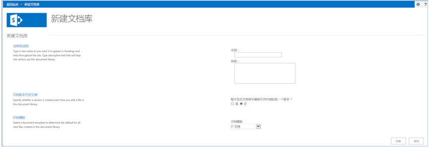
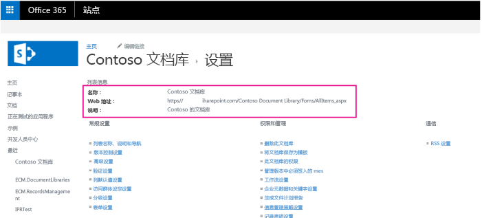


# 文档库模板示例 SharePoint 外接程序
作为企业内容管理 (ECM) 策略的一部分，您可以实现自定义 SharePoint 文档库模板，并自定义网站栏、网站内容类型、分类字段、版本设置和默认文档内容类型。

 **上次修改时间：** 2015年8月7日

 _ **适用范围：** SharePoint 2013?| SharePoint Add-ins?| SharePoint Online_

 **注释**  名称"SharePoint 相关应用程序"将更改为"SharePoint 外接程序"。在转换期间，某些 SharePoint 产品和 Visual Studio 工具的文档和 UI 仍可能使用术语"SharePoint 相关应用程序"。有关详细信息，请参阅 [Office 和 SharePoint 相关应用程序的新名称](05b07b04-6c8b-4b7e-bd86-e32c589dfead.md#bk_newname)。

[ECM.DocumentLibraries](https://github.com/OfficeDev/PnP/tree/dev/Scenarios/ECM.DocumentLibraries) 示例演示如何使用提供程序托管的 SharePoint 外接程序创建 SharePoint 列表或文档库，向其分配内容类型，并删除默认内容类型。如果您需要执行以下操作，请使用此解决方案：

- 创建列表或文档库并应用默认内容类型。
    
- 对自定义字段的本地化版本的添加、维护或实现加强控制。
    
- 删除列表或库上的默认内容类型。
    
- 创建列表或库时应用库配置设置。
    
 **为改进此内容做贡献**
您可以获取最新的更新，或为改进 [GitHub 上的此文章](https://github.com/OfficeDev/PnP-Guidance/blob/master/articles/Document-library-templates-sample-app-for-SharePoint.md)做贡献。您还可以为改进本示例以及 [GitHub 上的其他示例](https://github.com/OfficeDev/PnP)做贡献。有关示例的完整列表，请参阅 [模式和做法开发人员中心](http://dev.office.com/patterns-and-practices)。我们欢迎您做出 [贡献](https://github.com/OfficeDev/PnP/wiki/contributing-to-Office-365-developer-patterns-and-practices)。 

## 开始之前

若要开始，请从 GitHub 上的 [Office 365 开发人员模式和做法](https://github.com/OfficeDev/PnP/tree/dev)项目下载 [ECM.DocumentLibraries](https://github.com/OfficeDev/PnP/tree/dev/Scenarios/ECM.DocumentLibraries) 示例外接程序。

访问 ECM.DocumentLibraries 外接程序的用户必须具有管理列表的权限。Default.aspx.cs 中的  **DoesUserHavePermission** 方法将检查用户的权限，确保他们可以管理列表。如果用户没有权限管理列表，外接程序将向用户显示一条错误消息。


```C#
private bool DoesUserHavePermission()
        {
            var spContext = SharePointContextProvider.Current.GetSharePointContext(Context);
            using (var ctx = spContext.CreateUserClientContextForSPHost())
            {
                BasePermissions perms = new BasePermissions();
                perms.Set(PermissionKind.ManageLists);
                ClientResult<bool> _permResult = ctx.Web.DoesUserHavePermissions(perms);
                ctx.ExecuteQuery();
                return _permResult.Value;
            }
        }

```


## 使用 ECM.DocumentLibraries 示例外接程序

当您启动此外接程序时，起始页面将如图 1 中所示。选择"网站内容">"添加外接程序">"文档库">"高级选项"时，ECM.DocumentLibraries 起始页面将与添加新文档库的页面类似，只有一个区别。启动外接程序时，"文档模板"下拉列表将显示自定义文档库模板、IT 模板和 Contoso 文档。当用户选择"创建"时，会将所选的自定义内容类型分配到新文档库。 


**图 1. ECM.DocumentLibraries 外接程序的起始页面**

当用户选择"创建"时，Default.aspx.cs 中的  **CreateLibrary_Click** 方法将检查所选的默认模板，并调用 ContentTypeManager.cs 中的 **CreateITDocumentLibrary** 或 **CreateContosoDocumentLibrary** 方法，如以下代码中所示。


    
 **注释**  本文中的代码按原样提供，不提供任何明示或暗示的担保，包括对特定用途适用性、适销性或不侵权的默示担保。


```C#
protected void CreateLibrary_Click(object sender, EventArgs e)
        {
            try
            {
                var _spContext = SharePointContextProvider.Current.GetSharePointContext(Context);
                var _templateSelectedItem = this.DocumentTemplateType.Value;
                var _libraryToCreate = this.GetLibraryToCreate();
                using (var _ctx = _spContext.CreateUserClientContextForSPHost())
                {
                    
                    _ctx.ApplicationName = "AMS ECM.DocumentLibraries";
                    ContentTypeManager _manager = new ContentTypeManager();
                    switch(_templateSelectedItem)
                    {
                        case "IT Document":
                            _manager.CreateITDocumentLibrary(_ctx, _libraryToCreate);
                            break;
                        case "Contoso Document":
                            _manager.CreateContosoDocumentLibrary(_ctx, _libraryToCreate);
                            break;
                    }
                 }

                Response.Redirect(this.Url.Value);
            }
            catch (Exception _ex)
            {
                throw;
            }
        }

```

然后  **CreateContosoDocumentLibrary** 方法将执行下列任务，如下一代码示例中所示：


1. 在 Managed Metadata Service 中创建自定义字段。
    
2. 创建内容类型。 
    
3. 将自定义字段与内容类型相关联。
    
4. 使用该内容类型创建文档库。
    


```C#
        public void CreateContosoDocumentLibrary(ClientContext ctx, Library library)
        {
            // Check the fields.
            if (!ctx.Web.FieldExistsById(FLD_CLASSIFICATION_ID)){
                ctx.Web.CreateTaxonomyField(FLD_CLASSIFICATION_ID, 
                                            FLD_CLASSIFICATION_INTERNAL_NAME, 
                                            FLD_CLASSIFICATION_DISPLAY_NAME, 
                                            FIELDS_GROUP_NAME, 
                                            TAXONOMY_GROUP, 
                                            TAXONOMY_TERMSET_CLASSIFICATION_NAME);
            }
            
            // Check the content type.
            if (!ctx.Web.ContentTypeExistsById(CONTOSODOCUMENT_CT_ID)){
                ctx.Web.CreateContentType(CONTOSODOCUMENT_CT_NAME, 
                                          CT_DESC, CONTOSODOCUMENT_CT_ID, 
                                          CT_GROUP);
            }

            // Associate fields to content types.
            if (!ctx.Web.FieldExistsByNameInContentType(CONTOSODOCUMENT_CT_NAME, FLD_CLASSIFICATION_INTERNAL_NAME)){
                ctx.Web.AddFieldToContentTypeById(CONTOSODOCUMENT_CT_ID, 
                                                  FLD_CLASSIFICATION_ID.ToString(), 
                                                  false);
            }
            CreateLibrary(ctx, library, CONTOSODOCUMENT_CT_ID);
          
        }

```

 **CreateContosoDocumentLibrary** 调用 **CreateTaxonomyField** 方法，这是 OfficeDevPnP.Core 的一部分。 **CreateTaxonomyField** 从提供程序托管的外接程序中的托管元数据服务创建字段。


```C#
public static Field CreateTaxonomyField(this Web web, Guid id, string internalName, string displayName, string group, TermSet termSet, bool multiValue = false)
		{
			internalName.ValidateNotNullOrEmpty("internalName");
			displayName.ValidateNotNullOrEmpty("displayName");
			termSet.ValidateNotNullOrEmpty("termSet");

			try
			{
				var _field = web.CreateField(id, internalName, multiValue ? "TaxonomyFieldTypeMulti" : "TaxonomyFieldType", true, displayName, group, "ShowField=\"Term1033\"");

				WireUpTaxonomyField(web, _field, termSet, multiValue);
				_field.Update();

				web.Context.ExecuteQuery();

				return _field;
			}
			catch (Exception)
			{
				/// If there is an exception, the hidden field might be present.
				FieldCollection _fields = web.Fields;
				web.Context.Load(_fields, fc => fc.Include(f => f.Id, f => f.InternalName));
				web.Context.ExecuteQuery();
				var _hiddenField = id.ToString().Replace("-", "");

				var _field = _fields.FirstOrDefault(f => f.InternalName == _hiddenField);
				if (_field != null)
				{
					_field.DeleteObject();
					web.Context.ExecuteQuery();
				}
				throw;

			}
		}

```

 **CreateContosoDocumentLibrary** 调用 **CreateContentType** 方法，这是 OfficeDevPnP.Core 的一部分。 **CreateContentType** 将创建新的内容类型。


```C#
public static ContentType CreateContentType(this Web web, string name, string description, string id, string group, ContentType parentContentType = null)
        {
            LoggingUtility.Internal.TraceInformation((int)EventId.CreateContentType, CoreResources.FieldAndContentTypeExtensions_CreateContentType01, name, id);

            // Load the current collection of content types.
            ContentTypeCollection contentTypes = web.ContentTypes;
            web.Context.Load(contentTypes);
            web.Context.ExecuteQuery();
            ContentTypeCreationInformation newCt = new ContentTypeCreationInformation();

            // Set the properties for the content type.
            newCt.Name = name;
            newCt.Id = id;
            newCt.Description = description;
            newCt.Group = group;
            newCt.ParentContentType = parentContentType;
            ContentType myContentType = contentTypes.Add(newCt);
            web.Context.ExecuteQuery();

            // Return the content type object.
            return myContentType;
        }

```

 **CreateContosoDocumentLibrary** 调用 **AddFieldToContentTypeById** 方法，这是 OfficeDevPnP.Core 的一部分。 **AddFieldToContentTypeById** 将字段与内容类型相关联。


```C#
public static void AddFieldToContentTypeById(this Web web, string contentTypeID, string fieldID, bool required = false, bool hidden = false)
        {
            // Get content type.
            ContentType ct = web.GetContentTypeById(contentTypeID);
            web.Context.Load(ct);
            web.Context.Load(ct.FieldLinks);
            web.Context.ExecuteQuery();

            // Get field.
            Field fld = web.Fields.GetById(new Guid(fieldID));

            // Add field association to content type.
            AddFieldToContentType(web, ct, fld, required, hidden);
        }
```

 **CreateContosoDocumentLibrary** 调用 ContentTypeManager.cs 中的 **CreateLibrary** 方法，以创建文档库。 **CreateLibrary** 方法分配库设置，如文档库的描述、文档版本控制和相关的内容类型。


```C#
private void CreateLibrary(ClientContext ctx, Library library, string associateContentTypeID)
        {
            if (!ctx.Web.ListExists(library.Title))
            {
                ctx.Web.AddList(ListTemplateType.DocumentLibrary, library.Title, false);
                List _list = ctx.Web.GetListByTitle(library.Title);
                if(!string.IsNullOrEmpty(library.Description)) {
                    _list.Description = library.Description;
                }

                if(library.VerisioningEnabled) {
                    _list.EnableVersioning = true;
                }

                _list.ContentTypesEnabled = true;
                _list.Update();
                ctx.Web.AddContentTypeToListById(library.Title, associateContentTypeID, true);
                // Remove the default Document Content Type.
                _list.RemoveContentTypeByName(ContentTypeManager.DEFAULT_DOCUMENT_CT_NAME);
                ctx.Web.Context.ExecuteQuery();
            }
            else
            {
                throw new Exception("A list, survey, discussion board, or document library with the specified title already exists in this Web site.  Please choose another title.");
            }
        }
```

 **CreateLibrary** 调用 ListExtensions.cs 中的 **RemoveContentTypeByName** ，这是 OfficeDevPnP.Core 的一部分。 **RemoveContentTypeByName** 将删除文档库上的默认内容类型。


```C#
        public static void RemoveContentTypeByName(this List list, string contentTypeName)
        {
            if (string.IsNullOrEmpty(contentTypeName))
            {
                throw (contentTypeName == null)
                  ? new ArgumentNullException("contentTypeName")
                  : new ArgumentException(CoreResources.Exception_Message_EmptyString_Arg, "contentTypeName");
            }

            ContentTypeCollection _cts = list.ContentTypes;
            list.Context.Load(_cts);

            IEnumerable<ContentType> _results = list.Context.LoadQuery<ContentType>(_cts.Where(item => item.Name == contentTypeName));
            list.Context.ExecuteQuery();

            ContentType _ct = _results.FirstOrDefault();
            if (_ct != null)
            {
                _ct.DeleteObject();
                list.Update();
                list.Context.ExecuteQuery();
            }
        }
```

创建文档库后，转到文档库上的"库设置"，以检查外接程序分配给文档库的名称、描述、文档版本控制设置、内容类型和自定义字段。


**图 2. 外接程序应用的库设置**




## 其他资源


- [适用于 SharePoint 2013 和 SharePoint Online 的企业内容管理解决方案](enterprise-content-management-solutions-for-sharepoint-2013-and-sharepoint-online.md)
    
- [ECM.Autotagging 示例外接程序](http://dev.office.com/patterns-and-practices-detail/1935)
    
