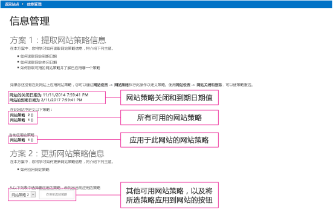


# 信息管理示例 SharePoint 外接程序
作为企业内容管理 (ECM) 策略的一部分，您可以获取或设置管理 SharePoint 网站生命周期的网站策略。

 **上次修改时间：** 2015年8月7日

 _ **适用范围：** SharePoint 2013?| SharePoint Add-ins?| SharePoint Online_

 **注释**  名称"SharePoint 相关应用程序"将更改为"SharePoint 外接程序"。在转换期间，某些 SharePoint 产品和 Visual Studio 工具的文档和 UI 仍可能使用术语"SharePoint 相关应用程序"。有关详细信息，请参阅 [Office 和 SharePoint 相关应用程序的新名称](05b07b04-6c8b-4b7e-bd86-e32c589dfead.md#bk_newname)。

[Core.InformationManagement](https://github.com/OfficeDev/PnP/tree/dev/Scenarios/Core.InformationManagement) 示例说明如何使用 ASP.NET 提供程序托管的 SharePoint 外接程序在网站上获取和设置网站策略。如果您需要执行以下操作，请使用此解决方案：

- 在自定义网站设置期间应用策略设置。 
    
- 创建新的或修改现有的网站策略。
    
- 创建自定义过期公式。 
    
 **为改进此内容做贡献**
您可以获取最新的更新，或为改进 [GitHub 上的此文章](https://github.com/OfficeDev/PnP-Guidance/blob/master/articles/Information-management-sample-app-for-SharePoint.md)做贡献。您还可以为改进本示例以及 [GitHub 上的其他示例](https://github.com/OfficeDev/PnP)做贡献。有关示例的完整列表，请参阅 [模式和做法开发人员中心](http://dev.office.com/patterns-and-practices)。我们欢迎您做出 [贡献](https://github.com/OfficeDev/PnP/wiki/contributing-to-Office-365-developer-patterns-and-practices)。 

## 开始之前

若要开始，请从 GitHub 上的 [Office 365 开发人员模式和做法](https://github.com/OfficeDev/PnP/tree/dev)项目下载 [Core.InformationManagement ](https://github.com/OfficeDev/PnP/tree/dev/Scenarios/Core.InformationManagement) 示例外接程序。

我们建议您至少创建一个网站策略，并在运行此外接程序之前将其分配给您的网站。否则，外接程序将启动而不显示示例数据。有关详细信息，请参阅 [SharePoint 2013 中的网站策略概述](http://technet.microsoft.com/zh-cn/library/jj219569%28v=office.15%29.aspx)。


## 使用 Core.InformationManagement 示例外接程序

当您启动此外接程序时，起始页面将显示以下信息，如图 1 中所示：


- 网站的关闭和过期日期。这些日期特定于某个网站，且基于所应用的网站策略的配置设置。
    
- 可以应用于网站的所有网站策略。
    
- 当前应用的网站策略。
    
- 选择并将新网站策略应用到网站的选项框。
    

**图 1. 信息管理外接程序起始页面**

从您的 SharePoint 网站，您可以转到在远程主机上运行的外接程序，方法是选择"最近的文档">"Core.InformationManagement"。要返回到您的 SharePoint 网站，请选择"返回到网站"。

Core.InformationManagementWeb 项目中的 Pages\Default.aspx.cs 文件包含图 1 中显示的页面的代码。 

Default.aspx.cs 页面的  **Page_Load** 方法中的以下代码根据应用的网站策略，获取并显示网站的关闭和过期日期。此代码调用 OfficeDevPnP.Core 项目的 **GetSiteExpirationDate** 和 **GetSiteCloseDate** 扩展方法。


    
 **注释**  本文中的代码按原样提供，不提供任何明示或暗示的担保，包括对特定用途适用性、适销性或不侵权的默示担保。


```C#
// Get site expiration and closure dates.
if (cc.Web.HasSitePolicyApplied())
{
        lblSiteExpiration.Text = String.Format("The expiration date for the site is {0}", cc.Web.GetSiteExpirationDate());
        lblSiteClosure.Text = String.Format("The closure date for the site is {0}", cc.Web.GetSiteCloseDate());
}

```

Default.aspx.cs 页面的  **Page_Load** 方法中的以下代码显示可以应用于网站的所有网站策略的名称（包括当前应用的网站策略）。此代码调用 OfficeDevPnP.Core 项目的 **GetSitePolicies** 扩展方法。


```C#
// List the defined policies.
List<SitePolicyEntity> policies = cc.Web.GetSitePolicies();
string policiesString = "";
foreach (var policy in policies)
                    {
                        policiesString += String.Format("{0} ({1}) <BR />", policy.Name, policy.Description);
                    }
lblSitePolicies.Text = policiesString;
            };

```

Default.aspx.cs 页面的  **Page_Load** 方法中的以下代码显示当前应用到网站的网站策略的名称。此代码调用 OfficeDevPnP.Core 项目的 **GetAppliedSitePolicy** 扩展方法。


```C#
// Show the assigned policy.
SitePolicyEntity appliedPolicy = cc.Web.GetAppliedSitePolicy();
if (appliedPolicy != null)
            {
            lblAppliedPolicy.Text = String.Format("{0} ({1})", appliedPolicy.Name, appliedPolicy.Description);
            }
else
            {
            lblAppliedPolicy.Text = "No policy has been applied";
            }

```

Default.aspx.cs 页面的  **Page_Load** 方法中的以下代码使用可用的网站策略填充下拉列表，当前已分配给网站的网站策略除外。


```C#
// Fill the policies combo.
foreach (var policy in policies)
{
if (appliedPolicy == null || !policy.Name.Equals(appliedPolicy.Name, StringComparison.InvariantCultureIgnoreCase))
{
                            drlPolicies.Items.Add(policy.Name);
           }
}
btnApplyPolicy.Enabled = drlPolicies.Items.Count > 0;


```

Default.aspx.cs 页面中的以下代码将所选网站策略应用到网站。原始网站策略将替换为新的网站策略。 


```C#
protected void btnApplyPolicy_Click(object sender, EventArgs e)
{
if (drlPolicies.SelectedItem != null)
            {
                cc.Web.ApplySitePolicy(drlPolicies.SelectedItem.Text);
                Page.Response.Redirect(Page.Request.Url.ToString(), true);
            }
}

```


## 其他资源


- [适用于 SharePoint 2013 和 SharePoint Online 的企业内容管理解决方案](Enterprise-Content-Management-solutions-for-SharePoint-2013-and-SharePoint-Online.md)
    
- [OfficeDevPnP.Core 示例](https://github.com/OfficeDev/PnP/tree/master/OfficeDevPnP.Core)
    
- [Core.SiteClassification 示例](https://github.com/OfficeDev/PnP/tree/master/Scenarios/Core.SiteClassification)
    
- [ECM.AutoTagging 示例外接程序](https://github.com/OfficeDev/PnP/tree/dev/Scenarios/ECM.AutoTagging)
    
- [ECM.DocumentLibraries 示例外接程序](https://github.com/OfficeDev/PnP/tree/dev/Scenarios/ECM.DocumentLibraries)
    
- [ECM.RecordsManagement 示例外接程序](https://github.com/OfficeDev/PnP/tree/dev/Scenarios/ECM.RecordsManagement)
    
