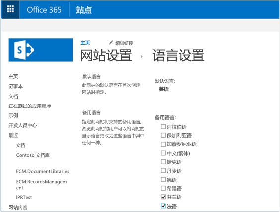
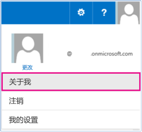
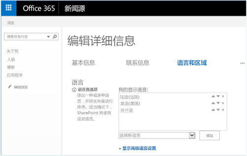
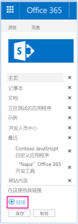
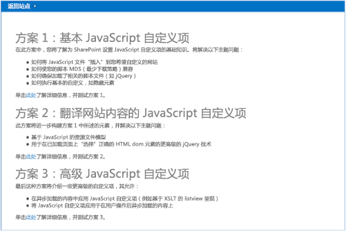
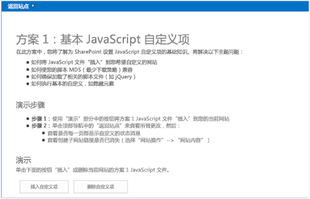
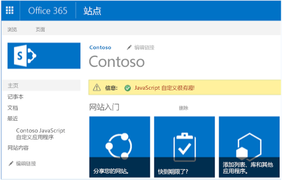
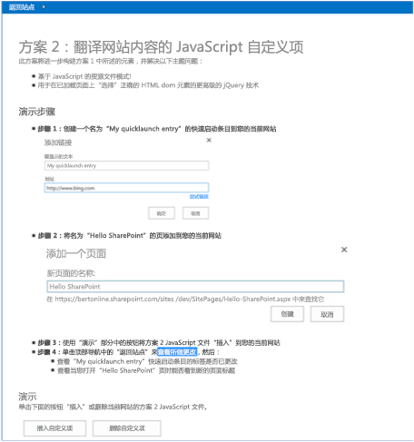
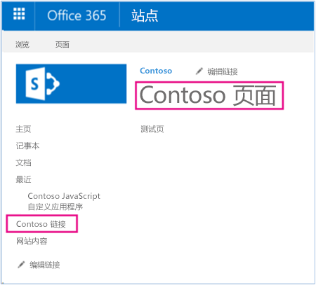


# 本地化 UI 元素示例 SharePoint 外接程序
使用 JavaScript 将 UI 元素值的文本值替换为从 JavaScript 资源文件加载的已翻译文本值，从而本地化 SharePoint UI 元素。 

 **上次修改时间：** 2015年8月13日

 _ **适用范围：** SharePoint 2013?| SharePoint Add-ins?| SharePoint Online_

 **注释**  名称"SharePoint 相关应用程序"将更改为"SharePoint 外接程序"。在转换期间，某些 SharePoint 产品和 Visual Studio 工具的文档和 UI 仍可能使用术语"SharePoint 相关应用程序"。有关详细信息，请参阅 [Office 和 SharePoint 相关应用程序的新名称](05b07b04-6c8b-4b7e-bd86-e32c589dfead.md#bk_newname)。

[Core.JavaScriptCustomization](https://github.com/OfficeDev/PnP/tree/master/Scenarios/Core.JavaScriptCustomization) 示例外接程序演示如何使用 JavaScript 将 SharePoint UI 元素的文本值替换为从 JavaScript 资源文件读取的已翻译文本值。

 **注释**  您负责维护 JavaScript 资源文件中的已翻译文本值。 

本代码示例使用提供程序托管的外接程序执行以下操作：

- 使用特定文本值本地化网页或快速启动链接标题。
    
- 保留主要语言的网页或快速启动链接标题，并在运行时以其他语言提供网页和快速启动链接标题的已翻译版本。
    
- 使用 JavaScript 资源文件进行客户端本地化。
    
- 使用自定义操作将 JavaScript 文件链接到 SharePoint 网站。
    
- 查看网站的 UI 区域性，然后从 JavaScript 资源文件加载特定于区域性的文本值。
    
- 使用 jQuery，用特定于区域性的文本值覆盖网页和快速启动链接标题。
    
 **为改进此内容做贡献**
您可以获取最新的更新，或为改进 [GitHub 上的此文章](https://github.com/OfficeDev/PnP-Guidance/blob/master/articles/Localize-UI-elements-sample-app-for-SharePoint.md)做贡献。您还可以为改进本示例以及 [GitHub 上的其他示例](https://github.com/OfficeDev/PnP)做贡献。有关示例的完整列表，请参阅 [模式和做法开发人员中心](http://dev.office.com/patterns-and-practices)。我们欢迎您做出 [贡献](https://github.com/OfficeDev/PnP/wiki/contributing-to-Office-365-developer-patterns-and-practices)。 

## 开始之前

若要开始，请从 GitHub 上的 [Office 365 开发人员模式和做法](https://github.com/OfficeDev/PnP/tree/dev)项目下载 [Core.JavaScriptCustomization](https://github.com/OfficeDev/PnP/tree/master/Scenarios/Core.JavaScriptCustomization) 示例外接程序。

运行此代码示例之前，请在网站上配置语言设置，并设置用户配置文件页上的显示语言。


### 在您的网站上配置语言设置


1. 在您的团队网站上，选择"设置">"网站设置"。
    
2. 在"网站管理"中，选择"语言设置"。
    
3. 在"语言设置"页的"备用语言"中，选择您的网站可能支持的备用语言。例如，可以选择"法语"和"芬兰语"，如图 1 中所示。
    
4. 选择"确定"。
    

### 设置用户配置文件页上的显示语言


1. 在 Office 365 网站顶部，选择您的配置文件图片，然后选择"关于我"，如图 2 中所示。
    
2. 在"关于我"页上，选择"编辑您的配置文件"。
    
3. 选择省略号 (...) 显示其他选项，然后选择"语言和区域"。
    
4. 在"我的显示语言"中，从"选择新语言"下拉菜单中选择新语言，然后选择"添加"。例如，选择"法语"和"芬兰语"，如图 3 中所示。您可能需要选择向上和向下箭头向上或向下移动首选语言。
    
5. 选择"全部保存并关闭"。
    

 **注释**  可能需要等待几分钟才能以选定语言呈现您的网站。


 **重要信息**  CSOM 会定期更新新功能。如果 CSOM 提供了新功能来更新网页或快速启动链接标题，建议您使用 CSOM 中的新功能，而不使用此处讨论的选项。


**图 1. 设置网站语言**


**图 2. 选择"关于我"导航到用户配置文件页面**


**图 3. 更改用户配置文件页上用户的显示语言设置**

运行此代码示例的 [方案 2](#方案-2) 之前，请完成以下任务。


### 创建快速启动链接


1. 在主机 Web 上，选择"编辑链接"。
    
2. 选择"链接"，如图 4 中所示。
    
3. 在"要显示的文本"中，输入"我的快速启动条目" 。
    
4. 在"地址"中，输入网站的 URL。
    
5. 选择"确定">"保存"。
    

**图 4. 将链接添加到快速启动栏**


### 创建网页


1. 在主机 Web 上，选择"网站内容">"网页">"新建"。
    
2. 在"新页面名称"中，输入"Hello SharePoint"。
    
3. 选择"创建"。
    
4. 在页面正文中，输入"测试页"。
    
5. 选择"保存"。
    

## 使用 Core.JavaScriptCustomization 示例外接程序

运行本代码示例时，会显示提供程序承载的外接程序，如图 5 中所示。本文介绍方案 1 和方案 2，因为您可能会使用方案 1 和方案 2 中的技术来提供网页和快速启动链接标题的本地化版本。 


**图 5. Core.JavaScriptCustomization 外接程序的起始页**


### 方案 1

方案 1 介绍如何使用自定义操作添加对 SharePoint 网站上的 JavaScript 文件的引用。选择"插入自定义项"按钮将调用 scenario1.aspx.cs 中的  **btnSubmit_Click** 方法。 **btnSubmit_Click** 方法通过在主机 Web 上使用自定义操作来调用 **AddJsLink**，以添加对 JavaScript 文件的引用。 

图 6 显示方案 1 的起始页。


**图 6. 方案 1 起始页**

 **AddJSLink** 方法是 **OfficeDevPnP.Core** 中的 JavaScriptExtensions.cs 文件的一部分。 **AddJSLink** 需要提供一个字符串表示向自定义操作分配的标识符，还要提供另一个字符串，其中包含您要添加到主机 Web 的 JavaScript 文件的 URL 列表（以分号分隔）。请注意，本代码示例将添加对 Scripts\scenario1.js 的引用，这会向主机 Web 添加状态栏消息。


    
 **注释**  本文中的代码按原样提供，不提供任何明示或暗示的担保，包括对特定用途适用性、适销性或不侵权的默示担保。


```
protected void btnSubmit_Click(object sender, EventArgs e)
        {
            var spContext = SharePointContextProvider.Current.GetSharePointContext(Context);
            using (var cc = spContext.CreateUserClientContextForSPHost())
            {
                cc.Web.AddJsLink(Utilities.Scenario1Key, Utilities.BuildScenarioJavaScriptUrl(Utilities.Scenario1Key, this.Request));
            }
        }

```


    
 **注释**  用户在 SharePoint 网站上的页面之间导航时，SharePoint 2013 使用最少下载策略减少浏览器下载的数据量。有关详细信息，请参阅 [最少下载策略概述](http://msdn.microsoft.com/library/9caa7d99-1e74-4889-96c7-ba5a10772ad7%28Office.15%29.aspx)。在 scenario1.js 中，以下代码将确保无论是否在 SharePoint 网站上使用了最小下载策略，都会始终调用  **RemoteManager_Inject** 方法来运行 JavaScript 代码，以向主机 Web 添加状态栏消息。


```
if ("undefined" != typeof g_MinimalDownload &amp;&amp; g_MinimalDownload &amp;&amp; (window.location.pathname.toLowerCase()).endsWith("/_layouts/15/start.aspx") &amp;&amp; "undefined" != typeof asyncDeltaManager) {
    // Register script for MDS if possible.
    RegisterModuleInit("scenario1.js", RemoteManager_Inject); //MDS registration
    RemoteManager_Inject(); //non MDS scenario
} else {
    RemoteManager_Inject();
}

```


    
 **注释**  要成功运行和完成 JavaScript 文件，可能要首先加载其他 JavaScript 文件。 **RemoteManager_Inject** 的以下代码结构使用 scenario1.js 中的 **loadScript** 函数先加载 jQuery，然后继续运行其余 JavaScript 代码。


```
var jQuery = "https://ajax.aspnetcdn.com/ajax/jQuery/jquery-2.0.2.min.js";

    // Load jQuery first, then continue running the rest of the code.
    loadScript(jQuery, function () {
   	 // Add additional JavaScript code here to complete your task. 
});

```

选择"返回网站"。如图 7 中所示，主机 Web 现在显示由 scenario1.js 添加的状态栏消息。


**图 7. 使用 JavaScript 添加到团队网站的状态栏消息**




### 方案 2


方案 2 使用方案 1 中介绍的技术将 UI 文本替换为从 JavaScript 资源文件读取的已翻译文本。方案 2 将替换您之前创建的快速启动链接标题 ( **我的快速启动条目**) 和网页标题 ( **Hello SharePoint**)。方案 2 附加了JavaScript 文件，此文件可从特定于区域性的 JavaScript 资源文件中的变量中读取已翻译文本值。图 8 显示方案 2 的起始页。


**图 8. 方案 2 起始页**

如图 8 中所示，选择"插入自定义项"将应用对网站所做的以下更改：


- 快速启动链接标题"我的快速启动条目" 已更改为"Contoso 链接"。
    
- 网站标题" **Hello SharePoint**"已更改为"Contoso 页"。
    

**图 9. 方案 2 自定义项**


    
 **注释**  如果您的快速启动链接标题和网页标题的值与图 8 中所示的不同，可以在 JavaScript 资源文件 scenario2.en-us.js 或 scenario2.nl-nl.js 中编辑  **quickLauch_Scenario2** 和 **pageTitle_HelloSharePoint** 变量。然后再次运行代码示例。scenario2.en-us.js 文件将存储"英语(美国)"特定于区域性的资源。scenario2.nl-nl.js 文件将存储"荷兰语"特定于区域性的资源。如果您使用的是其他语言测试此代码示例，请考虑使用同一命名约定创建另一个 JavaScript 资源文件。

类似于方案 1，scenario2.aspx.cs 中的  **btnSubmit_Click** 将调用 **AddJsLink** 添加对 Scripts\scenario2.js 文件的引用。在 scenario2.js 中， **RemoteManager_Inject** 函数调用 **TranslateQuickLaunch** 函数，后者将执行以下任务：


- 使用  **_spPageContextInfo.currentUICultureName** 确定网站的区域性。
    
- 加载包含与网站的 UI 区域性匹配的特定于区域性的资源的 JavaScript 资源文件。例如，如果网站的区域性为英语(美国)，则加载 scenario2.en-us.js 文件。
    
- 将"我的快速启动条目"替换为从 JavaScript 资源文件读取的  **quickLauch_Scenario2** 变量的值。
    


```
function RemoteManager_Inject() {

    var jQuery = "https://ajax.aspnetcdn.com/ajax/jQuery/jquery-2.0.2.min.js";
    
    loadScript(jQuery, function () {
        SP.SOD.executeOrDelayUntilScriptLoaded(function () { TranslateQuickLaunch(); }, 'sp.js');
    });
}

function TranslateQuickLaunch() {
    // Load jQuery and if complete, load the JS resource file.
    var scriptUrl = "";
    var scriptRevision = "";
    // Iterate over the scripts loaded on the page to find the scenario2 script. Then use the script URL to dynamically build the URL for the resource file to be loaded.
    $('script').each(function (i, el) {
        if (el.src.toLowerCase().indexOf('scenario2.js') > -1) {
            scriptUrl = el.src;
            scriptRevision = scriptUrl.substring(scriptUrl.indexOf('.js') + 3);
            scriptUrl = scriptUrl.substring(0, scriptUrl.indexOf('.js'));
        }
    })

    var resourcesFile = scriptUrl + "." + _spPageContextInfo.currentUICultureName.toLowerCase() + ".js" + scriptRevision;
    // Load the JS resource file based on the user's language settings.
    loadScript(resourcesFile, function () {

        // General changes that apply to all loaded pages.
        // ----------------------------------------------

        // Update the Quick Launch labels.
        // Note that you can use the jQuery  function to iterate over all elements that match your jQuery selector.
        $("span.ms-navedit-flyoutArrow").each(function () {
            if (this.innerText.toLowerCase().indexOf('my quicklaunch entry') > -1) {
                // Update the label.
                $(this).find('.menu-item-text').text(quickLauch_Scenario2);
                // Update the tooltip.
                $(this).parent().attr("title", quickLauch_Scenario2);
            }
        });

        // Page specific changes require an IsOnPage call.
        // ----------------------------------------------------------

        // Change the title of the "Hello SharePoint" page.
        if (IsOnPage("Hello%20SharePoint.aspx")) {
            $("#DeltaPlaceHolderPageTitleInTitleArea").find("A").each(function () {
                if ($(this).text().toLowerCase().indexOf("hello sharepoint") > -1) {
                    // Update the label.
                    $(this).text(pageTitle_HelloSharePoint);
                    // Update the tooltip.
                    $(this).attr("title", pageTitle_HelloSharePoint);
                }
            });
        }

    });
}

```


## 其他资源


- [适用于 SharePoint 2013 和 SharePoint Online 的本地化解决方案](localization-solutions-for-sharepoint-2013-and-sharepoint-online.md)
    
- [Core.JavaScriptCustomization](https://github.com/OfficeDev/PnP/tree/master/Scenarios/Core.JavaScriptCustomization)
    
