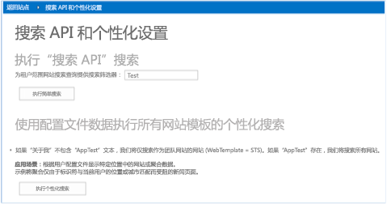
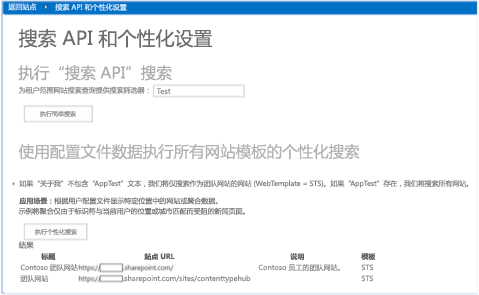
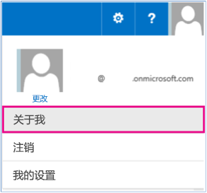
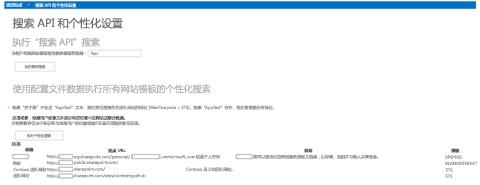


# 个性化设置搜索结果示例 SharePoint 外接程序
您可以根据用户配置文件属性的值筛选出对用户显示的信息，以个性化设置 SharePoint。

 **上次修改时间：** 2015年12月7日

 _ **适用范围：** SharePoint 2013?| SharePoint Add-ins?| SharePoint Online_

 **注释**  名称"SharePoint 相关应用程序"将更改为"SharePoint 外接程序"。在转换期间，某些 SharePoint 产品和 Visual Studio 工具的文档和 UI 仍可能使用术语"SharePoint 相关应用程序"。有关详细信息，请参阅 [Office 和 SharePoint 相关应用程序的新名称](05b07b04-6c8b-4b7e-bd86-e32c589dfead.md#bk_newname)。

[Search.PersonalizedResults](https://github.com/OfficeDev/PnP/tree/dev/Samples/Search.PersonalizedResults) 代码示例演示如何根据用户配置文件属性的值筛选信息，以个性化设置 SharePoint。部分个性化设置示例包括：

- 根据国家/地区或位置筛选出的新闻文章或其他内容。
    
- 根据用户的角色或组织筛选出的导航链接。
    
- 根据您的业务位置筛选出的餐馆或零售商店列表。
    
此代码示例使用提供程序托管的外接程序向用户显示搜索结果，内容涉及用户访问过的所有网站或只涉及团队网站。为此，请按以下示例操作：

- 查看  **AboutMe** 用户配置文件属性的值。
    
- 构建与  **AboutMe** 用户配置文件属性的值关联的搜索查询筛选字符串。
    
- 运行搜索查询并显示搜索查询结果。
    
 **为改进此内容做贡献**
您可以获取最新的更新，或为改进 [GitHub 上的此文章](https://github.com/OfficeDev/PnP-Guidance/blob/master/articles/Personalize-search-results-sample-app-for-SharePoint.md)做贡献。您还可以为改进本示例以及 [GitHub 上的其他示例](https://github.com/OfficeDev/PnP)做贡献。有关示例的完整列表，请参阅 [模式和做法开发人员中心](http://dev.office.com/patterns-and-practices)。我们欢迎您做出 [贡献](https://github.com/OfficeDev/PnP/wiki/contributing-to-Office-365-developer-patterns-and-practices)。 

## 开始之前

若要开始，请从 GitHub 上的 [Office 365 开发人员模式和做法](https://github.com/OfficeDev/PnP/tree/dev)项目下载 [Search.PersonalizedResults](https://github.com/OfficeDev/PnP/tree/dev/Samples/Search.PersonalizedResults) 示例外接程序。


## 使用 Search.PersonalizedResults 外接程序

运行本代码示例时，会显示提供程序承载的外接程序。 


**Search.PersonalizedResults 外接程序的起始页**

本文介绍"使用配置文件数据执行所有网站模板的个性化搜索"方案。选择"执行个性化设置的搜索"将返回仅包含团队网站的经筛选的搜索结果。请注意，"模板"列仅包含"STS"类型的网站。


**仅显示工作组网站的搜索结果**

若要处理个性化设置方案，可以通过以下方式更改搜索查询：


- 读取和测试该用户的用户配置文件属性的值。此代码示例将测试  **AppTest** 的值的 **About Me** 属性。
    
- 根据用户配置文件属性的值执行特殊操作。例如，如果  **About Me** 用户配置文件属性的值为 **AppTest**，此代码示例将删除团队网站筛选器，并返回包含所有网站的搜索结果。
    

### 在"关于我"用户配置文件属性中输入 AppTest


1. 在 Office 365 网站顶部，选择您的配置文件图片，然后选择"关于我"。
    
2. 在"关于我"页上，选择"编辑您的配置文件"。
    
3. 在"关于我"中，输入  **AppTest**。
    
4. 选择"全部保存并关闭"。
    

**选择"关于我"导航到用户的配置文件页面**

返回到  **Search.PersonalizedResults** 提供程序托管的外接程序，然后再次选择"执行个性化搜索"。外接程序会将搜索查询的筛选器更改为显示所有网站，而非仅显示团队网站。现在，"模板"列包含多个不同的网站模板类型。


**显示所有网站的搜索结果**

选择"执行个性化搜索"将调用 default.aspx.cs 中的  **btnPersonalizedSearch_Click** 方法。 **btnPersonalizedSearch_Click** 将执行以下操作：


- 使用  **PeopleManager** 可获取运行此外接程序的用户的所有用户配置文件属性。
    
- 检索并查看  **AboutMe** 用户配置文件属性的值。如果 **AboutMe** 属性的值为 **AppTest**，搜索查询将使用查询字符串  `contentclass:"STS_Site"` 检索所有网站。如果 **AboutMe** 属性的值不为 **AppTest**，则会为查询字符串 ( `WebTemplate=STS`) 追加团队网站筛选器，搜索查询将仅检索团队网站。
    
- 调用  **ProcessQuery** 方法可以根据提供的查询字符串检索搜索结果。 **ProcessQuery** 还演示了如何指定一列属性返回搜索结果。
    
- 调用  **FormatResults** 方法可将搜索结果格式化为 HTML 表。
    

    
 **注释**  本文中的代码按原样提供，不提供任何明示或暗示的担保，包括对特定用途适用性、适销性或不侵权的默示担保。


```
protected void btnPersonalizedSearch_Click(object sender, EventArgs e)
        {
            var spContext = SharePointContextProvider.Current.GetSharePointContext(Context);

            using (var clientContext = spContext.CreateUserClientContextForSPHost())
            {
                // Load user profile properties.
                PeopleManager peopleManager = new PeopleManager(clientContext);
                PersonProperties personProperties = peopleManager.GetMyProperties();
                clientContext.Load(personProperties);
                clientContext.ExecuteQuery();
                // Check the value of About Me. 
                string aboutMeValue = personProperties.UserProfileProperties["AboutMe"];
                string templateFilter = ResolveAdditionalFilter(aboutMeValue);
                // Build the query string.
                string query = "contentclass:\"STS_Site\" " + templateFilter;
                ClientResult<ResultTableCollection> results = ProcessQuery(clientContext, query);
                lblStatus2.Text = FormatResults(results);
            }
        }

private ClientResult<ResultTableCollection> ProcessQuery(ClientContext ctx, string keywordQueryValue)
        {
            KeywordQuery keywordQuery = new KeywordQuery(ctx);
            keywordQuery.QueryText = keywordQueryValue;
            keywordQuery.RowLimit = 500;
            keywordQuery.StartRow = 0;
            keywordQuery.SelectProperties.Add("Title");
            keywordQuery.SelectProperties.Add("SPSiteUrl");
            keywordQuery.SelectProperties.Add("Description");
            keywordQuery.SelectProperties.Add("WebTemplate");
            keywordQuery.SortList.Add("SPSiteUrl", Microsoft.SharePoint.Client.Search.Query.SortDirection.Ascending);
            SearchExecutor searchExec = new SearchExecutor(ctx);
            ClientResult<ResultTableCollection> results = searchExec.ExecuteQuery(keywordQuery);
            ctx.ExecuteQuery();
            return results;
        }

```


## 其他资源


- [适用于 SharePoint 2013 和 SharePoint Online 的用户配置文件解决方案](user-profile-solutions-for-sharepoint.md)
    
- [Search.PersonalizedResults 外接程序](https://github.com/OfficeDev/PnP/tree/dev/Samples/Search.PersonalizedResults)
    
- [UserProfile.Manipulation.CSOM](https://github.com/OfficeDev/PnP/tree/dev/Samples/UserProfile.Manipulation.CSOM)
    
- [UserProfile.Manipulation.CSOM.Console](https://github.com/OfficeDev/PnP/tree/dev/Samples/UserProfile.Manipulation.CSOM.Console)
    
- [Core.ProfileProperty.Migration](https://github.com/OfficeDev/PnP/tree/dev/Samples/Core.ProfileProperty.Migration)
    
