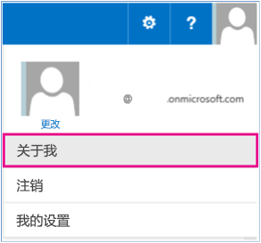

# 读取或更新用户配置文件属性示例 SharePoint 外接程序
您可以使用提供程序托管的外接程序读取或更新 SharePoint 单值和多值用户配置文件属性。

 **上次修改时间：** 2015年8月7日

 _ **适用范围：** SharePoint 2013?| SharePoint Add-ins?| SharePoint Online_

 **注释**  名称"SharePoint 相关应用程序"将更改为"SharePoint 外接程序"。在转换期间，某些 SharePoint 产品和 Visual Studio 工具的文档和 UI 仍可能使用术语"SharePoint 相关应用程序"。有关详细信息，请参阅 [Office 和 SharePoint 相关应用程序的新名称](05b07b04-6c8b-4b7e-bd86-e32c589dfead.md#bk_newname)。

[UserProfile.Manipulation.CSOM](https://github.com/OfficeDev/PnP/tree/dev/Samples/UserProfile.Manipulation.CSOM) 示例演示如何读取和更新特定用户的用户配置文件属性。本示例使用提供程序托管的外接程序执行以下操作：

- 读取并显示用户的所有用户配置文件属性。
    
- 更新单值用户配置文件属性。
    
- 更新多值用户配置文件属性。
    
如果您需要执行以下操作，请使用此解决方案：

- 从用户的用户配置文件属性中读取数据或将数据写入用户配置文件属性。 
    
- 使用用户配置文件属性值个性化设置 SharePoint。
    

 **注释**  此代码仅在 Office 365 上运行。 

 **为改进此内容做贡献**
您可以获取最新的更新，或为改进 [GitHub 上的此文章](https://github.com/OfficeDev/PnP-Guidance/blob/master/articles/Read-or-update-user-profile-properties-sample-app-for-SharePoint.md)做贡献。您还可以为改进本示例以及 [GitHub 上的其他示例](https://github.com/OfficeDev/PnP)做贡献。有关示例的完整列表，请参阅 [模式和做法开发人员中心](http://dev.office.com/patterns-and-practices)。我们欢迎您做出 [贡献](https://github.com/OfficeDev/PnP/wiki/contributing-to-Office-365-developer-patterns-and-practices)。 

## 开始之前

若要开始，请从 GitHub 上的 [Office 365 开发人员模式和做法](https://github.com/OfficeDev/PnP/tree/dev)项目下载 [UserProfile.Manipulation.CSOM](https://github.com/OfficeDev/PnP/tree/dev/Samples/UserProfile.Manipulation.CSOM) 示例外接程序。

在运行方案 1 之前：


1. 在 Office 365 网站顶部，选择您的配置文件图片，然后选择"关于我"，如图 1 中所示。 
    
2. 在"关于我"页上，选择"编辑您的配置文件"。
    
3. 在"关于我"中，输入"我就职于 Contoso"。
    
4. 选择"全部保存并关闭"。 
    
在运行方案 3 之前：


1. 在 网站顶部，选择您的配置文件图片，然后选择"关于我"，如图 1 中所示。 
    
2. 在"关于我"页上，选择"编辑您的配置文件"。
    
3. 在"编辑详细信息"中，选择"详细信息"。
    
4. 在"技能"中，输入 C#、JavaScript。
    
5. 选择"全部保存并关闭"。 
    

**图 1. 选择"关于我"导航到用户配置文件页面**




## 使用 UserProfile.Manipulation.CSOM 外接程序

运行本示例时，会启动提供程序托管的外接程序，如图 2 中所示。


**图 2. UserProfile.Manipulation.CSOM 外接程序起始页**

此代码示例包括三个方案。


|**方案**|**介绍如何...**|
|:-----|:-----|
|1|读取运行外接程序的用户的所有用户配置文件属性。|
|2|更新单值用户配置文件属性。
 **注释**  仅在 Office 365 中支持此方案。

|
|3|更新多值用户配置文件属性。
 **注释**  仅在 Office 365 中支持此方案。

|

### 方案 1：读取所有用户配置文件属性

选择"运行方案 1"后，外接程序会读取当前用户的所有用户配置文件属性，然后在"当前用户配置文件属性"中显示用户配置文件数据，如图 3 所示。


**图 3. 当前用户的配置文件属性数据**

选择"运行方案 1"将调用 CodeSample1.aspx.cs 中的  **btnScenario1_Click** 方法来执行以下任务：


- 使用  **PeopleManager** 检索当前用户的所有用户配置文件属性。
    
- 循环访问  **PersonProperties.UserProfileProperties** 以在文本框中列出用户配置文件属性的值。
    

    
 **注释**  本文中的代码按原样提供，不提供任何明示或暗示的担保，包括对特定用途适用性、适销性或不侵权的默示担保。


```C#
protected void btnScenario1_Click(object sender, EventArgs e)
        {

            var spContext = SharePointContextProvider.Current.GetSharePointContext(Context);

            using (var clientContext = spContext.CreateUserClientContextForSPHost())
            {
                // Get the people manager instance and load current properties.
                PeopleManager peopleManager = new PeopleManager(clientContext);
                PersonProperties personProperties = peopleManager.GetMyProperties();
                clientContext.Load(personProperties);
                clientContext.ExecuteQuery();

                // Output user profile properties to a text box.
                txtProperties.Text = "";
                foreach (var item in personProperties.UserProfileProperties)
                {
                    txtProperties.Text += string.Format("{0} - {1}{2}", item.Key, item.Value, Environment.NewLine);
                }
            }
        }

```


### 方案 2：更新单值用户配置文件属性

方案 2 介绍如何更新单值用户配置文件属性。如图 4 中所示，运行此外接程序的用户的"关于我"用户配置文件属性的当前值为"我就职于 Contoso"。若要更新"关于我"用户配置文件属性的值，在"关于我的新值"框中，输入我在 Contoso 担任软件工程师，然后选择"运行方案 2"。代码会将"关于我"属性的值更新为"我在 Contoso 担任软件工程师"。如图 5 中所示，外接程序将"关于我的当前值"更新为"关于我"用户配置文件属性的新值。


**图 4. 方案 2 起始页**


**图 5. 更新的"关于我"用户配置文件属性**

选择"运行方案 2"将调用 CodeSample2.aspx.cs 中的  **btnScenario2_Click** 方法来执行以下任务：


- 使用  **PeopleManager** 获取当前用户的用户配置文件属性。
    
- 将用户输入的文本格式设置为 HTML。
    
- 使用  **SetSingleValueProfileProperty** 更新 **AboutMe** 用户配置文件属性的值。 **SetSingleValueProfileProperty** 将接受三个参数：
    
      - 您正在为其更新用户配置文件的用户的帐户名。
    
  - 用户配置文件属性名称（本方案中为  **AboutMe** ）。
    
  - HTML 格式的属性值（本方案中为"我在 Contoso 担任软件工程师"）。 
    


```C#
protected void btnScenario2_Click(object sender, EventArgs e)
        {
            var spContext = SharePointContextProvider.Current.GetSharePointContext(Context);

            using (var clientContext = spContext.CreateUserClientContextForSPHost())
            {
                // Get the people manager instance and initialize the account name.
                PeopleManager peopleManager = new PeopleManager(clientContext);
                PersonProperties personProperties = peopleManager.GetMyProperties();
                clientContext.Load(personProperties, p => p.AccountName);
                clientContext.ExecuteQuery();

                // Convert entry to HTML.
                string updatedValue = (txtAboutMe.Text).Replace(Environment.NewLine, "");

                // Update the AboutMe property for the user using account name from the user profile.
                peopleManager.SetSingleValueProfileProperty(personProperties.AccountName, "AboutMe", updatedValue);
                clientContext.ExecuteQuery();

            }
        }

```


    
 **注释**  如果您使用自定义用户配置文件属性，请配置属性，以便用户可以进行编辑。本方案中所用技术对于自定义用户配置文件属性有用。 


### 方案 3：更新多值用户配置文件属性

方案 3 介绍如何更新多值用户配置文件属性。图 6 显示了方案 3 的起始页。"技能当前值"显示运行此外接程序的用户的技能。可从用户的 SPS-Skills 用户配置文件属性读取该技能。 


**图 6. 方案 3 起始页**

从此外接程序向 SPS-Skills 用户配置文件属性添加新技能：


1. 输入 HTML5，然后选择"添加技能"。 
    
2. 输入 ASP.Net，然后选择"添加技能"。 
    
3. 选择"运行方案 3"。
    
4. 确认"技能当前值"显示用户新的技能列表。 
    
5. 确认用户的"SPS-Skills"用户配置文件属性现在显示技能的新列表。
    
选择"运行方案 3"将调用 CodeSample3.aspx.cs 中的  **btnScenario3_Click** 方法来执行以下任务：


- 使用  **PeopleManager** 获取当前用户的用户配置文件属性。
    
- 读取列表框中显示的技能列表。 
    
- 使用  **SetMultiValuedProfileProperty** 将新技能保存到 **SPS-Skills** 用户配置文件属性。 **SetMultiValuedProfileProperty** 将接受三个参数：
    
      - 您已为其更新用户配置文件的用户的帐户名。
    
  - 用户配置文件属性名称，即  **SPS-Skills** 。
    
  - 作为字符串对象的  **List** 的属性值。
    


```C#
  protected void btnScenario3_Click(object sender, EventArgs e)
        {
            var spContext = SharePointContextProvider.Current.GetSharePointContext(Context);

            using (var clientContext = spContext.CreateUserClientContextForSPHost())
            {
                // Get the people manager instance and initialize the account name.
                PeopleManager peopleManager = new PeopleManager(clientContext);
                PersonProperties personProperties = peopleManager.GetMyProperties();
                clientContext.Load(personProperties, p => p.AccountName);
                clientContext.ExecuteQuery();

                // Collect the user’s skills from the list box in order to update the user’s profile.
                List<string> skills = new List<string>();
                for (int i = 0; i < lstSkills.Items.Count; i++)
                {
                    skills.Add(lstSkills.Items[i].Value);
                }

                // Update the SPS-Skills property for the user using account name from the user’s profile.
                peopleManager.SetMultiValuedProfileProperty(personProperties.AccountName, "SPS-Skills", skills);
                clientContext.ExecuteQuery();

                // Refresh the values.
                RefreshUIValues();
            }

        }

```


## 其他资源


- [适用于 SharePoint 2013 和 SharePoint Online 的用户配置文件解决方案](user-profile-solutions-for-sharepoint.md)
    
- [ Search.PersonalizedResults 示例](https://github.com/OfficeDev/PnP/tree/dev/Samples/Search.PersonalizedResults)
    
