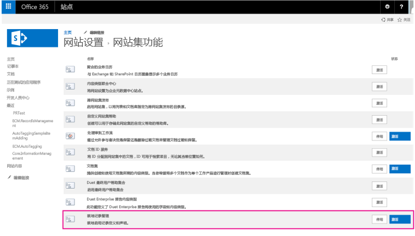
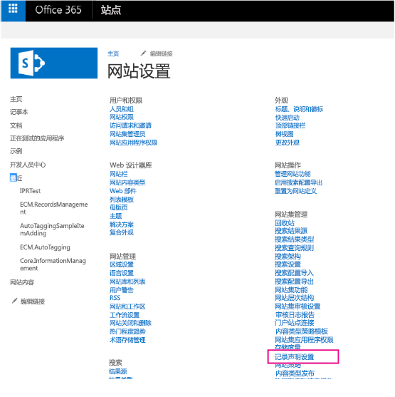
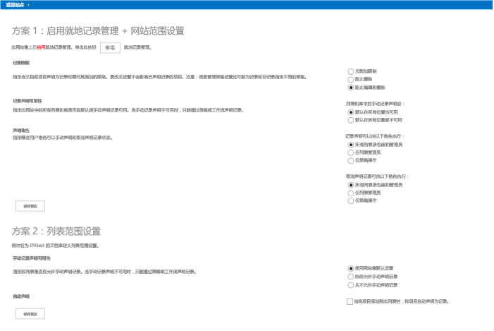
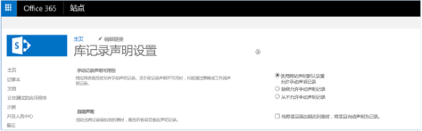


# 记录管理扩展示例 SharePoint 外接程序
作为企业内容管理 (ECM) 策略的一部分，您可以启用和更改 SharePoint 网站和列表上的就地记录管理设置。

 **上次修改时间：** 2015年8月7日

 _ **适用范围：** SharePoint 2013?| SharePoint Add-ins?| SharePoint Online_

 **注释**  名称"SharePoint 相关应用程序"将更改为"SharePoint 外接程序"。在转换期间，某些 SharePoint 产品和 Visual Studio 工具的文档和 UI 仍可能使用术语"SharePoint 相关应用程序"。有关详细信息，请参阅 [Office 和 SharePoint 相关应用程序的新名称](05b07b04-6c8b-4b7e-bd86-e32c589dfead.md#bk_newname)。

[ECM.RecordsManagement](https://github.com/OfficeDev/PnP/tree/dev/Scenarios/ECM.RecordsManagement) 示例说明如何使用提供程序托管的 SharePoint 外接程序来控制网站或列表的就地记录管理设置。
如果您需要执行以下操作，请使用此解决方案：

- 在自定义网站设置过程中配置就地记录管理设置。
    
 **为改进此内容做贡献**
您可以获取最新的更新，或为改进 [GitHub 上的此文章](https://github.com/OfficeDev/PnP-Guidance/blob/master/articles/Records-management-extensions-sample-app-for-SharePoint.md)做贡献。您还可以为改进本示例以及 [GitHub 上的其他示例](https://github.com/OfficeDev/PnP)做贡献。有关示例的完整列表，请参阅 [模式和做法开发人员中心](http://dev.office.com/patterns-and-practices)。我们欢迎您做出 [贡献](https://github.com/OfficeDev/PnP/wiki/contributing-to-Office-365-developer-patterns-and-practices)。 

## 开始之前

若要开始，请从 GitHub 上的 [Office 365 开发人员模式和做法](https://github.com/OfficeDev/PnP/tree/dev)项目下载 [ECM.RecordsManagement](https://github.com/OfficeDev/PnP/tree/dev/Scenarios/ECM.RecordsManagement) 示例外接程序。

运行此外接程序之前：


- 在网站集上激活就地记录管理功能，如图 1 中所示。
    
    **图 1. 在网站集上激活就地记录管理功能**

    

- 在网站设置中，确认您在"网站集管理"中可以看到"记录声明设置"，如图 2 中所示。
    
    **图 2. 网站设置中的记录声明设置**

    


## 使用 ECM.RecordsManagement 示例外接程序

 当您启动外接程序时，起始页面将显示可用的两种方案：


- 为网站启用就地记录管理
    
- 为列表启用就地记录管理
    

**图 3. ECM.RecordsManagement 外接程序起始页面**

 您可以使用方案 1 构建 UI，以控制网站集上的记录管理设置。此外接程序中的 UI 类似于在"网站设置"的"记录声明设置"中显示的 UI（见图 2）。您还可以激活或停用您的网站集上的就地记录管理功能。

您可以使用方案 2 构建 UI，以控制列表上的记录管理设置。此外接程序中的 UI 类似于在列表上的库设置的"记录声明设置"中显示的 UI。


**图 4. 列表上的记录声明设置**


### 方案 1

方案 1 针对网站的就地记录管理功能和设置。外接程序 UI 包括"停用"（或"激活"）按钮，如图 5 中所示。选择此按钮将停用（或激活）网站集上的就地记录管理功能。 


**图 5. 就地记录管理功能的停用按钮**

以下代码将激活或停用网站集上的就地记录管理功能。 **DisableInPlaceRecordsManagementFeature** 和 **EnableSiteForInPlaceRecordsManagement** 方法是 [OfficeDevPnP.Core](https://github.com/OfficeDev/PnP/tree/dev/OfficeDevPnP.Core) 中 AppModelExtensions\RecordsManagementExtensions.cs 文件的一部分。


    
 **注释**  本文中的代码按原样提供，不提供任何明示或暗示的担保，包括对特定用途适用性、适销性或不侵权的默示担保。


```C#
protected void btnToggleIPRStatus_Click(object sender, EventArgs e)
        {
            if (cc.Site.IsInPlaceRecordsManagementActive())
            {
                cc.Site.DisableInPlaceRecordsManagementFeature();
                IPRStatusUpdate(false);
            }
            else
            {
                cc.Site.EnableSiteForInPlaceRecordsManagement();
                IPRStatusUpdate(true);
            }
        }

```

OfficeDevPnP.Core 包括获取和设置所有网站范围内的就地记录管理设置的扩展方法。 **EnableSiteForInPlaceRecordsManagement** 方法的以下代码显示如何使用这些扩展方法设置限制，并指定谁可以在您的网站上声明或取消声明记录。


```C#
public static void EnableSiteForInPlaceRecordsManagement(this Site site)
        {
            // Activate the In-Place Records Management feature if not yet enabled.
            if (!site.IsFeatureActive(new Guid(INPLACE_RECORDS_MANAGEMENT_FEATURE_ID)))
            {
                // Note: this also sets the ECM_SITE_RECORD_RESTRICTIONS value to "BlockDelete, BlockEdit".
                site.ActivateInPlaceRecordsManagementFeature();
            }

            // Enable in-place records management in all locations.
            site.SetManualRecordDeclarationInAllLocations(true);

            // Set restrictions to default values after enablement (this is also done at feature activation).
            EcmSiteRecordRestrictions restrictions = EcmSiteRecordRestrictions.BlockDelete | EcmSiteRecordRestrictions.BlockEdit;
            site.SetRecordRestrictions(restrictions);

            // Set record declaration to default value.
            site.SetRecordDeclarationBy(EcmRecordDeclarationBy.AllListContributors);

            // Set record undeclaration to default value.
            site.SetRecordUnDeclarationBy(EcmRecordDeclarationBy.OnlyAdmins);

        }

```

当用户更改其就地记录管理设置并选择"保存更改"按钮时，  **btnSaveSiteScopedIPRSettings_Click** 方法中的以下代码将运行。


```C#
protected void btnSaveSiteScopedIPRSettings_Click(object sender, EventArgs e)
        {
            EcmSiteRecordRestrictions restrictions = (EcmSiteRecordRestrictions)Convert.ToInt32(rdRestrictions.SelectedValue);
            cc.Site.SetRecordRestrictions(restrictions);
            cc.Site.SetManualRecordDeclarationInAllLocations(Convert.ToBoolean(rdAvailability.SelectedValue));
            EcmRecordDeclarationBy declareBy = (EcmRecordDeclarationBy)Convert.ToInt32(rdDeclarationBy.SelectedValue);
            cc.Site.SetRecordDeclarationBy(declareBy);
            EcmRecordDeclarationBy unDeclareBy = (EcmRecordDeclarationBy)Convert.ToInt32(rdUndeclarationBy.SelectedValue);
            cc.Site.SetRecordUnDeclarationBy(unDeclareBy);
        }

```

在前一个代码中，将调用 RecordsManagementExtensions.cs 中的  **SetRecordRestrictions** 方法。下一个示例中的 **SetRecordRestrictions** 方法说明如何设置记录限制。


```C#
public static void SetRecordRestrictions(this Site site, EcmSiteRecordRestrictions restrictions)
        {
            string restrictionsProperty = "";

            if (restrictions.Has(EcmSiteRecordRestrictions.None))
            {
                restrictionsProperty = EcmSiteRecordRestrictions.None.ToString();
            }
            else if (restrictions.Has(EcmSiteRecordRestrictions.BlockEdit))
            {
                // BlockEdit is always used in conjunction with BlockDelete.
                restrictionsProperty = EcmSiteRecordRestrictions.BlockDelete.ToString() + ", " + EcmSiteRecordRestrictions.BlockEdit.ToString();
            }
            else if (restrictions.Has(EcmSiteRecordRestrictions.BlockDelete))
            {
                restrictionsProperty = EcmSiteRecordRestrictions.BlockDelete.ToString();
            }

            // Set property bag entry.
            site.RootWeb.SetPropertyBagValue(ECM_SITE_RECORD_RESTRICTIONS, restrictionsProperty);
        }

```


### 方案 2

方案 2 显示如何与列表的就地记录管理设置进行交互。安装外接程序时，它将创建一个称为 IPRTest 的文档库。当您使用此外接程序更改并保存就地记录管理设置时，更改将应用于 IPRTest。 


 **注释**  要在列表中使用就地记录管理设置，您必须在您的网站集上激活就地记录管理功能，如本文前面的图 1 中所示。 

当用户选择"保存更改"按钮时，Default.aspx.cs 中的以下代码将运行。 


```C#
protected void btnSaveListScopedIPRSettings_Click(object sender, EventArgs e)
        {
            List ipr = cc.Web.GetListByTitle(IPR_LIBRARY);
            EcmListManualRecordDeclaration listManual = (EcmListManualRecordDeclaration)Convert.ToInt32(rdListAvailability.SelectedValue);
            ipr.SetListManualRecordDeclaration(listManual);
            ipr.SetListAutoRecordDeclaration(chbAutoDeclare.Checked);

            // Refresh the settings as AutoDeclare changes the manual settings.
            if (ipr.IsListRecordSettingDefined())
            {
                rdListAvailability.SelectedValue = Convert.ToString((int)ipr.GetListManualRecordDeclaration());
                chbAutoDeclare.Checked = ipr.GetListAutoRecordDeclaration();
                rdListAvailability.Enabled = !chbAutoDeclare.Checked;
            }

        }

```

代码将调用 OfficeDevPnP.Core 的 RecordsManagementExtensions.cs 文件中的下列两个方法：


-  **SetListManualRecordDeclaration** – 定义此列表的手动记录声明设置。
    
-  **SetListAutoRecordDeclaration** – 自动声明作为记录添加到此列表的项目。如果记录声明在此列表上设置为自动，列表上的手动记录声明设置将不再适用。事件接收器已添加到列表中，以便在事件发生时启动特定的记录管理操作。
    


```C#
public static void SetListManualRecordDeclaration(this List list, EcmListManualRecordDeclaration settings)
        {
            if (settings == EcmListManualRecordDeclaration.UseSiteCollectionDefaults)
            {
                // If you set list record declaration back to the default values, you also need to 
                // turn off auto record declaration. Other property bag values are left as is; when 
                // settings are changed again these properties are also again usable.
                if (list.PropertyBagContainsKey(ECM_AUTO_DECLARE_RECORDS))
                {
                    list.SetListAutoRecordDeclaration(false);
                }
                // Set the property that dictates custom list record settings to false.
                list.SetPropertyBagValue(ECM_IPR_LIST_USE_LIST_SPECIFIC, false.ToString());
            }
            else if (settings == EcmListManualRecordDeclaration.AlwaysAllowManualDeclaration)
            {
                list.SetPropertyBagValue(ECM_ALLOW_MANUAL_DECLARATION, true.ToString());
                // Set the property that dictates custom list record settings to true.
                list.SetPropertyBagValue(ECM_IPR_LIST_USE_LIST_SPECIFIC, true.ToString());
            } 
            else if (settings == EcmListManualRecordDeclaration.NeverAllowManualDeclaration)
            {
                list.SetPropertyBagValue(ECM_ALLOW_MANUAL_DECLARATION, false.ToString());
                // Set the property that dictates custom list record settings to true.
                list.SetPropertyBagValue(ECM_IPR_LIST_USE_LIST_SPECIFIC, true.ToString());
            }
            else
            {
                throw new ArgumentOutOfRangeException("settings");
            }
        }

public static void SetListAutoRecordDeclaration(this List list, bool autoDeclareRecords)
        {
            // Determine the SharePoint version based on the loaded CSOM library.
            Assembly asm = Assembly.GetAssembly(typeof(Microsoft.SharePoint.Client.Site));
            int sharePointVersion = asm.GetName().Version.Major;

            if (autoDeclareRecords)
            {
                // Set the property that dictates custom list record settings to true.
                list.SetPropertyBagValue(ECM_IPR_LIST_USE_LIST_SPECIFIC, true.ToString());
                // Prevent manual declaration.
                list.SetPropertyBagValue(ECM_ALLOW_MANUAL_DECLARATION, false.ToString());

                // Hook up the needed event handlers.
                list.Context.Load(list.EventReceivers);
                list.Context.ExecuteQuery();

                List<EventReceiverDefinition> currentEventReceivers = new List<EventReceiverDefinition>(list.EventReceivers.Count);
                currentEventReceivers.AddRange(list.EventReceivers);

                // Track changes to see if a list.Update is needed.
                bool eventReceiverAdded = false;
                
                // ItemUpdating receiver.
                EventReceiverDefinitionCreationInformation newEventReceiver = CreateECMRecordEventReceiverDefinition(EventReceiverType.ItemUpdating, 1000, sharePointVersion);
                if (!ContainsECMRecordEventReceiver(newEventReceiver, currentEventReceivers))
                {
                    list.EventReceivers.Add(newEventReceiver);
                    eventReceiverAdded = true;
                }
                // ItemDeleting receiver.
                newEventReceiver = CreateECMRecordEventReceiverDefinition(EventReceiverType.ItemDeleting, 1000, sharePointVersion);
                if (!ContainsECMRecordEventReceiver(newEventReceiver, currentEventReceivers))
                {
                    list.EventReceivers.Add(newEventReceiver);
                    eventReceiverAdded = true;
                }
                // ItemFileMoving receiver.
                newEventReceiver = CreateECMRecordEventReceiverDefinition(EventReceiverType.ItemFileMoving, 1000, sharePointVersion);
                if (!ContainsECMRecordEventReceiver(newEventReceiver, currentEventReceivers))
                {
                    list.EventReceivers.Add(newEventReceiver);
                    eventReceiverAdded = true;
                }
                // ItemAdded receiver.
                newEventReceiver = CreateECMRecordEventReceiverDefinition(EventReceiverType.ItemAdded, 1005, sharePointVersion);
                if (!ContainsECMRecordEventReceiver(newEventReceiver, currentEventReceivers))
                {
                    list.EventReceivers.Add(newEventReceiver);
                    eventReceiverAdded = true;
                }
                // ItemUpdated receiver.
                newEventReceiver = CreateECMRecordEventReceiverDefinition(EventReceiverType.ItemUpdated, 1007, sharePointVersion);
                if (!ContainsECMRecordEventReceiver(newEventReceiver, currentEventReceivers))
                {
                    list.EventReceivers.Add(newEventReceiver);
                    eventReceiverAdded = true;
                }
                // ItemCheckedIn receiver.
                newEventReceiver = CreateECMRecordEventReceiverDefinition(EventReceiverType.ItemCheckedIn, 1006, sharePointVersion);
                if (!ContainsECMRecordEventReceiver(newEventReceiver, currentEventReceivers))
                {
                    list.EventReceivers.Add(newEventReceiver);
                    eventReceiverAdded = true;
                }
                                
                if (eventReceiverAdded)
                {
                    list.Update();
                    list.Context.ExecuteQuery();
                }

                // Set the property that dictates the autodeclaration.
                list.SetPropertyBagValue(ECM_AUTO_DECLARE_RECORDS, autoDeclareRecords.ToString());
            }
            else
            {
                // Set the property that dictates the autodeclaration.
                list.SetPropertyBagValue(ECM_AUTO_DECLARE_RECORDS, autoDeclareRecords.ToString());
                //Note: Existing list event handlers will just stay as they are, no need to remove them.
            }
        }

```


## 其他资源


- [适用于 SharePoint 2013 和 SharePoint Online 的企业内容管理解决方案](enterprise-content-management-solutions-for-sharepoint-2013-and-sharepoint-online.md)
    
- [OfficeDevPnP.Core 示例](https://github.com/OfficeDev/PnP/tree/master/OfficeDevPnP.Core)
    
