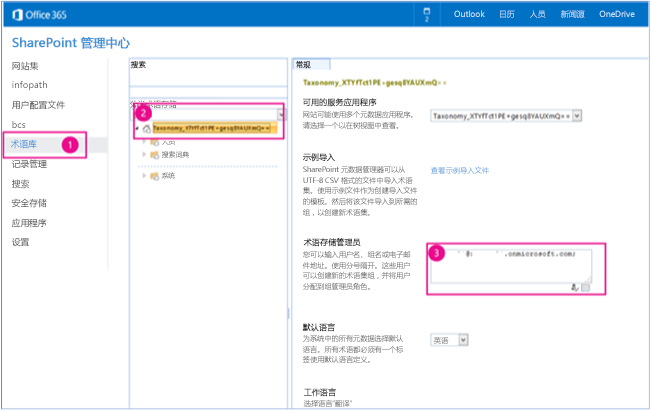

# 同步术语组示例 SharePoint 外接程序
作为企业内容管理 (ECM) 策略的一部分，您可以在多个 SharePoint 术语存储之间同步术语组。

 **上次修改时间：** 2015年8月12日

 _ **适用范围：** SharePoint 2013?| SharePoint Add-ins?| SharePoint Online_

 **注释**  名称"SharePoint 相关应用程序"将更改为"SharePoint 外接程序"。在转换期间，某些 SharePoint 产品和 Visual Studio 工具的文档和 UI 仍可能使用术语"SharePoint 相关应用程序"。有关详细信息，请参阅 [Office 和 SharePoint 相关应用程序的新名称](05b07b04-6c8b-4b7e-bd86-e32c589dfead.md#bk_newname)。

[Core.MMSSync](https://github.com/OfficeDev/PnP/tree/master/Samples/Core.MMSSync) 示例说明如何使用提供程序托管的 外接程序同步源和目标分类。此外接程序同步 Managed Metadata Service 中的两个术语存储 - 源术语存储和目标术语存储。以下对象用于同步术语组：

-  **TermStore**
    
-  **ChangeInformation**
    
如果您需要执行以下操作，请使用此解决方案：

- 同步两个分类。例如，您可以将 SharePoint Online 和 SharePoint Server 2013 内部部署用于不同的术语集，但它们使用相同的分类。
    
- 同步仅对特定术语组所做的更改。
    
 **为改进此内容做贡献**
您可以获取最新的更新，或为改进 [GitHub 上的此文章](https://github.com/OfficeDev/PnP-Guidance/blob/master/articles/Synchronize-term-groups-sample-app-for-SharePoint.md)做贡献。您还可以为改进本示例以及 [GitHub 上的其他示例](https://github.com/OfficeDev/PnP)做贡献。有关示例的完整列表，请参阅 [模式和做法开发人员中心](http://dev.office.com/patterns-and-practices)。我们欢迎您做出 [贡献](https://github.com/OfficeDev/PnP/wiki/contributing-to-Office-365-developer-patterns-and-practices)。 

## 开始之前

若要开始，请从 GitHub 上的 [Office 365 开发人员模式和做法](https://github.com/OfficeDev/PnP/tree/dev)项目下载 [Core.MMSSync](https://github.com/OfficeDev/PnP/tree/master/Samples/Core.MMSSync) 示例外接程序。

运行此外接程序之前，您需要具有访问 Managed Metadata Service 中的术语存储的权限。下图显示分配这些权限的 Office 365 管理中心。


**在 SharePoint 管理中心中分配对术语存储的权限**

分配对术语存储的权限：


1. 从 Office 365 管理员中心中，选择"术语存储"。
    
2. 在"分类术语存储"中，选择您希望向其分配管理员权限的术语集。
    
3. 在"术语存储管理员"中，输入需要术语存储管理员权限的组织帐户。
    

## 使用 Core.MMSSync 示例外接程序

当您启动外接程序时，您将看到控制台应用程序。系统会提示您输入以下信息：


- 包含源术语存储的 Office 365 管理中心的 URL（这是源 Managed Metadata Service 的 URL）。例如，您可以输入 https://contososource-admin.sharepoint.com。
    
- 您的源 Managed Metadata Service 上的术语存储管理员的用户名和密码。
    
- 包含目标术语存储的 Office 365 管理中心的 URL（这是目标 MMS 的 URL）。例如，您可以输入 https://contosotarget-admin.sharepoint.com。
    
- 您的目标 Managed Metadata Service 上的术语存储管理员的用户名和密码。
    
- 您想要执行的操作的类型。您可以：
    
      - 使用  **TermStore** 对象移动术语组（方案 1）。
    
  - 使用  **ChangeInformation** 对象处理更改（方案 2）。
    

 **重要信息**  此示例外接程序适用于本地 SharePoint Online 和 SharePoint Server 2013。

选择方案后，输入您要从源 Managed Metadata Service 同步到目标 Managed Metadata Service 的术语组。例如，您可以输入 Enterprise。


**Managed Metadata Service 中的术语组**


### 方案 1 - 移动术语组

选择"移动术语组"时，外接程序将提示您输入要同步的术语组，然后调用 MMSSyncManager.cs 中的  **CopyNewTermGroups** 方法。然后 **CopyNewTermGroups** 执行下列操作，将术语组从源术语存储复制到目标术语存储：


1. 检索源和目标术语存储对象。
    
2. 验证源和目标术语存储的语言相匹配。 
    
3. 确认源术语组在目标术语存储中不存在，然后使用  **CreateNewTargetTermGroup** 将源术语组复制到目标术语存储。
    
您可以设置  _TermGroupExclusions_、 _TermGroupToCopy_ 和 _TermSetInclusions_ 参数以筛选已处理的术语。

以下代码显示了 MMSSyncManager.cs 中的  **CopyNewTermGroups** 和 **CreateNewTargetTermGroup** 方法。


 **注释**  本文中的代码按原样提供，不提供任何明示或暗示的担保，包括对特定用途适用性、适销性或不侵权的默示担保。


```C#
public bool CopyNewTermGroups(ClientContext sourceContext, ClientContext targetContext, List<string> termGroupExclusions = null, string termGroupToCopy = null)
        {
            TermStore sourceTermStore = GetTermStoreObject(sourceContext);
            TermStore targetTermStore = GetTermStoreObject(targetContext);

            
            List<int> languagesToProcess = null;
            if (!ValidTermStoreLanguages(sourceTermStore, targetTermStore, out languagesToProcess))
            {
                Log.Internal.TraceError((int)EventId.LanguageMismatch, "The target termstore default language is not available as language in the source term store, syncing cannot proceed.");
                return false;
            }

            // Get a list of term groups to process. Exclude site collection-scoped groups and system groups.
            IEnumerable<TermGroup> termGroups = sourceContext.LoadQuery(sourceTermStore.Groups.Include(g => g.Name,
                                                                                                       g => g.Id,
                                                                                                       g => g.IsSiteCollectionGroup,
                                                                                                       g => g.IsSystemGroup))
                                                                                              .Where(g => g.IsSystemGroup == false &amp;&amp; g.IsSiteCollectionGroup == false);
            sourceContext.ExecuteQuery();

            foreach (TermGroup termGroup in termGroups)
            {
                // Skip term group if you only want to copy one particular term group.
                if (!String.IsNullOrEmpty(termGroupToCopy))
                {
                    if (!termGroup.Name.Equals(termGroupToCopy, StringComparison.InvariantCultureIgnoreCase))
                    {
                        continue;
                    }
                }

                // Skip term groups that you do not want to copy.
                if (termGroupExclusions != null &amp;&amp; termGroupExclusions.Contains(termGroup.Name, StringComparer.InvariantCultureIgnoreCase))
                {
                    Log.Internal.TraceInformation((int)EventId.CopyTermGroup_Skip, "Skipping {0} as this is a system termgroup", termGroup.Name);
                    continue;
                }

                // About to start copying a term group.
                TermGroup sourceTermGroup = GetTermGroup(sourceContext, sourceTermStore, termGroup.Name);
                TermGroup targetTermGroup = GetTermGroup(targetContext, targetTermStore, termGroup.Name);

                if (sourceTermGroup == null)
                {
                    continue;
                }
                if (targetTermGroup != null)
                {
                    if (sourceTermGroup.Id != targetTermGroup.Id)
                    {
                        // Term group exists with a different ID, unable to sync.
                        Log.Internal.TraceWarning((int)EventId.CopyTermGroup_IDMismatch, "The term groups have different ID's. I don't know how to work it.");
                    }
                    else
                    {
                        // Do nothing as this term group was previously copied. Term group changes need to be 
                        // picked up by the change log processing.
                        Log.Internal.TraceInformation((int)EventId.CopyTermGroup_AlreadyCopied, "Termgroup {0} was already copied...changes to it will need to come from changelog processing.", termGroup.Name);
                    }
                }
                else
                {
                    Log.Internal.TraceInformation((int)EventId.CopyTermGroup_Copying, "Copying termgroup {0}...", termGroup.Name);
                    this.CreateNewTargetTermGroup(sourceContext, targetContext, sourceTermGroup, targetTermStore, languagesToProcess);
                }
            }

            return true;
        }


private void CreateNewTargetTermGroup(ClientContext sourceClientContext, ClientContext targetClientContext, TermGroup sourceTermGroup, TermStore targetTermStore, List<int> languagesToProcess)
        {
            TermGroup destinationTermGroup = targetTermStore.CreateGroup(sourceTermGroup.Name, sourceTermGroup.Id);
            if (!string.IsNullOrEmpty(sourceTermGroup.Description))
            {
                destinationTermGroup.Description = sourceTermGroup.Description;
            }

            TermSetCollection sourceTermSetCollection = sourceTermGroup.TermSets;
            if (sourceTermSetCollection.Count > 0)
            {
                foreach (TermSet sourceTermSet in sourceTermSetCollection)
                {
                    sourceClientContext.Load(sourceTermSet,
                                              set => set.Name,
                                              set => set.Description,
                                              set => set.Id,
                                              set => set.Contact,
                                              set => set.CustomProperties,
                                              set => set.IsAvailableForTagging,
                                              set => set.IsOpenForTermCreation,
                                              set => set.CustomProperties,
                                              set => set.Terms.Include(
                                                        term => term.Name,
                                                        term => term.Description,
                                                        term => term.Id,
                                                        term => term.IsAvailableForTagging,
                                                        term => term.LocalCustomProperties,
                                                        term => term.CustomProperties,
                                                        term => term.IsDeprecated,
                                                        term => term.Labels.Include(label => label.Value, label => label.Language, label => label.IsDefaultForLanguage)));

                    sourceClientContext.ExecuteQuery();

                    TermSet targetTermSet = destinationTermGroup.CreateTermSet(sourceTermSet.Name, sourceTermSet.Id, targetTermStore.DefaultLanguage);
                    targetClientContext.Load(targetTermSet, set => set.CustomProperties);
                    targetClientContext.ExecuteQuery();
                    UpdateTermSet(sourceClientContext, targetClientContext, sourceTermSet, targetTermSet);

                    foreach (Term sourceTerm in sourceTermSet.Terms)
                    {
                        Term reusedTerm = targetTermStore.GetTerm(sourceTerm.Id);
                        targetClientContext.Load(reusedTerm);
                        targetClientContext.ExecuteQuery();

                        Term targetTerm;
                        if (reusedTerm.ServerObjectIsNull.Value)
                        {
                            try
                            {
                                targetTerm = targetTermSet.CreateTerm(sourceTerm.Name, targetTermStore.DefaultLanguage, sourceTerm.Id);
                                targetClientContext.Load(targetTerm, term => term.IsDeprecated,
                                                                     term => term.CustomProperties,
                                                                     term => term.LocalCustomProperties);
                                targetClientContext.ExecuteQuery();
                                UpdateTerm(sourceClientContext, targetClientContext, sourceTerm, targetTerm, languagesToProcess);
                            }
                            catch (ServerException ex)
                            {
                                if (ex.Message.IndexOf("Failed to read from or write to database. Refresh and try again.") > -1)
                                {
                                    // This exception was due to caching issues and generally is thrown when terms are reused across groups.
                                    targetTerm = targetTermSet.ReuseTerm(reusedTerm, false);
                                }
                                else
                                {
                                    throw ex;
                                }
                            }
                        }
                        else
                        {
                            targetTerm = targetTermSet.ReuseTerm(reusedTerm, false);
                        }

                        targetClientContext.Load(targetTerm);
                        targetClientContext.ExecuteQuery();

                        targetTermStore.UpdateCache();

                        // Refresh session and term store references to force reload of the term just added. You need 
                        // to do this because there can be an update change event following next, and if you don't,
                        // the newly created term set cannot be obtained from the server.
                        targetTermStore = GetTermStoreObject(targetClientContext);

                        // Recursively add the other terms.
                        ProcessSubTerms(sourceClientContext, targetClientContext, targetTermSet, targetTerm, sourceTerm, languagesToProcess, targetTermStore.DefaultLanguage);
                    }
                }
            }
            targetClientContext.ExecuteQuery();
        }

```


### 方案 2 - 流程更改

当您选择"流程更改"时，外接程序将提示您输入要同步的术语组，然后调用 MMSSyncManager.cs 中的  **ProcessChanges** 方法。 **ProcessChanges** 使用 **ChangedInformation** 类的 **GetChanges** 检索对源 Managed Metadata Service 中的组、术语集和术语所做的所有更改。然后更改将应用于目标 Managed Metadata Service。


 **注释**  本文档仅包含  **ProcessChanges** 方法的某些部分。要查看整个方法，请在 Visual Studio 中打开 Core.MMSSync 解决方案。

 **ProcessChanges** 方法将首先创建 **TaxonomySession** 对象。


```C#
Log.Internal.TraceInformation((int)EventId.TaxonomySession_Open, "Opening the taxonomy session");
            TaxonomySession sourceTaxonomySession = TaxonomySession.GetTaxonomySession(sourceClientContext);
            TermStore sourceTermStore = sourceTaxonomySession.GetDefaultKeywordsTermStore();
            sourceClientContext.Load(sourceTermStore,
                                            store => store.Name,
                                            store => store.DefaultLanguage,
                                            store => store.Languages,
                                            store => store.Groups.Include(group => group.Name, group => group.Id));
            sourceClientContext.ExecuteQuery();

```

接下来，它将使用  **ChangeInformation** 对象检索更改，并为 **ChangeInformation** 对象设置起始日期。本示例检索在过去一年中所做的所有更改。


```C#
Log.Internal.TraceInformation((int)EventId.TermStore_GetChangeLog, "Reading the changes");
            ChangeInformation changeInformation = new ChangeInformation(sourceClientContext);
            changeInformation.StartTime = startFrom;
            ChangedItemCollection termStoreChanges = sourceTermStore.GetChanges(changeInformation);
            sourceClientContext.Load(termStoreChanges);
            sourceClientContext.ExecuteQuery();

```

 **GetChanges** 方法返回 **ChangedItemCollection** ，这将枚举术语存储中发生的所有更改，如以下代码示例中所示。示例的最后一行将进行检查，确定 **ChangedItem** 是否为术语组。 **ProcessChanges** 包括用于在术语集和术语的 **ChangedItem** 上执行类似检查的代码。


```C#
foreach (ChangedItem _changeItem in termStoreChanges)
                {
                    
                    if (_changeItem.ChangedTime < startFrom)
                    {
                        Log.Internal.TraceVerbose((int)EventId.TermStore_SkipChangeLogEntry, "Skipping item {1} changed at {0}", _changeItem.ChangedTime, _changeItem.Id);
                        continue;
                    }

                    Log.Internal.TraceVerbose((int)EventId.TermStore_ProcessChangeLogEntry, "Processing item {1} changed at {0}. Operation = {2}, ItemType = {3}", _changeItem.ChangedTime, _changeItem.Id, _changeItem.Operation, _changeItem.ItemType);

                    #region Group changes
                    if (_changeItem.ItemType == ChangedItemType.Group)

```

更改的项目类型可能是术语组、术语集或术语。每个更改的项目类型都有您可以执行的不同操作。下表列出了您可以对每个更改的项目类型执行的操作。 


|**发生什么变化？(ChangedItemType)**|**您可以对已更改的项目类型执行的操作 (ChangedOperationType)**|
|:-----|:-----|
|组|删除组添加组编辑组|
|术语集|删除术语集移动术语集复制术语集添加术语集编辑术语集|
|术语|删除术语移动术语复制术语更改术语路径合并术语添加术语编辑术语|
以下代码显示在源 Managed Metadata Service 中删除术语组时如何执行删除操作。


```C#
#region Delete group
                        if (_changeItem.Operation == ChangedOperationType.DeleteObject)
                        {
                            TermGroup targetTermGroup = targetTermStore.GetGroup(_changeItem.Id);
                            targetClientContext.Load(targetTermGroup, group => group.Name);
                            targetClientContext.ExecuteQuery();

                            if (!targetTermGroup.ServerObjectIsNull.Value)
                            {
                                if (termGroupExclusions == null || !termGroupExclusions.Contains(targetTermGroup.Name, StringComparer.InvariantCultureIgnoreCase))
                                {
                                    Log.Internal.TraceInformation((int)EventId.TermGroup_Delete, "Deleting group: {0}", targetTermGroup.Name);
                                    targetTermGroup.DeleteObject();
                                    targetClientContext.ExecuteQuery();
                                }
                            }
                        }
                        #endregion

```


## 其他资源


- [适用于 SharePoint 2013 和 SharePoint Online 的企业内容管理解决方案](Enterprise-Content-Management-solutions-for-SharePoint-2013-and-SharePoint-Online.md)
    
- [OfficeDevPnP.Core 示例](https://github.com/OfficeDev/PnP/tree/master/OfficeDevPnP.Core)
    
- [Core.MMS 示例](https://github.com/OfficeDev/PnP/tree/master/Samples/Core.MMS)
    
