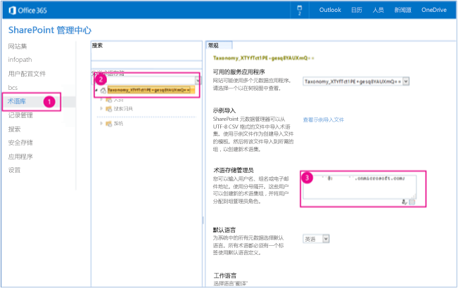
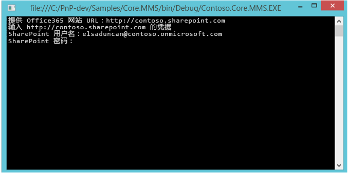
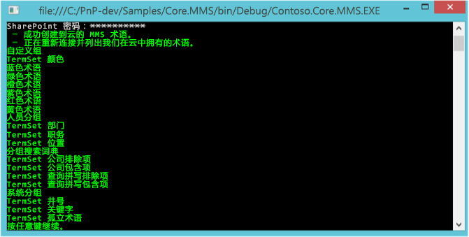
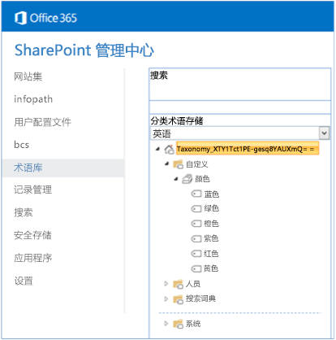


# 分类操作示例 SharePoint 外接程序
作为企业内容管理 (ECM) 策略的一部分，您可以创建并读取 SharePoint 列表上的分类数据。

 **上次修改时间：** 2015年8月12日

 _ **适用范围：** SharePoint 2013?| SharePoint Add-ins?| SharePoint Online_

 **注释**  名称"SharePoint 相关应用程序"将更改为"SharePoint 外接程序"。在转换期间，某些 SharePoint 产品和 Visual Studio 工具的文档和 UI 仍可能使用术语"SharePoint 相关应用程序"。有关详细信息，请参阅 [Office 和 SharePoint 相关应用程序的新名称](05b07b04-6c8b-4b7e-bd86-e32c589dfead.md#bk_newname)。

[Core.MMS](https://github.com/OfficeDev/PnP/tree/dev/Samples/Core.MMS) 示例控制台应用程序说明如何与 SharePoint Managed Metadata Service 交互，以创建和检索术语、术语集和组。此示例还将在提供程序托管的外接程序中运行，例如 ASP.NET MVC Web 外接程序。如果您希望在 SharePoint 服务器场之间迁移术语或在自定义外接程序中显示术语，请使用此解决方案。
 **为改进此内容做贡献**
您可以获取最新的更新，或为改进 [GitHub 上的此文章](https://github.com/OfficeDev/PnP-Guidance/blob/master/articles/Taxonomy-operations-sample-app-for-SharePoint.md)做贡献。您还可以为改进本示例以及 [GitHub 上的其他示例](https://github.com/OfficeDev/PnP)做贡献。有关示例的完整列表，请参阅 [模式和做法开发人员中心](http://dev.office.com/patterns-and-practices)。我们欢迎您做出 [贡献](https://github.com/OfficeDev/PnP/wiki/contributing-to-Office-365-developer-patterns-and-practices)。 

## 开始之前

若要开始，请从 GitHub 上的 [Office 365 开发人员模式和做法](https://github.com/OfficeDev/PnP/tree/dev)项目下载 [Core.MMS](https://github.com/OfficeDev/PnP/tree/dev/Samples/Core.MMS) 示例外接程序。

在运行此外接程序之前，您需要：


- SharePoint 网站的 URL。
    
- 访问 Managed Metadata Service 中的术语存储的权限。图 1 显示分配这些权限的 Office 365 管理中心。 
    
    **图 1. 在 SharePoint 管理中心中分配对术语存储的权限**

    
    分配对术语存储的权限：
    

      1. 从 Office 365 管理员中心中，选择"术语存储"。
    
  2. 在"分类术语存储"中，选择您希望向其分配管理员权限的术语集。
    
  3. 在"术语存储管理员"中，输入需要术语存储管理员权限的组织帐户。
    

## 使用 Core.MMS 示例外接程序

当您启动外接程序时，您将看到控制台应用程序，如图 2 中所示。系统将提示您输入您的 SharePoint 2013 或 SharePoint Online 网站的 URL 以及您的凭据。 


**图 2. Core.MMS 控制台应用程序**

当您提供 SharePoint URL 和您的凭据之后，将进行用户身份验证。以下代码将在 SharePoint Online 中执行用户身份验证。


    
 **注释**  本文中的代码按原样提供，不提供任何明示或暗示的担保，包括对特定用途适用性、适销性或不侵权的默示担保。


```C#
ClientContext cc = new ClientContext(siteUrl);
cc.AuthenticationMode = ClientAuthenticationMode.Default;
// For SharePoint Online.
cc.Credentials = new SharePointOnlineCredentials(userName, pwd);

```

以下代码将在专用 SharePoint Online 或内部部署 SharePoint 2013 服务器场中执行用户身份验证。


```C#
ClientContext cc = new ClientContext(siteUrl);
cc.AuthenticationMode = ClientAuthenticationMode.Default;
// For SharePoint Online Dedicated or on-premises .
cc.Credentials = new NetworkCredential(userName, pwd);

```

 **CreateNecessaryMMSTermsToCloud** 方法将在 Managed Metadata Service 中创建组、术语集和多个术语。代码首先获取对 **TaxonomySession** 对象的引用，然后获取对 **TermStore** 对象的引用，之后再创建自定义 **TermGroup** 、 **TermSet** 和新术语。


```C#
private static void CreateNecessaryMMSTermsToCloud(ClientContext cc)
        {
            // Get access to taxonomy CSOM.
            TaxonomySession taxonomySession = TaxonomySession.GetTaxonomySession(cc);
            cc.Load(taxonomySession);
            cc.ExecuteQuery();

            if (taxonomySession != null)
            {
                TermStore termStore = taxonomySession.GetDefaultSiteCollectionTermStore();
                if (termStore != null)
                {
                    //
                    // Create group, termset, and terms.
                    //
                    TermGroup myGroup = termStore.CreateGroup("Custom", Guid.NewGuid());
                    TermSet myTermSet = myGroup.CreateTermSet("Colors", Guid.NewGuid(), 1033);
                    myTermSet.CreateTerm("Red", 1033, Guid.NewGuid());
                    myTermSet.CreateTerm("Orange", 1033, Guid.NewGuid());
                    myTermSet.CreateTerm("Yellow", 1033, Guid.NewGuid());
                    myTermSet.CreateTerm("Green", 1033, Guid.NewGuid());
                    myTermSet.CreateTerm("Blue", 1033, Guid.NewGuid());
                    myTermSet.CreateTerm("Purple", 1033, Guid.NewGuid());

                    cc.ExecuteQuery();
                }
            }
        }

```

创建新术语后， **GetMMSTermsFromCloud()** 方法将从 Managed Metadata Service 检索所有术语组、术语集和术语。与 **CreateNecessaryMMSTermsToCloud()** 方法类似，代码首先获取对 **TaxonomySession** 对象的引用，然后获取对 **TermStore** 对象的引用，之后再检索和显示术语信息。


```C#
private static void GetMMSTermsFromCloud(ClientContext cc)
        {
            //
            // Load up the taxonomy item names.
            //
            TaxonomySession taxonomySession = TaxonomySession.GetTaxonomySession(cc);
            TermStore termStore = taxonomySession.GetDefaultSiteCollectionTermStore();
            cc.Load(termStore,
                    store => store.Name,
                    store => store.Groups.Include(
                        group => group.Name,
                        group => group.TermSets.Include(
                            termSet => termSet.Name,
                            termSet => termSet.Terms.Include(
                                term => term.Name)
                        )
                    )
            );
            cc.ExecuteQuery();

            //
            // Writes the taxonomy item names.
            //
            if (taxonomySession != null)
            {
                if (termStore != null)
                {
                    foreach (TermGroup group in termStore.Groups)
                    {
                        Console.WriteLine("Group " + group.Name);

                        foreach (TermSet termSet in group.TermSets)
                        {
                            Console.WriteLine("TermSet " + termSet.Name);

                            foreach (Term term in termSet.Terms)
                            {
                                // Writes root-level terms only.
                                Console.WriteLine("Term " + term.Name);
                            }
                        }
                    }
                }
            }
        }

```

您将看到您的 Managed Metadata Service 中的术语数据显示在控制台应用程序中，如图 3 中所示，并且还会显示在 Managed Metadata Service 中的术语存储中，如图 4 中所示。


**图 3. 显示 Managed Metadata Service 中的组、术语集和术语的控制台应用程序**




**图 4. 显示 Managed Metadata Service 中的组、术语集和术语的 SharePoint 管理中心**




## 其他资源


- [适用于 SharePoint 2013 和 SharePoint Online 的企业内容管理解决方案](enterprise-content-management-solutions-for-sharepoint-2013-and-sharepoint-online.md)
    
- [Core.MMSSync 示例](https://github.com/OfficeDev/PnP/tree/dev/Samples/Core.MMSSync)
    
- [Core.ContentTypesAndFields 示例](https://github.com/OfficeDev/PnP/tree/dev/Scenarios/Core.ContentTypesAndFields)
    
