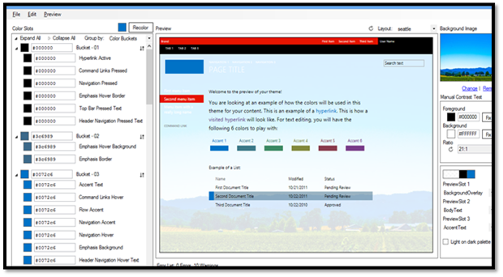
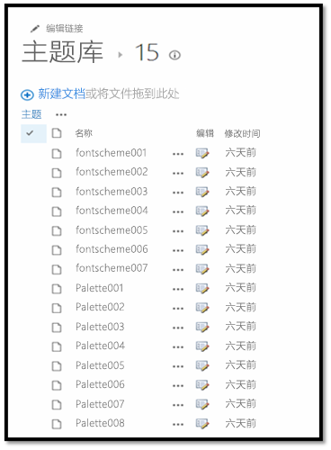
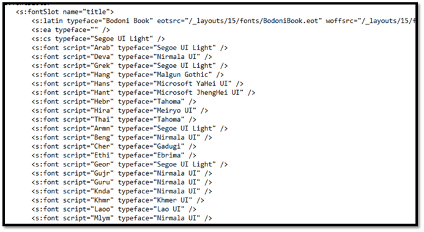
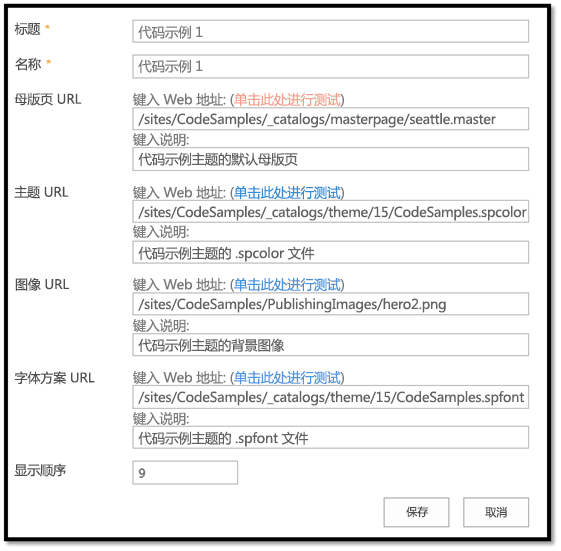
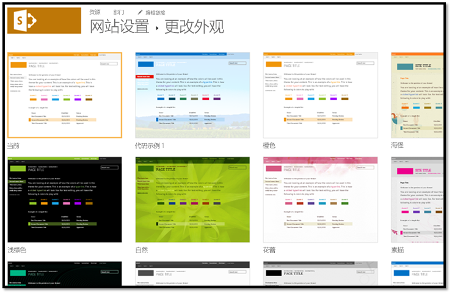


# 使用组合外观打造 SharePoint 网站品牌
通过使用 SharePoint 主题设置引擎将组合外观（包括颜色、字体和背景图像）应用到您的 SharePoint 2013 和 SharePoint Online 网站。

 **上次修改时间：** 2015年4月3日

 _ **适用范围：** SharePoint 2013?| SharePoint Add-ins?| SharePoint Online_

 **注释**  名称"SharePoint 相关应用程序"将更改为"SharePoint 外接程序"。在转换期间，某些 SharePoint 产品和 Visual Studio 工具的文档和 UI 仍可能使用术语"SharePoint 相关应用程序"。有关详细信息，请参阅 [Office 和 SharePoint 相关应用程序的新名称](05b07b04-6c8b-4b7e-bd86-e32c589dfead.md#bk_newname)。

您可以将组合外观应用到您的 SharePoint 网站。组合外观是 SharePoint 2013 和 SharePoint Online 中包含的现成主题。 
若要将组合外观应用到 SharePoint 网站，请选择"网站设置">"外观">"更改外观"。然后，可以使用"更改外观"向导自定义组合外观的颜色、字体、母版页和背景图像。"更改外观"向导将复制、转换 CSS 并将其存储在 SharePoint 的内容数据库中。还会对图像重新着色，并将它们存储在内容数据库中。 
 **为改进此内容做贡献**
您可以获取最新的更新，或为改进 [GitHub 上的此文章](https://github.com/OfficeDev/PnP-Guidance)做贡献。您还可以为改进本示例以及 [GitHub 上的其他示例](https://github.com/OfficeDev/PnP)做贡献。有关示例的完整列表，请参阅 [模式和做法开发人员中心](http://dev.office.com/patterns-and-practices)。我们欢迎您做出 [贡献](https://github.com/OfficeDev/PnP/wiki/contributing-to-Office-365-developer-patterns-and-practices)。 

## SharePoint 主题设置引擎

您可以使用 SharePoint 2013 主题设置引擎将颜色、字体和背景图像应用到网站，方法是将这些元素关联到母版页。

在 SharePoint 2013 和 SharePoint Online 中，主题是 XML 定义文件、图像文件以及关联的母版页的连接的集，可用于将自定义 CSS 应用到网站。以下 XML 文件定义了一些颜色插槽和字体插槽，用于在将特定颜色和字体应用到样式时定义其细节： 


- .spcolor
    
- .spfont
    
您可以在喜爱的文本编辑器中创建自己的颜色和字体文件。

下表列出了组合外观的各个元素。


|**元素**|**文件**|**存储位置**|**是否必需？**|
|:-----|:-----|:-----|:-----|
|调色板|.spcolor|Theme Gallery\15 folder|是|
|字体方案|.spfont|Theme Gallery\15 folder|否|
|网站布局|.master.preview|母版页样式库|是|
|背景图像|.jpg.bmp.png.gif|网站资产|否|
用户可以使用"更改外观"向导（"网站设置">"外观">"更改外观"）、"入门"UI 或直接在网站操作菜单中选择组合外观。用户选择组合外观后，主题设置引擎会将颜色、字体、背景图像、关联的 .master 页，以及与 .master 页关联的 .preview 文件应用到网站。 


### 调色板

主题设置引擎将颜色存储在 .spcolor 文件定义的调色板中，如图 1 中所示。调色板存储在根网站的"主题库"中。调色板是一个可编辑的 XML 文件，包含调色板定义和颜色插槽。调色板元数据 ( `<s:colorPalette>`) 定义以下内容：


- 定义要在组合外观预览中使用的颜色插槽的三个预览插槽。
    
- 允许调色板设计器指定是否反转主题（深色背景、浅色文本）的  **isInverted** 属性。
    
- 与主题关联的 XML 命名空间。
    
颜色插槽由颜色名称和值这两个属性来定义（定义颜色的名称及其 RGB 值）。颜色插槽具有语义名称，如 BodyText 或 SiteTitle，这有助于您识别与 SharePoint 页的某个区域对应的插槽。

 `<s:color name="BodyText" value="444444" />`


**图 1. .spcolor 文件**

.spcolor 文件的第二行定义 XML 命名空间、预览插槽，以及是否反转颜色（其为浅色前景色、深色背景，而不是深色前景色、浅色背景）。 

.spcolor 文件包含 89 个颜色插槽。您可以使用颜色插槽通过 8 位数十六进制数值来定义颜色的更加丰富的层面，包括不透明度。例如，如果绿色为 RRGGBB 00FF00，则 70% 的不透明绿色为 AARRGGBB 7F00FF00。如果 SharePoint 使用的是未定义的插槽，则引用该插槽的任何 CSS 将不会更改颜色。如果定义了插槽，但从未在 CSS 中引用，则颜色不会在 UI 中显示。

您可以在记事本中编辑 .spcolor 文件，但不能在 PowerPoint 中进行编辑。


### 调色板工具

您可以使用 [调色板工具](http://www.microsoft.com/en-us/download/details.aspx?id=38182)直观地呈现主题颜色以及这些颜色如何在页面上协同显示。使用调色板工具可确定您可以在 .spcolor 文件的颜色插槽中使用的颜色信息，并将颜色应用到 SharePoint 网站，无需作为该过程的一部分更改任何 CSS。 

此工具将按十六进制格式显示颜色，因此，您可以轻松地将颜色值复制并粘贴到 .spcolor 文件中的相应元素中。您还可以使用调色板工具使背景图像适应 seattle.master 和 oslo.master 母版页之间的模型和切换。 


**图 2. 调色板工具**

.spcolor 文件是新主题所需的唯一文件，但您可能需要添加一些自定义字体声明，具体取决于您的设计的预期结果。为此，需要访问 .spfont 文件。


### 字体方案

字体方案在组合外观中定义字体的方式与调色板定义在组合外观中使用颜色的方式相同。 

字体方案在 .spfont 文件中定义，该文件存储在主题库中。.spfont 文件包括以下字体插槽，它们定义组合外观的名称、字样和脚本值：


- 标题
    
- 导航
    
- 小型标题
    
- 标题
    
- 大型标题
    
- 正文
    
- 大型正文
    
字体通过脚本类型（例如拉丁文、阿拉伯文、西里尔文）进一步细分。以下四种文件类型支持 Web 字体：


- 嵌入式开放类型 (EOT)
    
- Web 开放字体格式文件 (WOFF)
    
- TrueType 字体 (TTF)
    
- 可缩放的向量图形 (SVG)
    
字体方案定义大型预览图像和小型预览图像。Web 字体仅需要这两种图像。


 **注释**  您可以在记事本中编辑 .spfont 文件，但不能在 PowerPoint 中进行编辑。

以下是 .spfont 文件的示例。


```XML
<?xml version="1.0" encoding="utf-8"?>
<s:fontScheme name="Georgia" previewSlot1="title" previewSlot2="body"
  xmlns:s=http://schemas.microsoft.com/sharepoint/>
    <s:fontSlots>
        <s:fontSlot name="title">
            <s:latin typeface="Georgia"/>
            <s:font script="Arab" typeface="Calibri" />
            <s:font script="Deva" typeface="Mangal" />
            . . . 
        </s:fontSlot>
    <s:fontSlot name="navigation">
        <s:latin typeface="Georgia"/>
        <s:font script="Arab" typeface="Calibri" />
        <s:font script="Deva" typeface="Mangal" />
        . . . 
        </s:fontSlot>
    </s:fontSlots>
</s:fontScheme>

```


### 网站布局：母版页和相应的预览文件

主题设置引擎基于 .master 母版页及其对应的 .preview 文件定义组合外观的网站布局。例如，如果为组合外观定义的母版页为 seattle.master，则该母版页将定义网站的布局。

网站布局从包含相应的 .preview 文件的任何母版页的母版页样式库中提取。母版页作为一个选项显示在"更改外观"UI（"网站设置">"外观">"更改外观"）中时需要 .preview 文件。

若要使母版页在"网站布局"下拉菜单中可用，可以创建一个与 .master 页对应的 .preview 文件。.preview 文件在 designbuilder.aspx 页的"更改外观"选项右侧显示组合外观的缩略图图像以及预览部分。


### 背景图像

选择"更改"可以更改组合外观的背景图像。这将打开一个上载对话框，您可以使用此对话框上载图像文件。您还可以将自己的图像拖动至背景预览中。


## 创建自定义主题

要创建自定义主题，请执行以下操作：


1. 转到"网站设置"，在"Web 设计器库"标题下，选择"主题">"15"。将显示 .spcolor 和 .spfont 文件列表，如图 3 中所示。
    
    **图 3. 主题库**

    

2. 下载其中一个 .spcolor 文件（例如，Palette001.spcolor）的副本，并在文本编辑器中打开。 
    
3. 编辑复制的 .spcolor 文件，以反映您的设计准则。例如，如果您将黑色字体用于主正文文本，则编辑文件以将  `<s:color name="BodyText" value="444444" />` 行更改为 `<s:color name="BodyText" value="000000" />`。
    
4. 对于每个 HTML 元素，添加颜色。 
    
5. 完成后，将 .spcolor 文件上载到"网站设置">"主题">"15"文件夹。 
    
     **注释**  保存文件并命名（例如，custom_palette1.spcolor）。

    下表将颜色和页元素映射到其 .spcolor 文件中的代码中。这是映射的子集，包含在 .spcolor 文件中。
    

|**元素**|**颜色**|**代码**|
|:-----|:-----|:-----|
|正文文本|黑色| `<s:color name="BodyText" value="000000" />`|
|全局导航背景|蓝色| `<s:color name="HeaderBackground" value="018dff" />`|
|全局导航文本|白色| `<s:color name="HeaderNavigationText" value="ffffff" />`|
|当前导航背景|红色| `<s:color name="NavigationHoverBackground" value="e51400" />`|
|当前导航文本|白色| `<s:color name="Navigation" value="ffffff" />`|
|标题|白色| `<s:color name="SiteTitle" value="FFFFFF" />`|
|页脚背景|黑色| `<s:color name="FooterBackground" value="000000" />`|
6. 若要自定义 .spfont，可下载 .spfont 文件的副本并在文本编辑器中打开。请注意，.spfont 文件的布局与 .spcolor 文件略有差异，但这两个文件使用类似的结构。 
    
    **图 4. .spfont 文件**

    

7. 编辑每个  `<s:fontSlot />` 部分以自定义应用到页面上的指定字体插槽的 SharePoint。例如，请注意第一个条目 `<s:fontSlot name="title">`。此条目说明了 SharePoint 将使用哪种字体来设计页面标题的样式。该部分还指定了用于不同语言的不同字体。
    
     **注释**  您可以将自定义字体上载到 SharePoint 并将每个条目指向一个自定义的 .eot, .woff, .ttf 和 .svg 文件。 
8. 将文件上载到"网站设置">"主题">"15"文件夹。
    
     **注释**  保存文件并命名（例如，custom_font.spfont）。

    下表将在 .spfont 文件中定义后的页元素映射到字体。
    

|**元素**|**字体**|**代码**|
|:-----|:-----|:-----|
|标题|Open Sans| `<s:cs typeface="Open Sans" />`|
|导航|Roboto| `<s:cs typeface="Roboto" />`|
|标题|Trajan Pro| `<s:cs typeface="Trajan Pro" />`|
|正文|Open Sans| `<s:cs typeface="Open Sans" />`|

    您可能需要确保部分自定义字体在用户的浏览器中可用。例如，如果标题涉及大多数用户计算机上不常用的 Trajan Pro 字体，可以在 <s:fontSlot> 声明的顶部添加以下字体声明。这将确保显示正确的字体。 
    


  ```XML
  <s:latin typeface=" Trajan Pro" eotsrc="/SiteAssets/Trajan Pro.eot" woffsrc="/SiteAssets/Trajan Pro.woff" ttfsrc="/SiteAssets/Trajan Pro.ttf" svgsrc="/SiteAssets/Trajan Pro.svg"  />
  ```


## 将自定义主题添加到 SharePoint

将自定义设置应用到母版页, .spcolor 和 .spfont 文件后，将它们添加到"组合外观"目录，以便 SharePoint 可以进行访问。 


1. 转到"网站设置"，在"Web 设计器库"下，选择"组合外观"。 
    
2. 选择左上角的"新建项目"链接。将打开一个窗口，如图 5 中所示。
    
    **图 5. 组合外观**

    

3. 为组合外观添加一个标题和名称。
    
4. 填写剩余字段：
    
      - 在"母版页 URL"字段中，添加您想要主题使用的母版页的 URL。
    
  - 在"主题 URL"字段中，添加 .spcolor 文件的 URL。
    
  - 在"图像 URL"字段中，加入您要用作背景的图像的 URL。如果您的设计不要求使用背景图像，则这不是必填项。
    
  - 在"字体方案 URL"中，加入 .spfont 文件的 URL。
    
  - 在"显示顺序"字段中，指明组合外观应按哪种顺序显示。
    
5. 选择"保存"。您的主题条目现在将显示在"组合外观"列表中。
    
将您的自定义主题作为组合外观添加到 后，用户就可以访问该主题，并可以转到"网站设置">"外观">"更改外观"，将该主题应用到网站。图 6 演示了"网站设置"中"更改外观"部分的示例。


**图 6. "更改外观"中可用的组合外观**




## 用户应用组合外观时，主题设置引擎会执行什么操作？

用户应用组合外观时，SharePoint 会复制、转换 CSS 并将其存储在内容数据库中。它还会对图像重新着色并将其存储在内容数据库中。在将主题应用到网站的过程中，主题设置引擎将从指定的调色板以及根网站的"主题库"中找到的字体方案提取颜色和字体值。为应用 .master 页和母版页 .preview 文件（网站布局），主题设置引擎将提取具有对应的 .preview 文件的"母版页样式库"中的母版页。 

主题设置引擎应用组合外观后，会映射由主题设置引擎定义的特定 CSS 注释指定的设置。主题设置引擎在后台将背景图像保存为"网站资产"，扩展并压缩 JPG 和 BMP 图像，并限制 GIF 和 PNG 图像的大小。 

将组合外观应用到 SharePoint 网站后，SharePoint 会在 CSS 文件中下一行的标记后插入从组合外观中派生的值，查找并替换 CSS 注释标记。此新值将应用到 SharePoint 网站。

下表列出了 CSS 注释标记。


|**标记**|**说明**|**对应的 ApplyTheme 参数**|
|:-----|:-----|:-----|
|/* ReplaceBGImage */|将当前背景图像替换为指定组合外观图像 URL 中的图像。|backgroundImageUrl|
|/* ReplaceFont */|将当前字体替换为在指定组合外观的字体方案 URL 中找到的其中一种字体。|fontSchemeUrl|
|/* ReplaceColor */|将当前颜色替换为在指定组合外观的调色板 URL 中的颜色插槽中指定的一种颜色。|colorPaletteUrl|
|/* RecolorImage */|使用着色或填充对图像重新着色。 ||

## 其他资源


- [SharePoint 网站品牌和页面自定义解决方案](sharepoint-site-branding-and-page-customization-solutions.md)
    
- [SharePoint 2013 和 SharePoint Online 的品牌打造和网站设置解决方案](branding-and-site-provisioning-solutions-for-sharepoint.md)
    
