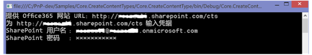

# 使用 Office 365 示例外接程序中的本地化功能
使用 Office 365 中的本地化功能，为 SharePoint 网站、列表、内容类型和网站栏提供本地化值。 

 **上次修改时间：** 2015年8月13日

 _ **适用范围：** SharePoint 2013?| SharePoint Add-ins?| SharePoint Online_

 **注释**  名称"SharePoint 相关应用程序"将更改为"SharePoint 外接程序"。在转换期间，某些 SharePoint 产品和 Visual Studio 工具的文档和 UI 仍可能使用术语"SharePoint 相关应用程序"。有关详细信息，请参阅 [Office 和 SharePoint 相关应用程序的新名称](05b07b04-6c8b-4b7e-bd86-e32c589dfead.md#bk_newname)。

[Core.CreateContentTypes](https://github.com/OfficeDev/PnP/tree/master/Samples/Core.CreateContentTypes) 示例演示如何在网站、列表、内容类型和网站栏中使用 Office 365 的本地化功能。此代码示例使用控制台应用程序执行以下操作：

- 创建内容类型、网站栏和列表，并将网站栏与内容类型关联。
    
- 本地化内容类型、网站栏、列表和用户提供的网站。
    

 **注释**  本文介绍的本地化功能仅在 Office 365 中提供。有关专用 Office 365 或本地 SharePoint Server 2013 中提供的本地化功能的信息，请参阅 [本地化 SharePoint 外接程序](http://msdn.microsoft.com/library/907a9189-7ce3-469a-8c87-4cef26f03c73%28Office.15%29.aspx)和 [本地化 SharePoint 解决方案](https://msdn.microsoft.com/zh-cn/library/ee696750.aspx).

 **为改进此内容做贡献**
您可以获取最新的更新，或为改进 [GitHub 上的此文章](https://github.com/OfficeDev/PnP-Guidance/blob/master/articles/Use-localization-features-in-Office-365-sample-app.md)做贡献。您还可以为改进本示例以及 [GitHub 上的其他示例](https://github.com/OfficeDev/PnP)做贡献。有关示例的完整列表，请参阅 [模式和做法开发人员中心](http://dev.office.com/patterns-and-practices)。我们欢迎您做出 [贡献](https://github.com/OfficeDev/PnP/wiki/contributing-to-Office-365-developer-patterns-and-practices)。 

## 开始之前

若要开始，请从 GitHub 上的 [Office 365 开发人员模式和做法](https://github.com/OfficeDev/PnP/tree/dev)项目下载 [Core.CreateContentTypes](https://github.com/OfficeDev/PnP/tree/master/Samples/Core.CreateContentTypes) 示例外接程序。

运行此代码示例之前：


1. 在您的网站上配置语言设置：
    
      1. 在您的团队网站上，选择"设置">"网站设置"。
    
  2. 在"网站管理"中，选择"语言设置"。
    
  3. 在"语言设置"页的"备用语言"中，选择您的网站可能支持的备用语言。例如，可以选择"法语"和"芬兰语"，如图 1 中所示。
    
  4. 选择"确定"。
    
2. 设置用户配置文件页上的显示语言：
    
      1. 在 Office 365 网站顶部，选择您的配置文件图片，然后选择"关于我"，如图 2 中所示。
    
  2. 在"关于我"页上，选择"编辑您的配置文件"。
    
  3. 选择"..."（其他选项），然后选择"语言和区域"。
    
  4. 在"我的显示语言"中，使用"选择新语言"下拉菜单选择与您在网站设置的类似的新语言，然后选择"添加"。例如，选择"法语"和"芬兰语"，如图 3 中所示。您可以选择向上和向下箭头向上或向下移动首选语言。
    
  5. 选择"全部保存并关闭"。
    

 **注释**  可能需要等待几分钟才能以选定语言呈现您的网站。 


**图 1. 网站的语言设置**


**图 2. 选择"关于我"导航到用户配置文件页面**


**图 3. 更改用户配置文件页上用户的显示语言设置**


## 使用 Core.CreateContentTypes 示例外接程序

运行此代码示例后，将显示一个控制台应用程序，如图 4 中所示。您需要提供网站进行本地化，还要提供 Office 365 管理员的凭据。控制台应用程序运行后，Program.cs 中的  **Main** 方法将执行以下任务：


- 调用  **CreateContentTypeIfDoesNotExist** 方法创建名为 **Contoso Document** 的内容类型。
    
- 调用  **CreateSiteColumn** 方法创建名为 **Contoso String** 的网站栏。
    
- 调用  **AddSiteColumnToContentType** 方法，将 **Contoso String** 网站栏链接到 **Contoso Document** 内容类型。
    
- 调用  **CreateCustomList** 方法创建名为 **MyList** 的新列表。
    

**图 4. Core.CreateContentTypes 控制台应用程序**

然后， **Main** 方法会调用 **LocalizeSiteAndList** 和 **LocalizeContentTypeAndField** 方法。 **LocalizeSiteAndList** 方法将演示如何执行以下操作：


- 使用  **Web** 对象的 **TitleResource** 和 **DescriptionResource** 属性上的 **SetValueForUICulture** 方法，为网站标题和说明设置不同的本地化值。
    
- 使用  **Web** 对象的 **TitleResource** 和 **DescriptionResource** 属性的 **SetValueForUICulture** 方法，为网站标题和说明设置不同的本地化值。
    
 **LocalizeContentTypeAndField** 方法将演示如何执行以下操作：


- 使用  **ContentType** 对象的 **NameResource** 和 **DescriptionResource** 属性上的 **SetValueForUICulture** 方法，为内容类型名称和说明设置不同的本地化值。
    
- 使用  **Field** 对象的 **TitleResource** 和 **DescriptionResource** 属性上的 **SetValueForUICulture** 方法，为网站标题和说明设置不同的本地化值。
    

    
 **注释**  本文中的代码按原样提供，不提供任何明示或暗示的担保，包括对特定用途适用性、适销性或不侵权的默示担保。


```C#
private static void LocalizeSiteAndList(ClientContext cc, Web web)
        {
            // Localize the site title.
            web.TitleResource.SetValueForUICulture("en-US", "Hello World");
            web.TitleResource.SetValueForUICulture("fi-FI", "Hello World - Finnish");
            web.TitleResource.SetValueForUICulture("fr-FR", "Hello World - French");
            // Localize the site description.
            web.DescriptionResource.SetValueForUICulture("en-US", "Hello World site sample");
            web.DescriptionResource.SetValueForUICulture("fi-FI", " Hello World site sample - Finnish");
            web.DescriptionResource.SetValueForUICulture("fr-FR", " Hello World site sample - French");
            web.Update();
            cc.ExecuteQuery();

            // Localize the custom list that was created previously.
            List list = cc.Web.Lists.GetByTitle("MyList");
            cc.Load(list);
            cc.ExecuteQuery();
            // Localize the list title.
            list.TitleResource.SetValueForUICulture("en-US", "Hello World");
            list.TitleResource.SetValueForUICulture("fi-FI", "Hello World - Finnish");
            list.TitleResource.SetValueForUICulture("fr-FR", " Hello World - French");
            // Localize the list description.
            list.DescriptionResource.SetValueForUICulture("en-US", "This example localizes a list using CSOM.");
            list.DescriptionResource.SetValueForUICulture("fi-FI", "This example localizes a list using CSOM – Finnish.");
            list.DescriptionResource.SetValueForUICulture("fr-FR", "This example localizes a list using CSOM - French.");
            list.Update();
            cc.ExecuteQuery();
        }

private static void LocalizeContentTypeAndField(ClientContext cc, Web web)
        {
            ContentTypeCollection contentTypes = web.ContentTypes;
            ContentType myContentType = contentTypes.GetById("0x0101009189AB5D3D2647B580F011DA2F356FB2");
            cc.Load(contentTypes);
            cc.Load(myContentType);
            cc.ExecuteQuery();
            // Localize content type name.
            myContentType.NameResource.SetValueForUICulture("en-US", "Contoso Document");
            myContentType.NameResource.SetValueForUICulture("fi-FI", "Contoso Document - Finnish");
            myContentType.NameResource.SetValueForUICulture("fr-FR", "Contoso Document - French");
            // Localize content type description.
            myContentType.DescriptionResource.SetValueForUICulture("en-US", "This is the Contoso Document.");
            myContentType.DescriptionResource.SetValueForUICulture("fi-FI", " This is the Contoso Document – Finnish.");
            myContentType.DescriptionResource.SetValueForUICulture("fr-FR", " This is the Contoso Document – French.");
            myContentType.Update(true);
            cc.ExecuteQuery();

            // Localize the site column.
            FieldCollection fields = web.Fields;
            Field fld = fields.GetByInternalNameOrTitle("ContosoString");
            // Localize site column title.
            fld.TitleResource.SetValueForUICulture("en-US", "Contoso String");
            fld.TitleResource.SetValueForUICulture("fi-FI", "Contoso String - Finnish");
            fld.TitleResource.SetValueForUICulture("fr-FR", "Contoso String - French");
            // Localize site column description.
            fld.DescriptionResource.SetValueForUICulture("en-US", "Used to store Contoso specific metadata.");
            fld.DescriptionResource.SetValueForUICulture("fi-FI", "Used to store Contoso specific metadata – Finnish.");
            fld.DescriptionResource.SetValueForUICulture("fr-FR", "Used to store Contoso specific metadata – French.");
            fld.UpdateAndPushChanges(true);
            cc.ExecuteQuery();
        }

```

如图 5 中所示，使用  **LocalizeSiteAndList** 方法进行设置后，您的网站将显示自定义的法语标题 **Hello World - French** 。


**图 5. LocalizeSiteAndList 方法更新的自定义页面标题**


## 其他资源


- [适用于 SharePoint 2013 和 SharePoint Online 的本地化解决方案](localization-solutions-for-sharepoint-2013-and-sharepoint-online.md)
    
- [Core.CreateContentTypes](https://github.com/OfficeDev/PnP/tree/master/Samples/Core.CreateContentTypes)
    
- [适用于 SharePoint 2013 和 SharePoint Online 的企业内容管理解决方案](enterprise-content-management-solutions-for-sharepoint-2013-and-sharepoint-online.md)
    
